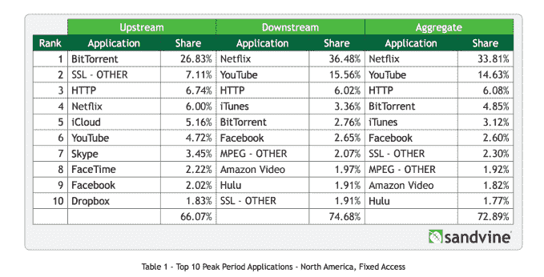
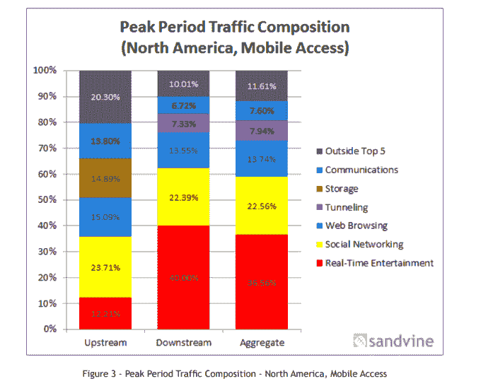
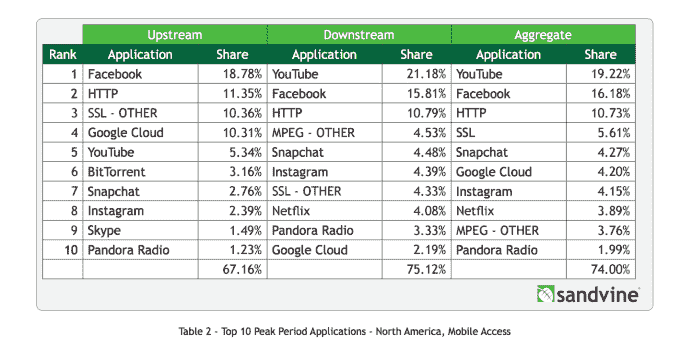

# 网飞，HBO 流媒体视频流量随着 BitTorrent 的下降而增加

> 原文：<https://web.archive.org/web/https://techcrunch.com/2015/05/28/netflix-hbo-streaming-video-traffic-increases-as-bittorrent-declines/>

今天发布的一份新报告显示，网飞继续统治北美互联网流量模式。根据宽带网络公司 Sandvine 的数据，该公司定期发布其关于网络使用的调查结果，网飞现在占固定网络晚间高峰时段下行流量的 36.5%，高于 2014 年下半年[报告的 34.9%。此外，该研究发现，HBO 也出现了一些增长，部分原因是其新的超顶级流媒体服务 HBO NOW 的推出，特别是其“权力的游戏”节目的受欢迎程度。](https://web.archive.org/web/20230324221426/https://www.sandvine.com/pr/2014/11/20/sandvine-report-netflix-dominates-still-amazon-instant-video-growing.html)

在《权力的游戏》第五季首播期间，HBO 的两家流媒体公司 HBO GO 和 HBO NOW 占美国一家固定网络流量的 4.1%，比平均水平增加了 300%以上。(HBO GO 是向付费电视用户提供的流媒体服务，而 HBO NOW 是最近推出的独立服务，旨在吸引插队者。)

在 HBO NOW 推出之前，HBO GO 仅占北美地区下游流量的 1%，早前的一份报告[称](https://web.archive.org/web/20230324221426/https://www.sandvine.com/pr/2014/11/20/sandvine-report-netflix-dominates-still-amazon-instant-video-growing.html)。但截至今天的报告，HBO GO 占 HBO 流量份额的 3.7%，而 HBO 现在只占峰值下游流量的 0.7%。Sandvine 说，这并不意味着 HBO NOW 的影响很小，而是与它的推出时间和仍然有限的访问有关。(它只能通过苹果产品和选定的有线电视提供商获得，如[有线电视](https://web.archive.org/web/20230324221426/https://techcrunch.com/2015/03/16/cablevision-becomes-first-pay-tv-provider-to-offer-hbo-now-to-broadband-customers/)。

然而，值得注意的是，Sandvine 只在周日播出期间测量了一个网络的 HBO 流量，这对 HBO 来说是一个更大的流量日。换句话说，HBO 的流量增长数据是初步的——sand vine 表示，HBO 的完整报告预计将在今年晚些时候发布。

当然，HBO 的《权力的游戏》已经成为有史以来盗版最多的电视节目之一，甚至在今年的第五季中打破了记录，因为《T4》第六集有 350 万用户在点对点文件共享网站上下载了该剧。

然而，Sandvine 指出，整体 BitTorrent(文件共享)流量正在下降，今天只占北美总流量的 6.3%和拉丁美洲流量的 8.5%。

其他流媒体视频服务也出现了较为温和的增长。例如，与网飞相比，亚马逊即时视频仍然只拥有一小部分带宽，但其流量正在增长。一年前，该服务的峰值下游流量为 1.90%，现在为 1.97%。

在其他地方，YouTube 仍然拥有相当大的流量份额，占峰值下游流量的 15.56%。Hulu 占峰值下游流量的 1.91%，新推出的顶级有线电视服务 Sling TV 占不到 1%。然而，Sandvine 指出，Sling 的服务仅在数据收集前一个月推出，因此要真正了解其潜在影响可能还为时过早。

## 移动的

在移动网络方面，Sandvine 发现拉丁美洲的移动流量现在越来越多地被两家公司控制:脸书和谷歌。这两家公司的各种资产，包括脸书、Instagram、WhatsApp、YouTube、Google Play 等，合计占移动流量的 60%以上。

在北美，实时娱乐是最受欢迎的移动流量类别，社交网络应用位居第二。YouTube 在手机上也很受欢迎，其峰值下游流量的 21.2%高于 2104 年上半年的 17.7%。

在过去的 18 个月里，脸书的流量份额也一直在增长，这要归功于自动播放视频的加入，这使得每位用户的脸书消费平均增加了 60%。

