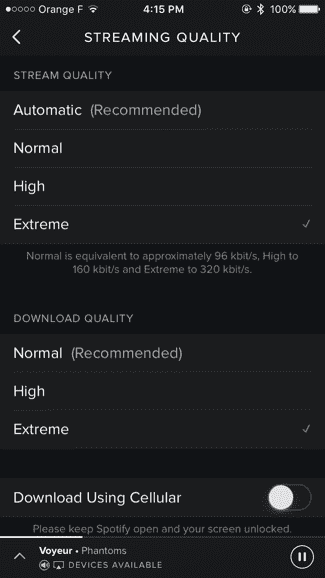

# 网飞让美国电话电报公司和威瑞森的视频看起来像垃圾

> 原文：<https://web.archive.org/web/https://techcrunch.com/2016/03/25/netflix-is-voluntarily-making-videos-look-like-garbage-on-att-and-verizon/>

# 网飞让美国电话电报公司和威瑞森的视频看起来像垃圾

如果你尝试过从运行在威瑞森或美国电话电报公司的平板电脑上流式传输《无主之作》,它很可能看起来像一大堆不值得一看的像素。原来，网飞正在悄悄地限制这些网络上的视频，这样你就不会在几个小时内用完你的全部数据量。

这些视频看起来有多糟糕？网飞正在美国电话电报公司和威瑞森的无线网络上播放分辨率为 360p、比特率为 600kbps 的视频(补充说明:威瑞森拥有美国在线，美国在线拥有 TechCrunch)。换句话说，即使在一部 5 英寸显示屏的普通智能手机上，你也会看到它看起来很糟糕。

网飞正在限制自己的服务，因为它不想让你超过数据上限，并支付超龄费。有趣的是，网飞没有对 T-Mobile 和 Sprint 上的视频设置上限，因为当你超过数据上限时，这两家运营商更加宽容。当然，如果你激活选项的[狂欢，T-Mobile 可以让你以 480 便士的价格观看网飞视频，而不会对你的数据计划产生不利影响。](https://web.archive.org/web/20221208233640/https://beta.techcrunch.com/2015/11/10/t-mobile-stops-counting-netflix-hbo-hulu-and-other-video-streams-against-your-data-usage/)

良好的用户体验包括在限制视频以消耗更少数据和流式传输高质量视频之间找到正确的平衡。但问题是网飞五年前就开始限制录像了。自那以后，智能手机、平板电脑、LTE 网络甚至数据上限都发生了很大变化 360p 似乎还不够。

网飞[在其博客](https://web.archive.org/web/20221208233640/https://media.netflix.com/en/company-blog/helping-netflix-members-get-more-from-their-mobile-data-plans)中写道[证实了《华尔街日报》的原始报道](https://web.archive.org/web/20221208233640/http://www.wsj.com/articles/netflix-throttles-its-videos-on-at-t-verizon-phones-1458857424)“我们认为限制性数据上限总体上对消费者和互联网不利，给那些越来越依赖移动设备娱乐、工作等的人制造了一个困境。“因此，为了保护我们的会员在超过移动数据上限时免于超额收费，我们在全球范围内通过移动网络观看的默认比特率上限为每秒 600 千比特。这是一种平衡，既要确保良好的流媒体体验，又要避免移动提供商的意外罚款。”

这也让美国电话电报公司和威瑞森看起来很糟糕。许多用户肯定认为这两个网络太慢了，无法以像样的质量处理这些视频流。还值得注意的是，网飞在世界各地的许多其他网络上限制视频，特别是那些昂贵的超龄费。

根据网站的设置，一个小时的高清视频代表 3GB，而一个小时的标清视频只代表 0.7GB。但该公司应该为那些想要更好的流媒体体验的人提供设置，而不是为用户做出决定。例如，Spotify 在这方面做得很好:

但是随着[即将于五月](https://web.archive.org/web/20221208233640/https://media.netflix.com/en/company-blog/helping-netflix-members-get-more-from-their-mobile-data-plans)发布的更新，看起来公司将朝着这个方向前进。有了更好的设置，公司就不应该对运营商有任何区别。