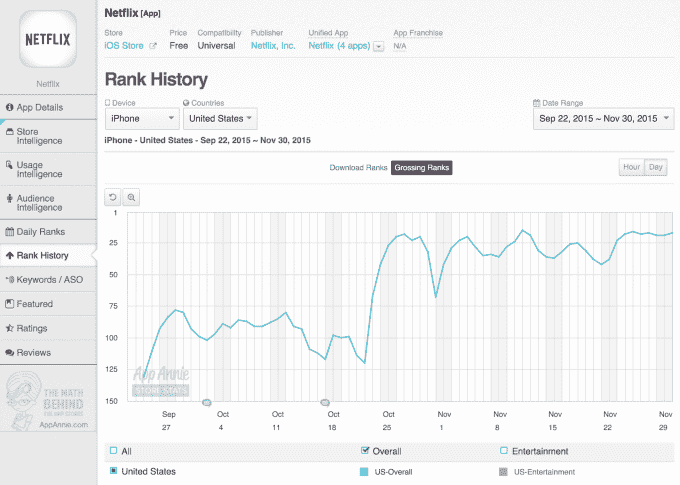

# 网飞刚刚成为全球十大票房应用之一

> 原文：<https://web.archive.org/web/http://techcrunch.com/2015/12/17/netflix-just-scored-a-spot-as-one-of-the-top-10-grossing-apps-worldwide/>

今年秋天早些时候，对 iTunes App Store 上票房收入最高的应用程序的分析显示，HBO NOW，该网络的脐带切割应用程序，[已经飙升至收入最高的视频流媒体应用程序](https://web.archive.org/web/20230316045218/https://techcrunch.com/2015/09/23/hbo-now-is-2015s-top-video-streaming-app-by-revenue-study-finds/)。现在，网飞似乎也加入了这一行列。根据今天来自 App Annie out 的[报道](https://web.archive.org/web/20230316045218/http://blog.appannie.com/worldwide-app-annie-index-apps-november-2015/)，网飞引入应用内订阅选项的举措导致 iTunes 收入飙升。这使得该应用程序在 11 月份的全球最赚钱应用程序排行榜(不包括游戏)上排名第九。

这张图表已经被这样或那样的流媒体服务所主导，包括 Spotify(排名第一)、Pandora(排名第三)、HBO NOW(排名第四)、中国的爱奇艺(排名第七)和 Hulu(排名第八)。

然而，网飞直到最近才上榜，因为它之前从未提供应用内购买服务。这种情况在 9 月份发生了变化，当时[网飞开始接受 iPhone 和 iPad 应用程序新用户的注册](https://web.archive.org/web/20230316045218/http://www.engadget.com/2015/09/25/netflix-ios-in-app-subscription-purchases/)。

像许多公司一样，网飞过去可能一直回避提供这一选项，因为苹果将应用内购买收入大幅削减了 30%。但其竞争对手，包括 Hulu 和 HBO NOW，已经在其应用程序中提供订阅功能，这可能导致了这一变化。(或者，也许苹果电视降价(从 30%降到 15%)帮助了。)

无论如何，这一变化影响票房排行榜只是几个星期的事情。App Annie 指出，通常情况下，确定新订阅模式的效果需要大约一个月的时间，因为大多数公司为新客户提供 30 天的免费试用。网飞在 9 月底增加了支付应用内订阅的选项，所以那些当时开始使用的用户直到 10 月底才会被提示付费。就在接下来的一个月，该应用看到了足够的盈利势头，实际上在收入排行榜上排名。

附注:我们也将很快看到 YouTube 的新订阅剧 YouTube Red 的表现。[该服务于 10 月下旬推出，](https://web.archive.org/web/20230316045218/https://techcrunch.com/2015/10/21/youtube-red/#.s2agxy:lSap)提供一个月的免费试用。然而，YouTube 一直在为一些用户延长这些试验，这可能会影响前景。

就收入而言，网飞的应用做得很好，尤其是在美国，自宣布应用内购买以来，该应用一直稳步攀升至总收入最高的行列。鉴于网飞[称](https://web.archive.org/web/20230316045218/http://ir.netflix.com/faq.cfm#Question34080)美国是其“最大和渗透率最高的市场”，这一点尤其有趣，这意味着其净增加量在未来几个季度可能会下降。

但是另一份报告——这份报告也是今天从 eMarketer 发布的——表明即使在美国这个几乎饱和的市场，仍然有增长的空间。该公司估计，网飞将在 2019 年将其在美国顶级视频服务用户中的份额从 2015 年的 63.2%增加到 71.7%。Hulu 和亚马逊也将攀升，前者从 33.1%升至 41.2%，后者从 36%升至 44.4%。

据 eMarketer 称，增长将来自联网电视用户，他们开始从光盘播放器和游戏机等传统技术转向更新的机顶盒和流媒体棒。

这意味着网飞的应用程序，以及 HBO NOW、Hulu 和其他应用程序，很可能会在一段时间内保持在“最高票房”排行榜上。