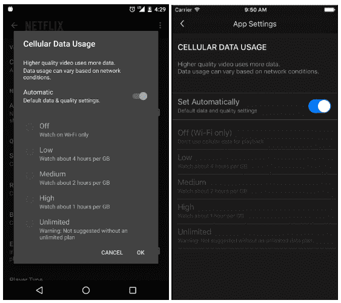
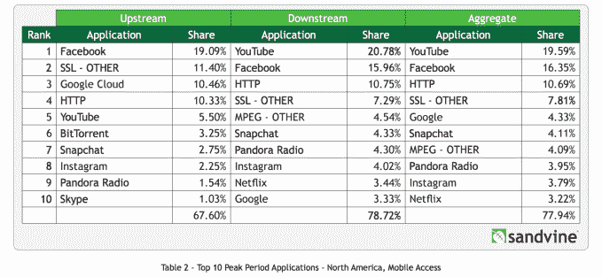

# 网飞现在可以让你控制它从你的智能手机传输数据时使用的数据量

> 原文：<https://web.archive.org/web/https://techcrunch.com/2016/05/05/netflix-now-lets-you-control-how-much-data-it-uses-when-streaming-from-your-smartphone/>

网飞[今天早上宣布](https://web.archive.org/web/20230404012943/https://media.netflix.com/en/company-blog/netflix-introduces-new-cellular-data-controls-globally)一种新的方式，让消费者在通过移动设备访问服务时控制其应用程序使用的数据量。在 iOS 或 Android 应用程序的更新版本中，将有一个名为“蜂窝数据使用”的新设置，您可以关闭自动默认设置，然后根据您的个人偏好选择更高或更低的数据使用设置。

在“应用程序设置”菜单下，该区域还提供了一个无限数据选项。

该公司表示，默认情况下，网飞允许用户以每千兆字节的数据传输约三小时的电视节目和电影，这相当于每秒 600 千比特。它根据对蜂窝网络的测试提出了这一设置，发现这在提供良好的视频质量和不导致用户超出数据上限或产生超额费用之间取得了平衡。

将这种设置放在消费者手中是网飞的一个显著举措，其流媒体服务如今有时占移动数据使用的相当大一部分。然而，就视频而言，它并不是移动数据的主要来源。

虽然[70%的互联网流量](https://web.archive.org/web/20230404012943/http://www.thewrap.com/netflix-youtube-amazon-hulu-streaming-services-70-percent-internet-data-usage/)来自网飞和其他流媒体服务，但 Sandvine 关于 2015 年互联网使用情况的[年终报告](https://web.archive.org/web/20230404012943/https://www.sandvine.com/trends/global-internet-phenomena/)将 YouTube 置于视频服务消耗移动用户带宽的榜首。

尽管如此，网飞仍然榜上有名，占北美移动网络下行流量的 3.44%和上行流量的 3.22%。(相比之下，YouTube 在下游和上游流量中都占据了大约 20%的份额)。

此前有消息称，手机“数据保存”功能正在研发中。该公司[在 2016 年世界移动通信大会上告诉](https://web.archive.org/web/20230404012943/http://www.gizmodo.com.au/2016/03/the-netflix-mobile-app-will-use-less-data-soon/) [press](https://web.archive.org/web/20230404012943/http://www.pocket-lint.com/news/136845-netflix-second-screen-and-mobile-data-limiter-coming-this-year-hdr-launch-show-revealed) ，它将在今年某个时候作为 iOS 和 Android 应用程序的即将到来的更新。

当网飞的 Android beta 测试程序意外公开时，这个功能也在野外被短暂发现。这造成了一些暂时的混乱，因为消费者认为他们可以在公开发布之前测试这个和其他功能。

此外，一些网飞用户表示，当时他们已经在自己的设备上看到了移动数据功能，而其他人则没有。(这可能是由于网飞方面的桶测试。)

网飞表示，新功能现在可以在更新的 iOS 和 Android 应用程序中使用，并且只有在你使用蜂窝网络时才适用——当你通过 Wi-Fi 连接或传输时，该设置将不起作用。

网飞产品创新总监 Eddy Wu 提到，关于该功能，有几个注意事项需要记住，他说:

> “我们一直在努力提高图像质量，同时提高流媒体的效率，因此比特率可能会随着时间的推移而变化。与所有流媒体一样，实际数据使用量可能会因您的设备功能和网络条件而异。即使您在网飞应用程序中选择了更高的设置，您的移动运营商也可能会影响实际的数据使用量。”

鉴于这一评论，值得指出的是，网飞已经是 T-Mobile 狂欢计划中的服务之一，视频使用不会计入消费者的数据上限。但是[这使得 T-Mobile 负责](https://web.archive.org/web/20230404012943/http://www.theverge.com/2016/1/19/10794288/netflix-t-mobile-binge-on-net-neutrality-zero-rating)数据流(在 [480p](https://web.archive.org/web/20230404012943/http://fortune.com/2015/11/11/tmobile-480p-video/) )，除非消费者选择退出。