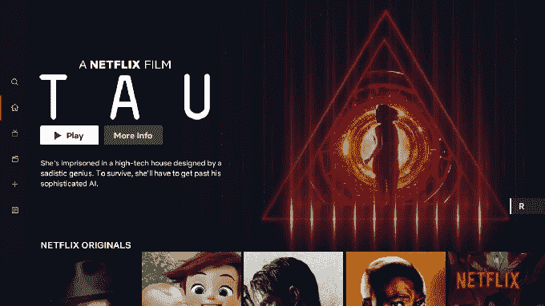

# 网飞用新的导航、全屏预告片重新设计了其电视界面 

> 原文：<https://web.archive.org/web/https://techcrunch.com/2018/07/18/netflix-redesigns-its-tv-interface-with-new-navigation-full-screen-trailers/>

网飞今天早上宣布为那些在电视上观看流媒体服务的人推出一个新的界面。更新的设计旨在通过遥控器改善导航，使其更快地获得您想要观看的内容。变化包括将网飞的一些关键功能，如“搜索”按钮和用户的“我的列表”转移到屏幕左侧的功能区菜单上，当你浏览时，菜单会弹出。在这里，它还添加了“电影”和“电视”的新快捷方式，以根据电影和节目过滤其目录，以及一个查看“新内容”的按钮

与此变化相关的是，当您浏览到给定的部分时，您现在会在内容建议行上方看到热门节目或电影自动播放的全屏预览。

该公司表示，重新设计是基于“严格的研究和测试”，应该会使网飞在许多方面更简单、更直观。

这些变化应该会受到电视观众的欢迎——当然，除了那些鄙视自动播放预告片的人。

随着网飞的目录多年来不断扩大，由于选择的悖论，找到一些值得观看的东西变得越来越困难。该服务根据你过去的观看历史提出建议，并提供主题分组，如“当前趋势”、“喜剧”、“电视剧”，加上像你的“最佳选择”等内容，这将让你滚动到无尽的建议行。

但是当你决定要重新开始，回到你的列表或者开始一个新的搜索时，你必须在遥控器上*点击，点击，点击*回到那些选项。

经过重新设计，你只需要点击旁边的按钮。

这是一个显而易见的变化——网飞甚至承认这一点——但他表示，这仍然需要“广泛的研究、测试和技术改进”才能实现。

简化导航的更大目标是减少用户浏览的时间，从而增加他们的观看时间。

与传统的有线电视不同，流媒体视频点播服务有时很难将观众与内容联系起来，因为用户在浏览内容时会犹豫不决。另一方面，电视一打开就会开始播放一些东西。虽然声音很大，而且会打断节目，但这种界面通常可以帮助人们发现新的节目——即使在他们点击遥控器的时候，他们也必须观看内容。

网飞也试图拥抱这种“开始播放”的心态，比如自动播放预告片和自动播放你正在观看的一季的下一集。现在，它在这个电视更新上加倍了那些自动播放的预告片。

在该公司因用户增长和收入低于预期而表现出较弱的收入后不久，重新设计的界面就出现了。股价暴跌，但随后[开始](https://web.archive.org/web/20221025222508/https://www.cnbc.com/2018/07/17/the-one-chart-that-explains-netflixs-stunning-comeback.html)到[恢复](https://web.archive.org/web/20221025222508/https://money.cnn.com/2018/07/17/media/netflix-stock-hollywood/index.html)——似乎还没有人准备好排除网飞。

网飞表示，新的电视界面将在未来几个月内向全球用户推出。