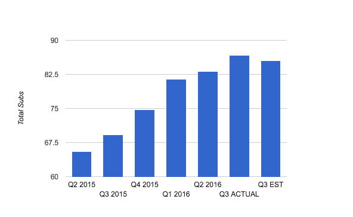
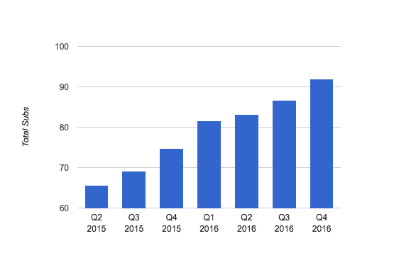
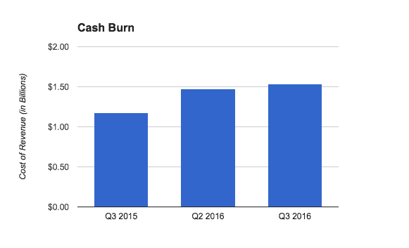

# 网飞新增 357 万用户，其中包括 320 万国际用户，超出华尔街预期

> 原文：<https://web.archive.org/web/https://techcrunch.com/2016/10/17/netflix-shakes-off-weak-subscriber-growth-and-its-stock-is-skyrocketing/>

网飞终于摆脱了用户增长放缓的趋势，公布了一个超出其自身和华尔街预期的巨大季度。

这是资金图表:

网飞的股票绝对是疯涨，在收益报告出来后的延长交易中上涨了 20%以上。随着今天股票的疯狂上涨，该公司的市值增加了近 100 亿美元。

这是包括该公司第四季度估计的图表:

因此，看起来该公司不仅提高了自己的预期，而且还在寻找一个巨大的假期季度来增加潜在的用户。

上个季度，该公司不仅公布了其订户(包括国际订户)的软收益，还下调了第三季度的预期。这种保守的做法引发了华尔街的许多担忧，担心该公司在快速扩张到新国家时，能否跟上国际增长的步伐。但看起来这个目标对网飞本身来说是保守的(当然，该公司完全可以对华尔街进行沙袋攻击)，目前的战略可能对该公司有效。

网飞增加了 320 万国际用户和 37 万国内用户。用户总数达到 8670 万。华尔街希望该公司增加 304，000 名美国用户和大约 200 万名国际用户。分析师原本预计收入为 22.8 亿美元，每股收益为 6 美分。

罪魁祸首几乎和我们预料的一样:人们对它的新原创内容感到兴奋——这可能足以吸引国际消费者急切地等待观看它，并在此期间赶上其他一切。

该公司在一份声明中表示:“我们超出预期的表现主要是由于对网飞原创内容的兴奋，收购活动强于预期。”

然而，报告中还有一点很有趣:它的收入成本逐年激增:

该公司还公布了非常广泛的收益，每股 12 美分。随着今天的报告，该公司已经扭转了该股自 1 月以来的大部分损失。

近来，低于预期的用户增长一直困扰着网飞，该公司大力试图进行国际扩张，但遇到了一系列问题。特别是，上个季度网飞指出，随着该公司继续在美国以外扩张，中国的监管将是一个重大问题。这严重打击了该公司的乐观情绪，因为它没有达到自己的预期，因此今年早些时候不得不下调未来预期。

还有一个问题是国外有足够的内容。上周末，加拿大广播公司报道称，几个允许国际客户观看美国内容的联合国屏蔽服务——这对网飞来说是一个巨大的推动——[遇到了很多问题](https://web.archive.org/web/20221206040347/http://www.cbc.ca/news/business/netflix-border-hopping-television-1.3805525)。虽然网飞继续在美国推出大量热门节目，特别是漫威原创系列和《夏日奇遇》，但它仍在试图将这些内容推向国际。

如果没有这一点，尽管在新的国家广泛扩张，它将很难说服人们为这项服务付费。它还必须想出如何在这些国家获得合适的本地内容。

至少可以说，网飞经历了极其坎坷的一年。自今年 1 月以来，网飞股价在财报发布前下跌了约 13%，而全年情况基本未变。从长期来看，网飞的战略似乎是有效的，但随着该公司推出其扩张计划，并将重点放在获取新用户上，短期内似乎仍需要做出一些调整。

然而，随着今天的报告，该公司已经扭转了过去 10 个月中几乎所有的损失。

[graphiq id="3soU5hSoixv" title= "网飞公司(NFLX)股票价格-1 年" width = " 600 " height = " 463 " URL = " https://SW . graphiq . com/w/3 sou 5 hsoixv " link = " http://listings . findcompany . com/l/16808888/网飞-Inc-in-Los-Gatos-CA"]