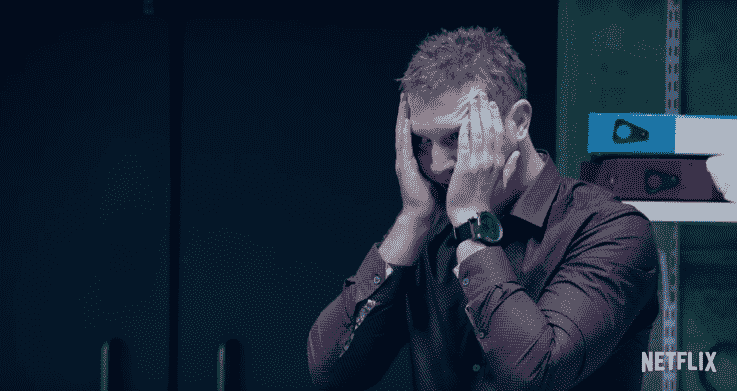

# 来自网飞的这个奇异的现实特别节目试图让人们犯下“谋杀”

> 原文：<https://web.archive.org/web/https://techcrunch.com/2018/02/21/netflix-the-push-reality-murder/>

# 这个来自网飞的奇怪的现实特别节目试图让人们犯下“谋杀”

网飞的原创节目是最好的内容之一，但是一个即将到来的名为 *The Push* 的真人秀节目看起来很奇怪，最糟糕的是令人不安。

该公司刚刚发布了一个预告片，详细介绍了该节目的前提，您可以在下面观看。

根据主持人达伦·布朗的说法，一个超感主义者和魔术师(用[的网站](https://web.archive.org/web/20221207015011/http://derrenbrown.co.uk/about/)的话来说，他已经成为“心理操纵艺术的代名词”)，这个节目是关于“我们多么乐意每天交出我们生活的主导权。”

主要问题是:“社会顺从能被用来迫使一个活生生的人走向死亡吗？”

本质上，这是以谋杀为笑点的朋克。讽刺的是，这感觉就像是《黑镜》中的一集电视剧。

一个由 70 名精心策划的演员组成的团队将一个名叫克里斯的可怜家伙置于一个他觉得谋杀是他唯一选择的境地。

“克里斯陷入了一个谎言的网络，这很重要，”布朗在预告片中说。“我需要让他感觉到，当他被要求去杀人时，只有一条出路。”

可悲的是，我们知道这个节目问题的答案。正如《the Verge》提醒我们的，心理学家[斯坦利·米尔格拉姆](https://web.archive.org/web/20221207015011/https://en.wikipedia.org/wiki/Milgram_experiment)在 60 年代证明，在他的研究中，2/3 的男性参与者愿意在被告知需要时对其他参与者实施致命电击。

这只是一个例子。历史一次又一次地向我们表明，普通人在权威人物的指引下也能杀人。

有趣的是，这个特别节目本身也不是新的。2016 年在第四频道播出的特别节目的一个版本名为*达伦·布朗:被推到边缘*。至少现在，你可以在这里观看全部 70 分钟。

推送将于 2 月 27 日在网飞上线。

[YouTube https://www.youtube.com/watch?v=doFpACkiZ2Q&w=560&h=315]