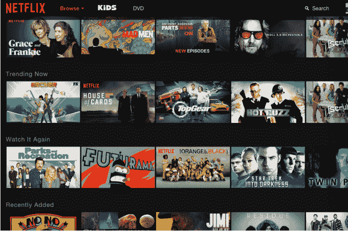
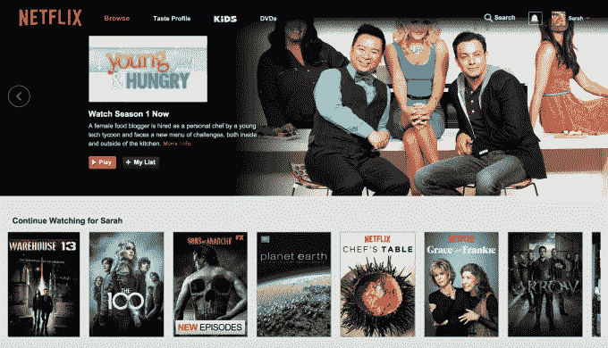

# 网飞将从 6 月开始推出一个新的、更具沉浸感的网络界面 

> 原文：<https://web.archive.org/web/https://techcrunch.com/2015/05/20/netflix-to-roll-out-a-new-more-immersive-web-interface-starting-in-june/>

网飞今天证实，它将从下个月开始向全球用户推出新的网络用户界面。许多网飞的顾客已经看到了更新的外观和感觉，然而，根据各种[报道](https://web.archive.org/web/20221208004908/http://www.theverge.com/2015/5/20/8628747/netflix-ui-redesign-spinning-carousel-removed)[。这个界面之前在 CES 和世界移动通信大会上展示过，它使网飞网站的设计更符合用户今天在手机、平板电脑、游戏机和 Roku 等其他流媒体播放器上看到的内容。](https://web.archive.org/web/20221208004908/http://www.reddit.com/r/movies/comments/36mjr5/netflix_testing_a_user_interface_redesign_that)

新设计最值得注意的方面是，它消除了用于内容发现的较慢的滚动传送带，有利于更新外观，每个部分都有较大的缩略图，单击这些缩略图可以扩展详细屏幕，显示有关所讨论标题的附加信息。

在这里，您可以看到电影或剧集的标题、描述、播放时间等，并可以将标题添加到您的观看列表中。在旧的网络界面中，你必须将鼠标悬停在节目或电影的缩略图上才能看到更多信息，但要看到相同级别的细节，你通常必须单击一个小的“更多信息”链接才能进入新的屏幕。

这种在两个屏幕之间移动的过程降低了用户找到他们想看的内容的能力，就像旧的导航一样，需要你点击箭头来浏览一系列标题，其缩略图类似于电影海报。

整体设计更具沉浸感，向用户呈现更多信息，很像网飞在电视上的界面。

更新的外观应该会让大多数网络用户满意，因为浏览速度提高了，尽管有些人抱怨说，这些变化意味着你现在在单个屏幕上看到的标题更少了，这要归功于取消了占据更少空间的垂直缩略图。这种在一个屏幕上看到更多内容的愿望近日来引发了很多兴趣——甚至有[今年早些时候发布的一款名为“上帝模式”的受欢迎的网飞黑客软件](https://web.archive.org/web/20221208004908/https://beta.techcrunch.com/2015/03/19/fix-netflixs-user-interface-with-god-mode/)，它可以让你一次看到所有的电影和电视节目，而无需在界面上点击。

有人不厌其烦地通过浏览器书签“修复”了网飞界面，这表明许多用户对在线体验还有很多不满意的地方。

网飞没有说在 6 月份全球发布之前有多少客户会看到更新的界面，但从报道中可以清楚地看到，推出已经在进行中。

网飞指出，这一举措对公司来说意义重大，因为它代表了自 2011 年以来个人电脑用户的首次用户界面更新。

这也是网飞在多屏世界中为客户简化界面的更大计划的一部分——该公司今年早些时候曾表示，客户希望在电视、手机和平板电脑上获得相同的体验，它[甚至推出了一个“推荐电视”计划](https://web.archive.org/web/20221208004908/http://www.geekwire.com/2015/netflix-announces-netflix-recommended-tv-program-bring-better-ui-viewers/)，为电视制造商提供指导。

作为参考，以下是用于比较的旧 PC 界面:

*(h/t，图像鸣谢: [The Verge](https://web.archive.org/web/20221208004908/https://beta.techcrunch.com/2015/03/19/fix-netflixs-user-interface-with-god-mode/) )*