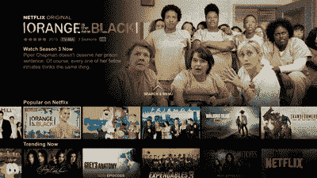

# 网飞升级其电视应用程序以节省您的点击次数

> 原文：<https://web.archive.org/web/http://techcrunch.com/2015/07/22/netflix-upgrades-its-tv-apps-to-save-you-a-few-clicks/>

网飞[今天宣布](https://web.archive.org/web/20230326065914/http://blog.netflix.com/2015/07/evolving-tv-at-netflix.html)推出自 2013 年末以来的首次重大电视应用更新。然而，与[上个月对网飞网站](https://web.archive.org/web/20230326065914/https://techcrunch.com/2015/06/15/netflixs-upgraded-website-goes-live/)的升级不同，电视应用程序的体验并没有得到真正的全面提升，而只是一个小小的调整。

现在，当您选择想要观看的标题时，它会立即恢复或开始播放，同时显示您需要的关键信息来帮助您确认您的选择-即标题、描述、剧集编号、观看进度等。

这是你在点击开始或恢复一个节目或电影之前会看到的相同界面，但现在它使你不必点击。

根据网飞的说法，这个想法是为了提供一种“更加身临其境和电影般的体验”，该公司表示，将视频播放纳入内容选择过程也更容易找到观看的内容。

我不确定所有观众都会同意后一点。虽然当你恢复一个你还没有完成的标题时，它看起来确实是一个方便的功能，但你并不总是想要立即开始播放你点击的任何标题。有时，您只是想了解更多信息，或者将某个项目添加到您的网飞观察列表中，以便以后查看。

但作为网飞电视应用相对于移动应用的一个特性，它更有意义。让标题立即开始播放让网飞感觉更像传统电视，而不是它实际上的点播服务。这也让我想起了使用有线电视的频道冲浪特性。

所有参与 Netlifx 在 CES 上推出的[的“](https://web.archive.org/web/20230326065914/http://deadline.com/2015/01/netflix-recommended-tv-sets-ces-1201341207/)[推荐电视”计划](https://web.archive.org/web/20230326065914/https://devices.netflix.com/recommendedtv/)的电视都将收到此更新，因为它们显然都是更新的智能电视。

此外，网飞告诉我们，任何运行它在 2013 年 11 月发布的[网飞用户界面的人也会收到这个更新，它预计每个人都会在不到一周的时间内收到。与今天的更新相比，2013 年的升级对电视应用程序进行了更大的改造，而且不仅限于智能电视。它还为 Roku 设备、游戏机和蓝光播放器提供了一套升级功能。](https://web.archive.org/web/20230326065914/http://blog.netflix.com/2013/11/netflix-on-tv-gets-major-makeover.html)