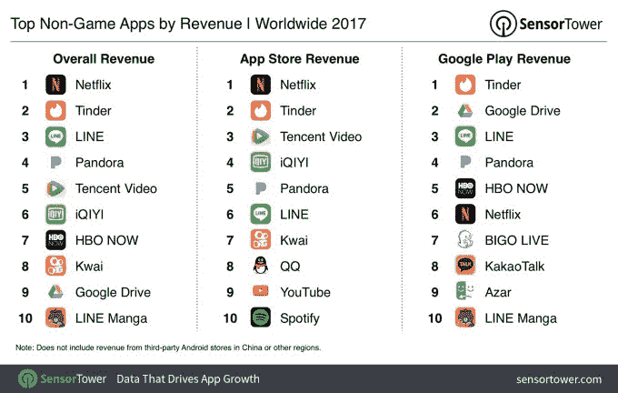
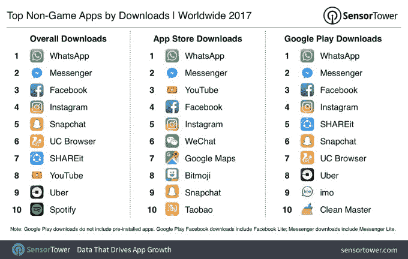

# 网飞是 2017 年收入最高的非游戏应用 

> 原文：<https://web.archive.org/web/https://techcrunch.com/2018/01/12/netflix-was-2017s-top-non-game-app-by-revenue/>

根据 [Sensor Tower 关于苹果应用商店和 Google Play 中最成功的应用和发行商的新年终报告](https://web.archive.org/web/20221221180243/https://sensortower.com/blog/top-apps-and-publishers-2017)，网飞是 2017 年最赚钱的非手机游戏应用。前几年，头把交椅都给了 Spotify，在此之前是 LINE。但今年是网飞大放异彩的一年。据该公司估计，这项服务的用户总收入约为 5.1 亿美元。这大约是 2016 年网飞应用程序 2.15 亿美元用户支出的 2.4 倍。

看到网飞夺得这个票房冠军的位置并不奇怪。该应用程序在 2017 年的各个时间点都位于收入排行榜的首位。例如，在 Q2，Sensor Tower】报告称，该应用的收入同比增长 233%,达到 1 . 53 亿美元，高于去年同期的 4600 万美元。

当时，网飞报道国际用户激增，占其新注册用户的大部分。这些新用户通常通过手机加入网飞，并通过应用内购买支付。

截至 10 月份公布的 2017 年第三季度收益，网飞在用户增长方面已经[超过了自己的预期](https://web.archive.org/web/20221221180243/https://techcrunch.com/2017/10/16/netflix-crushes-its-own-expectations-for-subscription-growth-again/)，这再次归功于其在国际市场的采用。在本季度的 530 万新用户中，85 万来自美国，445 万来自国际市场。

网飞的应用程序也是苹果应用商店中收入最高的应用程序。但在 Google Play 上，它的排名低于 Tiner、Google Drive、LINE、Pandora 和 HBO NOW。

去年另一个值得注意的成功应用是腾讯视频。2016 年，它是 App Store 上收入排名第 14 位的应用程序(非游戏)。过去一年，苹果在 App Store 的收入跃升至第三，在两家商店的总收入中排名第五。(如果 Google Play 可以在中国使用，情况可能也会大不相同。)

然而，就下载量而言，脸书占据了应用排行榜的首位。

今年，脸书的主要应用程序将第一的位置让给了 WhatsApp，跌至第三。Messenger 和 Instagram 紧随其后，Snapchat 位居第五。

Sensor Tower 的报告单独分析了手机游戏。

Mixi 的《怪物来袭》是 2017 年票房收入最高的手机游戏——目前已经连续三年保持这一位置。腾讯的《王者荣耀》获得了第二名，但还是因为 Google Play 不在中国。

[gallery ids="1586459，1586463"]

游戏列表有趣还有其他原因。曾经风靡一时的《精灵宝可梦 Go》没有进入前十，但五年前的《糖果粉碎传奇》进入了前十(排名第五)。这表明，尽管游戏在很大程度上是一个基于点击率的业务，但它也有可能在市场上有持久的力量。

腾讯在游戏和腾讯视频方面的成功也帮助它在 2017 年成为游戏和非游戏收入的顶级移动发行商。

[gallery ids="1586461，1586462"]

*图片致谢，包括图表:[感应塔](https://web.archive.org/web/20221221180243/https://sensortower.com/blog/top-apps-and-publishers-2017)*

*美国东部时间 2017 年 1 月 12 日晚 9 点更新，显示脸书在非游戏总下载量中排名第三，原因是《感应塔》的原始图表有错误，现已替换。*