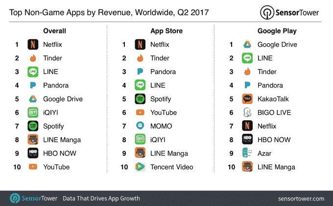

# 网飞是 Q2 票房最高的应用，自去年以来移动收入增长了 233%

> 原文：<https://web.archive.org/web/https://techcrunch.com/2017/07/24/netflix-was-the-top-grossing-app-in-q2-with-mobile-revenue-up-233-since-last-year/>

网飞上周公布的收入显示，该公司的用户增长迅猛，这也在应用商店中感受到了，其应用再次成为收入最高的应用。根据[应用商店分析公司 Sensor Tower 最近的一份报告](https://web.archive.org/web/20221210093118/https://sensortower.com/blog/top-apps-q2-2017)，在最近一个季度，Q2 的应用收入同比增长 233%，达到 1.53 亿美元。这比去年同期的 4600 万美元有所增加，包括两个顶级应用商店平台和 iOS 应用商店。

这一增长水平使网飞远远领先于两家应用商店的平均收入增长，目前为 56%。换句话说，网飞收入排行榜的上升不仅与应用生态系统及其相关应用业务的持续增长有关，还特别归功于网飞增加新用户的能力。

上周，[这家流媒体服务公司报告称](https://web.archive.org/web/20221210093118/https://beta.techcrunch.com/2017/07/17/netflixs-subscribers-are-surging-again-as-it-blows-away-wall-streets-expectations/)该季度增加了 520 万用户，超过其预期的 320 万。这些用户中的大多数(超过 400 万)来自国际市场，这也有助于解释 App Store 收入的增长。通常，新网飞用户通过手机注册流媒体服务，然后通过应用内购买支付。

网飞第二季度的收入增长了 32%，达到 27.9 亿美元；在前一季度，它的收入增长了 36%，达到 24.8 亿美元。然而，这些数字考虑了跨平台用户产生的收入，包括手机、台式电脑、机顶盒和其他平台。

随着应用商店增长 233%，Sensor Tower 的报告正确地指出，网飞的移动收入远远超过非移动平台产生的收入。

报告还指出，网飞也超过了其流媒体竞争对手 Hulu，其应用商店收入在本季度仅增长了 22%。

对网飞来说，最大的吸引力之一是原创内容，正如该公司在财报中所说的那样。这是该公司近年来的一项巨大投资。网飞此前表示，计划今年投资 60 亿美元用于原创内容，包括 40 部故事片《T2》。该公司也愿意为电影支付高价，比如它在第一部有潜力的大片《T4》中投资了 9000 多万美元，威尔·史密斯的奇幻史诗片《光明》，或者马丁·斯科塞斯(Martin Scorsese)耗资 1 亿多美元的黑帮电影《爱尔兰人》

网飞甚至在收入报告中向好莱坞电影业发出了挑战，指出它现在计划像曾经扰乱电视一样扰乱电影业。

“……正如我们通过把消费者放在第一位，让获取内容更方便来改变和重塑电视业务一样，我们相信互联网电视同样可以重振电影业务，”声明中写道。

除了网飞，许多其他基于订阅的业务在本季度也登上了收入排行榜的前列。在 iOS 应用商店上，Pandora 排名第三，表明其付费订阅有所增长；Spotify 排名第五；通过 YouTube Red 提供订阅服务的 YouTube 排名第六。

在 iOS 应用商店和 Google Play 中，Pandora 排名第四，Spotify 排名第七，YouTube 排名第十，另一个流媒体服务 HBO NOW 也排名第九。来自 Sensor Tower 的完整报告聚焦于非游戏应用的增长和收入。