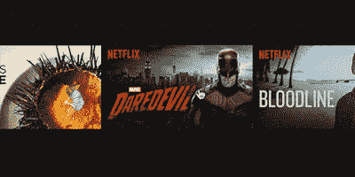

# 网飞升级后的网站上线 

> 原文：<https://web.archive.org/web/https://techcrunch.com/2015/06/15/netflixs-upgraded-website-goes-live/>

网飞[今天正式宣布推出其新网站](https://web.archive.org/web/20221208221232/http://blog.netflix.com/2015/06/the-netflix-website-gets-major-upgrade.html)，旨在为观众提供“更丰富、更视觉化的体验”，该公司表示，该网站的速度有所提高，动画效果更好，整体体验更具沉浸感，更像一个应用程序，而不是一系列“链接的网页”。该网站已经测试了一段时间——事实上，[网飞上个月](https://web.archive.org/web/20221208221232/https://beta.techcrunch.com/2015/05/20/netflix-to-roll-out-a-new-more-immersive-web-interface-starting-in-june/#.s2agxy:anal)告诉我们，它将从 6 月开始向所有客户推出这些变化。

此次升级是该公司在过去四年中对网飞网站的首次重大改进。

用户的主要抱怨之一正在通过这些变化得到解决——该网站以前用于内容发现的较慢的滚动传送带已经被更快的界面所取代。现在，当你用鼠标点击标题的缩略图(也已经从垂直的、类似电影的海报转变为水平的卡片)时，你将一次前进一整行。

该网站也是触摸友好的，这意味着那些在移动设备上浏览的人可以点击播放内容，查看电影或节目的细节，或者滑动滚动而不是点击。

节目和电影的个人页面也进行了改头换面。在这个新网站上，当你点击一个标题或一个梗概时，详细内容就会出现在里面，你可以点击浏览更多剧集，阅读详细内容或评论。网飞说，你还可以通过页面底部新的“更像这样”链接来浏览类似的标题，甚至可以被引导到来自相同演员、流派或风格的标题。

该网站也改进了它的视觉内容。例如，当你将鼠标悬停在一个标题上时，你会看到该节目或电影的图像幻灯片，网飞希望这能让用户更好地了解电影或节目的内容，而不是仅仅阅读描述。

总的来说，新的设计更具沉浸感，为客户提供了更多信息，同时也更容易在目录中查找要观看的内容或添加到您的列表中。

值得注意的是，新网站现在更像网飞在电视上的应用程序界面。即使客户在不同平台之间切换，向他们呈现一个简化的界面对公司来说也是非常重要的。例如，今年早些时候，网飞推出了一个“推荐电视”节目，为电视制造商提供如何创造良好网飞体验的指导。该公司也想在自己的网站上为用户做同样的事情，这是合情合理的。

全球推广将在两周内完成。