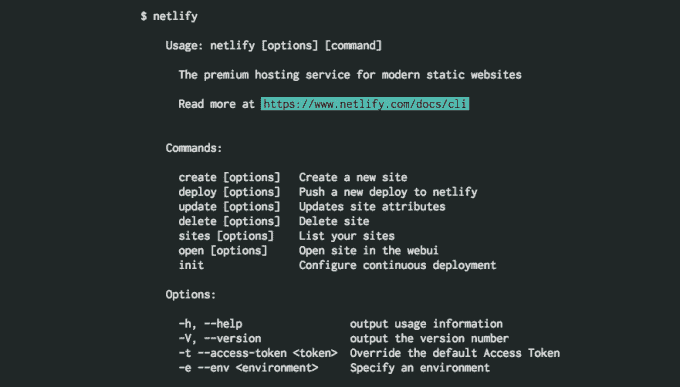

# 快速推出静态网站的服务 Netlify 筹集 210 万美元

> 原文：<https://web.archive.org/web/https://techcrunch.com/2016/08/17/netlify-a-sevice-for-quickly-rolling-out-static-websites-raises-2-1m/>

Mathias biil Mann——一家为小型企业建立网站的公司的前首席技术官——表示，开发人员已经非常习惯于使用 Github 作为一个中心工作流程，他们希望开发人员的整个剩余体验也是如此。

Netlify 的联合创始人比尔曼说:“前端开发人员的工作方式是进入服务器，改变事物的结构，但后来 Git 出现了，并成为基本的操作方式。”"你越来越期待推动某事发生."

这是他和他的联合创始人克里斯·巴赫的新公司的目标。Netlify 基本上启动了自己的存储库，将它自己的服务推送到 Github 存储库。然后，这些更新会执行并在内容交付网络的广泛网络中分发，以向访问者提供预构建的静态页面 Netlify 会从可用的云服务中选择最佳页面。然后，Netlify 将所有这些静态网站分布在自己的内容交付网络中，这意味着当访问者访问这些页面时，它们是预先构建好的。

这里的想法是，不是每次访问者访问一个页面就运行一个程序，而是预先加载已经完成，用户立即从最近的地理服务器得到一个页面，以减少加载时间。比尔曼说，如果流量突然激增，更动态构建的页面也可能容易变慢。

希望通过简化部署过程，他可以说服寻求轻量级页面体验的开发人员使用 Netlify 之类的东西，而不是简单地直接部署到 Amazon Web Services 或其他提供商。为了做到这一切，该公司已经从彭博贝塔和坦克山风险投资公司筹集了 210 万美元。

随着时间的推移，开发过程的一部分是简单地将 Git 更新直接推送到服务器，如 AWS。随着时间的推移，人们的期望变成了简单地通过命令行运行推送更新，并期望它在另一端工作。随着时间的推移，这已经成为一个越来越大的期望，特别是对于前端开发人员来说，Biilmann 和他的团队决定建立一套工具，将构建和部署这些页面的所有必要组件捆绑在一起。

因此，Netlify 使这些开发人员能够在一个更大的服务器网络上推出更改，这些更改可以通过这些简单的更新轻松回滚。所有这些都可以直接从命令行界面完成。

那么，为什么是预制的呢？有几个原因:有时，当访问一个网站时，页面会基于运行在亚马逊网络服务上的应用程序动态构建。这不仅需要页面自己构建，还会为恶意攻击留下机会(例如，在 Flask 服务器中查找漏洞)。通过将网站与 CDN 隔离开来，他们并没有进入一个可能会被攻击的动态环境。

“我们说静态网站不像 1994 年的网站是静态的，99.9%的网站是动态的，”比尔曼说。“他们只与浏览器交互，而不必每次都构建在服务器端。”

如果开发人员最终破坏了一行代码，他们可以快速回滚到该站点的前一个实例。虽然大多数操作都可以通过命令行界面完成，但 Netlify 用户也可以通过基于网络的界面查看其运行页面的快照，并监控其运行状况。

目前，Netlify 不提供与数据库层交互的工具。比尔曼说，这主要是因为许多现代页面实现了一种通过一组 API 连接到其他服务中的体验。他举的一个例子是通过像 Disqus 这样的 API 运行评论，或者通过另一个 API 运行搜索功能。

Netlify 的投资者包括 Heroku 创始人 Adam Wiggins 和 Github 创始人 Tom Preston-Werner，他们显然有兴趣帮助个人以更简单的开发者体验部署更全面、更快速的网站体验。

Netlify 面临的挑战是保持这些体验的简单性，并快速适应开发人员对这类工具的需求。不难想象像 AWS 这样的东西会实现类似的工具，而且已经有这么多开发人员在 AWS 上运行，可能很难将他们剥离。但是比尔曼说，虽然大公司已经享受了部署这种体验的能力，但像这样的工具将有助于吸引更广泛的长尾或开发者活动。