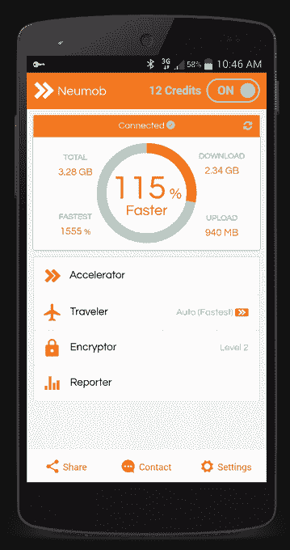

# Neumob 承诺加速您的移动应用程序，筹集了 230 万美元的种子资金 

> 原文：<https://web.archive.org/web/https://techcrunch.com/2015/05/13/neumob-promises-to-speed-up-your-mobile-apps-raises-2-3m-seed-round/>

[Neumob](https://web.archive.org/web/20221006062240/http://www.neumob.com/) 是一款为 [Android](https://web.archive.org/web/20221006062240/https://play.google.com/store/apps/details?id=com.neumob.accelerator) (Android 4.0+，随后将推出 iOS)开发的移动应用，它承诺通过其移动应用、VPN 服务和应用交付网络的结合，加快你所有其他移动应用和浏览器的速度。该公司今天宣布，它已经从一些顶级投资者那里筹集了 230 万美元的种子轮投资，包括 Accel Partners，Shasta Ventures，Menlo Ventures 和 Plug and Play Ventures。

起初，Neumob 背后的想法可能听起来很熟悉，特别是如果你曾经使用过 [Opera Max](https://web.archive.org/web/20221006062240/https://beta.techcrunch.com/2014/02/23/opera-launches-its-data-savings-app-for-android/) 或类似的专注于压缩图像和其他文件以加快浏览速度的服务。Neumob 采取了一种略有不同的方法，更注重节省时间而不是带宽。

正如 Neumob 首席执行官杰夫·金(Jeff Kim)告诉我的那样，魔力在于设备上运行的软件与公司的云网络相结合。因为移动应用程序本身已经倾向于进行大量的缓存，该公司目前并没有专注于前端优化(例如，不像 [Instart Logic](https://web.archive.org/web/20221006062240/https://beta.techcrunch.com/2015/05/13/instart-logic-raises-43m-series-d-round-for-its-cloud-application-delivery-platform/) )。相反，它使用 mobile [WAN acceleration](https://web.archive.org/web/20221006062240/http://en.wikipedia.org/wiki/WAN_optimization) 进行动态 API 调用(类似于 [Riverbed](https://web.archive.org/web/20221006062240/http://www.riverbed.com/) 为企业所做的)。Kim 还告诉我，该服务使用“一种 UDP 变体来最大化最后一英里和中间一英里专门路由的吞吐量。”

新用户可以获得 3gb 的免费加速。之后，他们要么通过应用内购买，要么通过让朋友注册这项服务来购买更多。

我通常对这类服务持怀疑态度。毕竟，Play Store 充满了“助推器”应用，承诺让你的手机更快，电池更持久。除了给你看广告，他们中只有少数人真正做了什么。Neumob 显然不属于这一类。

在我使用了几个小时后，这项服务告诉我，它将我的连接速度平均提高了约 35%，一些应用程序确实感觉更快了。但其他网站，如《纽约时报》、Redfin 和 Twitter，在服务开启后加载图片和新内容时出现了问题。

该公司的创始团队拥有深厚的网络和 cdn 工作背景，特别是在 Akamai、Cisco 和 CDNetworks 工作的经验。该公司成立于 2014 年，其 Android 应用程序上个月悄然登陆 Play Store。

虽然加速服务是该应用的核心，但 Neumob 还提供了许多其他工具。例如，就像大多数 VPN 服务一样，你可以使用 Neumob 来规避基于位置的限制，这样无论你在哪个国家，你都可以观看网飞。例如，你也可以假装你在中国、日本、巴西或德国。

此外，Neumob 还提供了一个加密工具。虽然这将降低你的连接速度，但它将确保没有人能够轻易窃听你的移动流量(至少在它攻击 Neumob 的服务器之前)。

与所有这些服务一样，Neumob 存在从用户那里收集大量个人数据的风险。然而，该公司表示，它非常重视客户的隐私，只保留聚合和匿名数据。

该公司表示:“我们存储的用户数据越少，就越有利于保护用户隐私。”。“我们只会在履行我们的服务所必需的范围内，或者在您事先同意的情况下，才会收集或使用您的数据。”