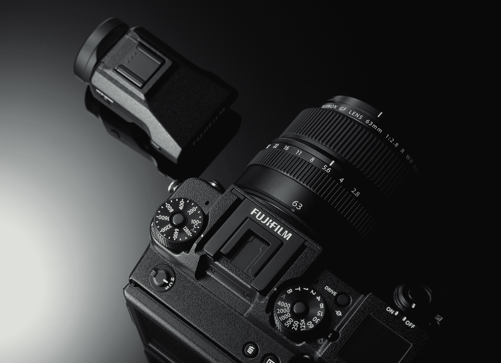

# 新型数码中画幅无反光镜增添富士胶片的复古魅力 

> 原文：<https://web.archive.org/web/https://techcrunch.com/2016/09/19/new-digital-medium-format-mirrorless-adds-to-fujifilms-retro-charm/>

# 新的数码中画幅无反光镜增添了富士胶片的复古魅力

富士胶片正得意洋洋地推行其战略，即采用经典相机，并为现代时代重新创造它们，现在它有了一个新的无反光镜中画幅相机系统，可能会赢得摄影爱好者的大量伪怀旧兴趣。

[富士 GFX 相机系统](https://web.archive.org/web/20221025230038/http://www.fujifilmusa.com/press/news/display_news?newsID=881070)将与 GFX 50S 一起亮相，这是一款无反光镜数码相机，配有一个巨大的 51.4MP，43.8×32.9 毫米传感器，以及六个富士龙 GF 镜头，将于 2017 年推出。相机本身也应该在 2017 年初上市。这是一件大事，因为与传统的数字和胶片介质格式系统相比，无反光镜设计将有助于减轻相机机身的重量和尺寸，同时还可以从那个巨大的传感器捕捉的图像中创建更大的照片。

GFX 50S 还有一个可拆卸的 EVF，使用可选的适配器配件，它也可以调整到几乎任何角度，它还通过一系列物理按钮和转盘回归其电影根源，就像富士在其 X 系列无反光镜相机中推出的其他产品一样。

【T2

富士用于 GFX 系统的首批镜头包括 63 毫米(相当于 50 毫米)F2.8、32-64 毫米(相当于 25-51 毫米)F4、120 毫米(相当于 95 毫米)带光学图像稳定的 F4 微距、110 毫米(相当于 87 毫米)F2、23 毫米(相当于 18 毫米)F4 和 45 毫米(相当于 35 毫米)F2.8。所有初始镜头都可以抵御更恶劣的拍摄条件。所有少还具有光圈环，这是另一个 X 系列相机结转。

处理是通过富士的 X-Processor Pro 处理的，相机的确切发布日期和价格将在稍后公布。我不指望它会便宜，因为它在中等格式类别中具有可比性，但富士胶片在 X 系列产品中的性价比方面做得很好。

[gallery ids="1388793，1388792，1388791"]