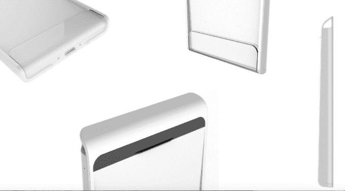
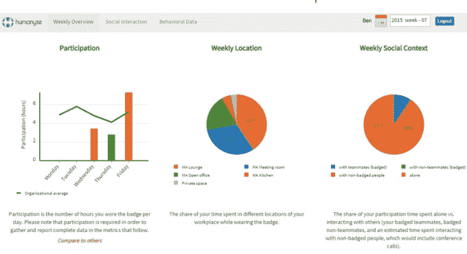

# 新公司结合可穿戴设备和数据来改善决策 

> 原文：<https://web.archive.org/web/http://techcrunch.com/2015/02/24/new-firm-combines-wearables-and-data-to-improve-decision-making/>

在[麻省理工学院媒体实验室](https://web.archive.org/web/20221126105619/http://www.media.mit.edu/)诞生的一家独特的新公司 Humanyze ，开发了一个使用智能员工徽章来收集员工行为数据的系统，该系统将员工行为数据与特定指标联系起来，以提高业务绩效。它今天宣布了 100 万美元的种子基金。

该基金由 Romulus Capital 牵头，波士顿种子公司和 dunnhumby Ventures 提供资金。

Humanyze 总裁 Ben Waber 表示，虽然运动队在使用数据评估员工(球员)方面做得很好，但企业到目前为止还没有有效地使用数据来衡量员工的生产力。他们可能会查看关于整体业务绩效的电子表格、关于销售转换率的图表以及营销产生的线索数量，但他们不会查看员工之间的互动以及这对底线有什么影响。几年前，Waber 和他的联合创始人在麻省理工学院媒体实验室开始研究人类行为及其对商业的影响。他们在 2010 年分拆了这家最初名为 Sociometric Solutions 的公司。

为了测量人类行为，创始人需要一种收集数据的工具，因此他们开发了一种智能员工徽章，带有麦克风、加速度计、蓝牙连接和智能手机中常见的其他工具。(其实长得有点像手机。)它衡量的内容包括人们一天中的活动情况，他们与谁互动，他们说话的语气是什么样的，他们是否愿意倾听以及每天在每个公司发生的其他类型的互动。

Humanyze 智能员工徽章

在你开始把这看作是“老大哥”徽章之前，Waber 说 Humanyze 已经采取了预防措施来保护隐私。首先，这完全是选择加入，他们与客户和最终用户签订合同，确保隐私。“公司无权访问个人数据，这已写入我们的合同，我们与最终用户签署了一份合同(同意书),声明我们不会将个人数据提供给任何其他人。如果我们这样做，就违反了我们的合同，”Waber 说

他解释说，还有一些技术保护措施——没有任何内容会被记录下来，在没有保存到内存的情况下被立即分析，名字不会与行为数据保存在同一个位置，等等。

一旦他们有了这个徽章，他们要求早期客户给他们关键的性能指标，如销售或客户服务完成时间，以便与数据进行比较，并且有很多很多的数据。

每个徽章每天产生大约 4GB 的数据，这些数据被上传到云中，Humanyze 在云中分解它收集的 40 种信息，并将其精简为对客户端最重要的 6 种信息。然后，他们将其链接到一个关键业务指标仪表板，以便客户可以看到行为如何影响公司的底线绩效。

一旦他们开始收集数据，他们就可以开始实验，看看改变某些因素会如何影响做简单 A/B 测试的数字。一组得到了调整，一组没有，然后他们看看会发生什么。

他们开始与美国银行客户服务中心合作，这是一项庞大的业务，有 10，000 名员工在世界各地工作。当他们开始研究销售代表时，他们认为关键指标是他们如何与客户交谈，但他们发现实际上最重要的是他们如何彼此交谈，因为员工共享信息和技术。

他们了解到，员工在午餐时间重叠的 15 分钟内说话最多，因此他们尝试同时给一组人提供午餐，让另一组人继续按照旧的交错时间表吃午餐。他们的发现令他们吃惊。

衡量他们沟通能力的网络凝聚力上升了 18%。这减少了 19%的压力(以语调来衡量)。所有这些都让员工更加开心，员工流失率降低了 28%。尽管关键指标显示，通话完成时间缩短了 23%。这些数字在美国银行的规模上可以转化为数十亿美元的储蓄。

他声称，该公司在其他早期客户身上看到了类似的结果，这导致了效率的大幅提高。它工作得非常好，他们已经能够引导到这一点。换句话说，大公司将为这种结果买单。

Waber 说，该公司希望利用今天的资金聘请首席产品官和其他员工，并允许他们通过增加额外的试点合作伙伴来扩大规模。

它还宣布德勤和另外两家公司成为新的合作伙伴，但没有透露它们的名字。

Waber 认为这是一个光明的未来。如果他的公司能够与客户合作，找到节约成本和提高效率的方法，这可能会非常有利可图，但它需要证明，它可以超越试点阶段，将这种方法推广到成熟的企业。

[https://web.archive.org/web/20221126105619if_/https://www.youtube.com/embed/XojhyhoRI7I?feature=oembed](https://web.archive.org/web/20221126105619if_/https://www.youtube.com/embed/XojhyhoRI7I?feature=oembed)

视频

*产品照片由 Humanyze 提供。*