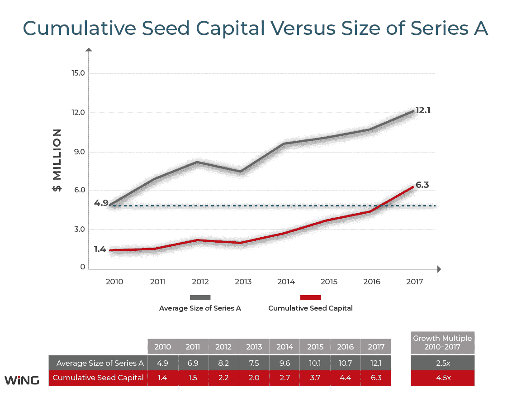
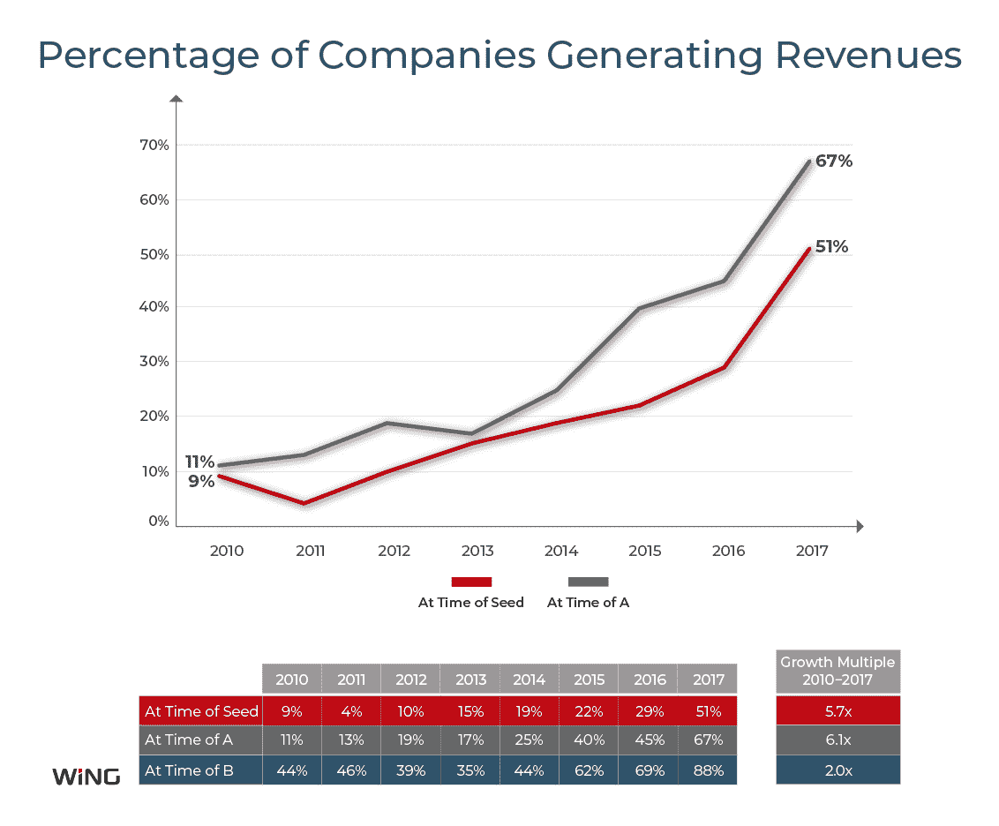
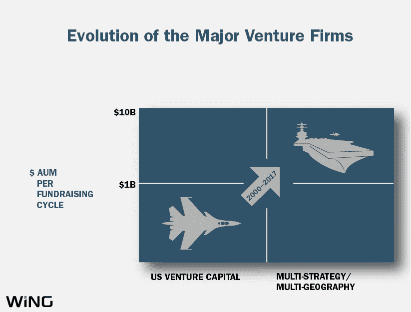

# 新的数据显示了年轻创业公司的融资变化有多快

> 原文：<https://web.archive.org/web/https://techcrunch.com/2018/04/24/new-numbers-illustrate-how-fast-fundraising-has-changed-for-young-startups/>

筹款从来都不容易，但是当目标被移动的时候就更难了。这就是当今最年轻的初创公司面临的挑战，与六七年前的初创公司相比，这些公司正在寻找非常不同的融资指标。

我们昨天与彼得·瓦格纳探讨了这个问题，他在 2013 年与另一位资深投资者、前红杉资本(Sequoia Capital)的高拉夫·加格(Gaurav Garg)共同创立早期公司 [Wing Venture Capital](https://web.archive.org/web/20230316161016/http://wing.vc/) 之前，曾在 Accel 担任管理合伙人超过 14 年。

瓦格纳显然对回合如何变化很感兴趣。Wing 必须知道投资一家公司的合理预期是多少，即使它更愿意投资那些还没有收入或客户的公司。在竞争激烈的融资环境中，其现在的四人投资团队也希望通过发布智能行业研究来提升公司的知名度，包括不久前关于物联网的[状态的研究。](https://web.archive.org/web/20230316161016/http://wing.vc/blog/iot-startup-state-of-the-union-2017)

无论 Wing 的动机是什么，如果你是一个正考虑在短期内筹集种子资金或首轮融资的创始人，它的发现都值得追踪。以下是我们与瓦格纳的谈话以及 Wing 的数据。

**TC:你的第二只基金 3 亿美元，几乎是你第一只基金 1.6 亿美元的两倍。你认为你的第三只基金会更大吗？有朝一日这将成为一个加速度大小的公司吗？**

PW:不，我们实际上正在努力控制我们的基金规模。早期投资没有规模。为了实现增长，我们必须改变投资策略。

许多公司都在这么做，只有 Benchmark 是个明显的例外，它在过去的 18 年里基本保持了基金规模。

PW:当我们(扩展到)进行后期实践时，我在 Accel。我们(从潜在雇员中)寻找不同的技能，因为这是一个不同的过程。事实上，我们对它了解得越多，我们就越意识到它是一门多么不同的学科。

**TC:鉴于你如此关注早期融资动态，请告诉我们你学到了什么。你是如何编写这份新报告的？**

PW:我们研究了 2010 年至 2017 年间由大约 20 家领先风险投资公司投资的公司。总共有 2700 家公司，5800 笔融资。如果一家公司从另一家公司筹集了种子基金，但红杉资本领导了它的首轮融资，那么它的所有融资轮次，包括种子轮次，都被纳入了我们的研究。我们还关注这些公司的下游融资(不管投资者是谁)。

TC:所以这些公司中有一些是非常新的。别人八岁。创始人应该对数字了解些什么？

PW:今天的累积种子资本——因为它经常在多轮中出现——比不久前的 2010 年首轮融资的平均水平要高。2010 年 A 轮平均 490 万美元；到去年，它已经达到 1210 万美元。2010 年，初创公司筹集的种子资金平均为 140 万美元；截至去年，为 630 万美元。

TC:这是一个很大的提升。你觉得这有什么关系吗？

PW:不一定。这反映了大型风险投资公司不断变化的策略。那些被定义为首轮投资者的人大多采取了后期姿态和规模。当你在扩大一家风险公司的规模时，你会进行更多的后期投资，因为你可以投入更多的资金。这是拉高 A 系列规模的原因之一。

**TC:看看你的另一张图表，看起来融资的公司比以前走得更远了。这算不上什么新闻，但仍然很有趣。也许更能说明问题的是，他们中的 67%已经在创收，而 2010 年他们的同行只有 11%。种子投资也是如此。**

PW:是的，在 2010 年，只有 9%的种子基金公司产生收入；去年，超过一半的人是。

风险投资:风险投资到此为止。既然在种子期和首轮融资阶段，每个人在这些公司身上承担的风险都小得多，那么早期风投在这些初创公司的所有权方面是不是也越来越少了？

PW:除了在 IPO 招股说明书中，很难获得(Wing 以外的)所有权比例。根据轶事数据和我的观察，大公司仍然在寻找相同的所有权比例。他们只是为此付出了更多。

**TC:你还有其他有趣的数据，包括初创公司在进入首轮融资之前完成的融资数量。过去是第二轮融资。现在，公司在达到这一点之前已经筹集了近三轮资金。**

对于创始人来说，这似乎不是什么好事，因为他们每次融资都会捐出公司的一部分。

PW:如你所知，“种子前期”和“种子加”融资现在都是一件事。因此，在你进入后采用阶段之前，你在种子世界中有这种细分，在后采用阶段，你有一些证据表明事情正在发生，投资者可以看到有多快。Seed 是新的 a。

至于创始人是否因为这种趋势而拥有更少的股份，这是一个很难追踪的问题，因为所有权统计是你最后会发现的。

**TC:嗯，你在很早的时候就开始投资，在很多情况下是在种子期前或采用期前。当你在做看起来更像种子交易的 A 轮交易时，你还在拿你看起来拥有的 20%吗？**

PW:理想情况下。其他时候，我们会从小仓位开始，逐步积累。我们扮演着重要合作伙伴的角色，所以我们希望处于这种所有权地位。

**TC:随着事情的不断变化，死亡之谷现在在哪里？显然，你必须有一个强大的初创公司才能获得首轮融资。**

PW:很有意思。一些大公司已经采用了这些扩大规模的策略，他们将大量的采用工作外包给投资者、孵化器和天使投资者，他们正在组建一支拥有一千艘船只的舰队。这使得这些公司可以四处逛逛，看看哪些初创公司看起来最好，然后挑挑拣拣。

值得注意的是，他们对首轮融资的公司没有那么大的既得利益，因为当你进行新的投资和后续投资时，这是非常不同的。过去，这些风险公司的个人参与的时间要早得多。

我不确定这是健康还是不健康的发展。但这确实意味着种子公司得到了这块其他公司已经退出的扩展领域。总得有人做基础建设。对于种子投资者来说，这是一个发挥更大作用的绝佳机会，但对于创始人来说，这肯定是一个令人困惑的时期，投资者在变，你让谁进入你的核心圈子的标准也在变。

**TC:你已经从事风险投资 20 多年了。是否会有一次调整或者有什么根本性的改变？**

PW:会有修正。总会有修正的时候。每次我们认为循环已经被打破，我们都被证明是错误的。VC 是循环的。我不知道的是这一调整的日期或深度。

**TC:鉴于这种可能性，你认为风险投资公司现在应该筹集如此巨额的资金吗？**

PW:上一次大约在[90 年代末]，一群人筹集了非常大的资金，当市场发生变化时，他们最终将一半或更多的资金返还给他们的有限合伙人。大型基金的回报总是令人失望。事情确实在变，而技术是一个更重要的因素。但我确实认为这仍然是一个繁荣-萧条的行业。

