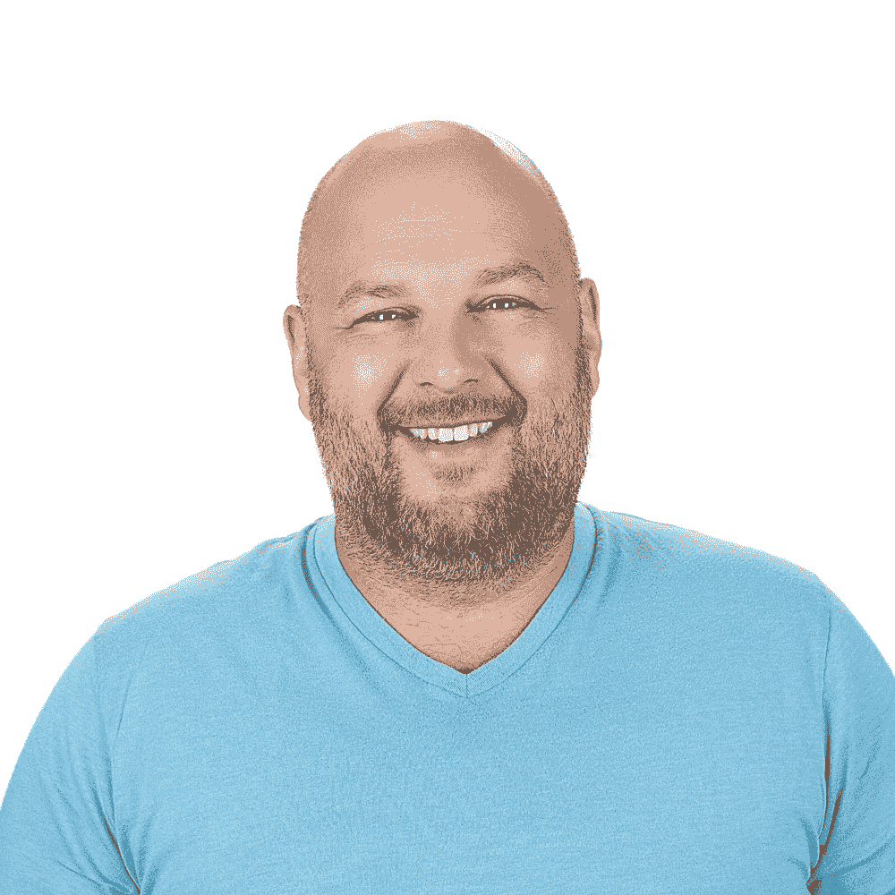

# 新的研究表明，应用程序可以帮助对抗屏幕成瘾

> 原文：<https://web.archive.org/web/https://techcrunch.com/2017/10/05/new-research-shows-that-apps-can-help-combat-screen-addictions/>

任何人类的进步都充满了误用和滥用的机会，互联网及其娱乐和消遣的渠道也不例外。

近年来，心理学家和整个社会已经开始努力解决屏幕成瘾问题，以及随之而来的更广泛的在线色情成瘾、赌博成瘾和游戏成瘾问题。

正如移动技术和为新通信平台构建的应用程序因其无处不在而产生了这些问题一样，一些技术公司也在寻求利用同样的无处不在和消息传递功能来解决这些问题。

这就是创始人基金支持的初创公司的新研究背后的原因，它证明了它的方法(以及该行业其他初创公司可能采取的方法)可以积极影响用户行为。

[向前](https://web.archive.org/web/20221025223554/https://www.onward.org/)作为对抗屏幕成瘾的工具推出，现在正在扩展到包括治疗在线赌博成瘾和色情成瘾的项目。

根据 Onward 在过去一年进行的调查研究，1400 名自我认定的色情上瘾者和 2500 名过度使用屏幕者显示了一些有趣的结果。

大约 89%的 Onward 用户减少了他们的屏幕时间和观看色情内容的时间，51%的受访者完全停止观看色情内容。与此同时，屏幕时间用户发现他们的社交媒体使用减少了，相当于每年在线时间减少了 75 个小时。

该公司的应用程序还能够阻止 62%的用户试图越过他们为自己设定的限制。

对于 Onward 的联合创始人兼首席执行官加布·齐赫曼(Gabe Zicherman)来说，该公司的工作是他之前试图通过游戏化让技术更容易上瘾的努力的延伸。

“我知道事情已经走得太远了，”齐赫曼在一份关于科技公司影响用户能力的声明中说。

首席执行官加布·齐赫曼

“Onward 的独特使命是治愈复杂的行为健康问题，如成瘾，”他说。

该公司的自动跟踪使用和阻止不想要的应用程序的能力，与一系列经临床验证的行动和行为训练相结合，旨在减少过度使用设备和访问对正在康复的人造成心理伤害的内容或网站的冲动。

作为该公司技术前景的证明，它设法与世界知名的神经科学家大卫·伊格尔曼博士签约加入其临床顾问委员会。

伊格尔曼的工作部分集中在他所谓的尤利西斯契约上。他在公共广播服务公司为他的系列节目“大脑”制作的预告片中解释了这一点。

https://www.youtube.com/watch?v=qgUvv6sT9qQ

Onward 使用了各种工具，可以作为不同类型的尤利西斯契约，包括社会关系和责任。

Onward 不仅被动地跟踪用户在手机上的行为，还会生成关于该行为的报告，以便人们可以确定他们想要改变的事情。

该公司的跟踪和报告是免费的，其 Onward Pro 每月只需 4.99 美元。

该公司获得了 320 万美元的投资，投资者包括创始人基金、复合风险投资公司和 Gaingels。

该公司总部位于洛杉矶，其顾问包括来自加州大学洛杉矶分校卫生学院的 Timothy W. Fong 博士和 Richard J. Rosenthal 博士，以及哥伦比亚大学医学中心的 Christina Brezing 博士(此外还有 Eagleman 博士)。

“解决成瘾问题是神经科学中最具挑战性的任务之一，也是最重要的任务之一，”伊格尔曼博士说。“我很高兴加入前进临床顾问委员会，并通过行为科学和高科技的结合为解决这一健康危机做出贡献。”

总部位于洛杉矶的 Onward 并不是唯一一家使用移动设备和认知行为疗法对抗成瘾的公司。像 Pelorus Health 和 T2 Recovery Record 这样的公司都在使用移动设备来提供认知行为治疗工具和获得打击成瘾行为的技能。