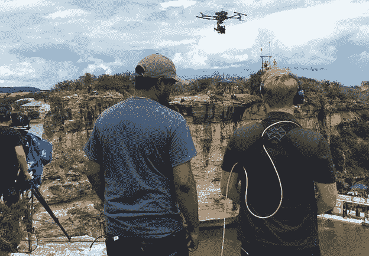
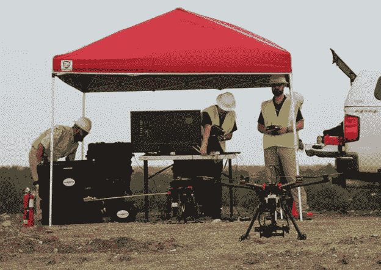

# 新规定推动了商用无人机行业的发展

> 原文：<https://web.archive.org/web/https://techcrunch.com/2016/08/05/new-rules-fuel-the-growth-of-the-commercial-drone-industry/>

弗兰克·瓦莱斯投稿人

More posts by this contributor

有了新的规定，将降低无人机商业运营的进入壁垒——这是时候了。联邦航空管理局(FAA)面临的挑战是建立一个规则框架，以监管小型无人驾驶飞机系统(小型 UAS 飞机或无人机)如何在美国空域安全使用，同时不影响基于无人机的创新技术解决方案的发展。

美国联邦航空局(FAA)最终发布了其新的规定([小型无人驾驶飞机系统的操作和认证](https://web.archive.org/web/20221128041624/http://www.faa.gov/regulations_policies/rulemaking/recently_published/media/2120-AJ60_NPRM_2-15-2015_joint_signature.pdf))，该规定将作为新的一节(第 107 部分)被添加到联邦航空条例(FAR)中，以允许无人机的安全商业操作。业内人士认为，联邦航空局(FAA)的最终规则将成功推动无人机技术在非娱乐性应用中的扩散。这给那些可能因为无人机行动的好处而中断的商业市场带来了巨大的刺激。

新的无人机技术和价格点的稳步下降加速了业余爱好者市场上无人机的爆炸性增长。业余爱好者可以使用小 UAS，只要他们的操作完全是出于爱好或娱乐目的，他们停留在离机场五英里的地方，停留在地面 400 英尺以下，并且在操作者的视线范围内。(爱好者应该自己查看联邦航空局的规定[这里](https://web.archive.org/web/20221128041624/https://www.faa.gov/uas/getting_started/fly_for_fun/)。)自 2015 年 12 月起，美国联邦航空局(FAA)规定，所有体重在 0.55 至 55 磅之间的小 UAS 车主必须在线[注册](https://web.archive.org/web/20221128041624/https://registermyuas.faa.gov/)。

娱乐性无人机的爆炸性增长激发了寻求在商业活动中利用无人机优势的企业的需求。摄像团队(如下面一场体育赛事直播中展示的无人机操作员的[特技飞行](https://web.archive.org/web/20221128041624/http://www.aerobo.com/)团队)试图利用无人机摄像机的视角拍摄各种直播、电影和电视电影。

房地产经纪人寻求使用无人机为他们的客户和潜在客户拍摄空中房地产照片。作物管理公司想用它们来测量他们的大片农田。紧急救援人员希望他们的救援行动得到支持。这些商业用途的进展受到空域使用规定和隐私问题的限制。

## 基于批准豁免的临时政策

意识到建立无人机商业使用的最终规则会有所延迟，美国联邦航空局在 2015 年初发布了一项针对商业 UAS 运营商的临时政策，这是对之前要求对每个商业 UAS 运营进行单独评估的流程的重大改进。该临时政策(与 2012 年美国联邦航空局现代化和改革法案第 333 节相关)允许企业申请豁免，允许他们在特定的非娱乐性低风险操作中在特定的参数下飞行小型 UAS，而无需政府的监督。

> FAA 对小型 UAS 商用无人机运营的最终规定预计将为无人机业务创造公平的竞争环境，并确保稳固的竞争。

到最终规则(第 107 部分)公布时，联邦航空局已经批准了 5000 多名无人机操作员的豁免，允许他们进行否则会被禁止的商业 UAS 飞行。虽然临时政策是一项重大改进，但一些限制严重损害了其效用。

最重要的限制是要求无人机操作员需要有美国联邦航空局颁发的飞行员执照(对于有人驾驶的飞机)。许多企业因此停滞不前，不愿意在预算有限的业务中雇佣有执照的飞行员。飞行员的要求很可能是服务机构蓬勃发展的一个因素，如[数据之翼](https://web.archive.org/web/20221128041624/http://www.usdatawing.com/)(下图显示的是准备执行空中任务，在垃圾填埋场进行空气取样和热检测)。

其他国家无人机运营商服务组织，如 [DroneBase](https://web.archive.org/web/20221128041624/http://www.dronebase.com/) 和 [Droners.io](https://web.archive.org/web/20221128041624/http://www.droners.io/) 扩大了他们的网络，而 [Skyward](https://web.archive.org/web/20221128041624/https://skyward.io/commercial-drone-software/) 为其全球无人机网络提供软件和对商业无人机运营商的支持。

## 第 107 部分:无人机商业运营的新规则

FAA 的小型 UAS 运行和认证规则(此处总结为)将于 2016 年 8 月 29 日生效，建立常规的民用运行和安全。来自业界的观点是，FAA 的最终规则将成功地推动无人机技术在非娱乐应用中的发展。这给那些可能因为无人机操作的好处而被打乱的商业市场带来了巨大的兴奋。

对企业来说，重要的变化是，新的第 107 部分规则取消了飞行员的执照要求(临时政策豁免的要求)，取而代之的是通过亲自参加书面的无人机特定航空知识测试获得的认证，旨在确保无人机操作员知道如何安全飞行。无人机操作员还必须通过 TSA 的审查，至少 16 岁，能够用英语交流，并且没有干扰安全飞行实践的身体或精神状况。

第 107 部分规则还规定了商业飞行 UAS 的要求，包括:

*   飞行高度低于地面 400 英尺(如果无人机保持在建筑物 400 英尺以内，则飞行高度更高)
*   仅在白天或曙光乐团目视视距内飞行(VLOS)
*   时速不到 100 英里

剩下的限制之一是，无人机操作员不能飞越任何没有直接参与行动的人——这对计划外的视频新闻报道来说可能是个问题。

因为联邦航空局没有规定 UAS 如何收集人或财产的数据，所以新规则没有解决隐私问题。然而，联邦航空局打算在 UAS 注册过程中包括隐私教育。他们强烈鼓励所有 UAS 飞行员在通过遥感技术或摄影收集信息之前，先检查当地和州的法律。

## 特殊应用的豁免

考虑到小型 UAS 技术正在快速变化，性能不断提高，技术不断创新，功能不断增加，Part 107 规则的一个关键条款是一个豁免机制，允许无人机操作员偏离某些操作限制，如果他们向 FAA 提供足够的证据，证明拟议的操作可以安全执行。第 107 部分的豁免部分包括:

*   移动车辆上的操作
*   非白天操作
*   超视距操作
*   对未参与人员的操作
*   在特定空域的操作

联邦航空局将进行一项基于风险的评估，评估他们是否认为申请人能够保持同等的安全水平。

随着豁免的增加，这些规则下有了很大的灵活性，这肯定会对无人机在不断增长的商业市场中的使用产生积极的影响。

## 商业应用

FAA 对小型 UAS 商用无人机运营的最终规定预计将为无人机业务创造公平的竞争环境，并确保稳固的竞争。无人机在广泛商业用途上的广泛整合已经开始，许多企业获得了与临时政策相关的豁免就证明了这一点。

无人机硬件和软件制造商比比皆是，因为不断增长的供应链生态系统已经在迎合早期采用者。许多公司现在提供基于视觉系统的空中商业服务。农业调查被视为无人机最有前途的商业应用之一。例如，下面由[无人传感系统](https://web.archive.org/web/20221128041624/http://www.unmannedsensing.com/)展示的六磅电动固定翼 UAS 是作物管理公司寻求执行空中农业检查(如作物压力评估)的交钥匙系统的一部分。

其他航空业务服务公司为能源行业进行管道和电力线勘测，为建筑行业进行保险评估和 3D 成像。

回顾[获得批准豁免的公司名单](https://web.archive.org/web/20221128041624/https://www.faa.gov/uas/getting_started/fly_for_work_business/beyond_the_basics/section_333/333_authorizations/)，大多数接受者计划将配备相机和其他传感器的无人机用于各种 B2B 应用，如精准农业、基础设施检查和测绘、电影和电视制作、新闻报道、房地产、保险和公共安全。无人机有望彻底改变这些行业，部分原因是它们提供了独特的空中视角。这将让他们以更低的成本和更低的风险做更多的事情，同时提高效率、改善安全性和缩短响应时间。许多参与者都是初创公司，尽管大型工业企业和国防供应商也在投资无人机技术。

无人机最著名的商业应用之一是包裹递送，这是由几位创新者(包括亚马逊和谷歌)提出的。亚马逊一直在推广将自导式无人机用于旨在 30 分钟内安全递送包裹的系统。虽然第 107 部分规则将允许涉及包裹递送的有限承运人操作，但一个主要警告是操作需要遵守视觉视线限制，这明确排除在豁免之外。感觉这个政策会显著限制无人机服务行业的增长。显然，联邦航空局正在采取措施制定允许超视距操作的标准，但这还没有实现。