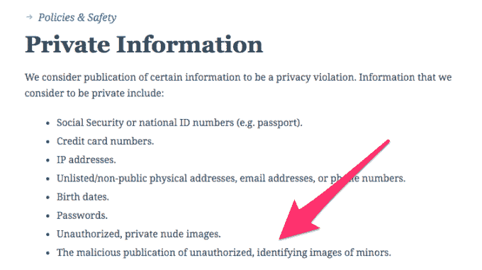

# WordPress.com 新政策允许其关闭否认桑迪胡克事件的博客

> 原文：<https://web.archive.org/web/https://techcrunch.com/2018/08/16/new-wordpress-policy-allows-it-to-shut-down-blogs-of-sandy-hook-deniers/>

根据受影响的博客所有者和读者的投诉，WordPress.com 已经关闭了一些博客，他们声称这些网站被从 WordPress.com 移除，尽管没有违反公司的服务条款。一些网站所有者也表示，他们没有提前得到关闭通知，已经丢失了他们的工作。我们了解到，删除的部分原因是 WordPress 推出了一项新政策，禁止博客发布*“恶意发布未经授权的未成年人识别图像”*

是的，没错:WordPress.com 背后的公司 Automattic 创建了一个新规则，专门处理桑迪胡克阴谋，并从其平台上驱逐他们。

虽然一些受影响的网站——包括一些极右[博客](https://web.archive.org/web/20230315100724/https://mediabiasfactcheck.com/fellowship-of-the-minds/)和那些浮动阴谋论——已经被标记为其他违规行为，但许多网站仍在托管桑迪胡克阴谋论和其他“虚假标记”内容。

在 YouTube [视频](https://web.archive.org/web/20230315100724/https://www.youtube.com/watch?v=cKxJ81aB5nA&feature=youtu.be)中，一个网站的主持人哀叹道，“他们抹去了我他妈的 11 年的生活。”然后，他通读了 WordPress.com 的服务条款，对自己的违规行为感到困惑。

根据谷歌的[缓存](https://web.archive.org/web/20230315100724/https://webcache.googleusercontent.com/search?q=cache:cGEhh4zuCFYJ:https://americaneveryman.com/about/+&cd=2&hl=en&ct=clnk&gl=us)，他的网站托管了 911“真相”内容，并且[声称](https://web.archive.org/web/20230315100724/https://webcache.googleusercontent.com/search?q=cache:838O8VmkjMUJ:https://americaneveryman.com/2015/06/11/why-i-changed-my-opinion-on-the-sandy-hook-shooting-psyop/+&cd=2&hl=en&ct=clnk&gl=us)桑迪胡克事件是一个有预谋的事件。这些观点对很多人来说都是令人反感的，但是他说这些观点并没有被 WordPress.com 禁止是正确的。

WordPress.com 政策更新之前，NYT 本周发布了一份谴责性报告，解释了世界上最大的博客服务[如何允许桑迪胡克阴谋论者继续在线](https://web.archive.org/web/20230315100724/https://www.nytimes.com/2018/08/13/business/media/sandy-hook-conspiracies-leonard-pozner.html)。

文章解释说，这个问题在一定程度上与 WordPress.com 的政策最初是如何制定的有关。

WordPress.com 的政策旨在更好地抵制将版权声明作为删除内容的策略。长期的网络老手知道他们是这样写的，因为他们是在大公司将著作权法——如[DMCA](https://web.archive.org/web/20230315100724/https://en.wikipedia.org/wiki/Digital_Millennium_Copyright_Act)——作为一种武器来迫使平台删除他们认为不利的关于他们公司的内容的时候创建的。

但近年来，这些政策的放任也为那些散布虚假信息、煽动仇恨和暴力以及在网络上发布辱骂和攻击性内容的人创造了漏洞。

由于没有其他可用的资源，一些桑迪胡克的父母利用版权法把他们孩子的照片从网上删除。

正如 NYT 所解释的那样，桑迪胡克小学枪击案受害者的父亲伦纳德·波兹纳(Leonard Pozner)向包括 WordPress.com 在内的许多平台提交了对他儿子诺亚(6 岁的桑迪胡克小学枪击案受害者)图像的版权索赔。脸书、亚马逊和谷歌满足了这些要求。但是 WordPress 回复了一封信函，解释了为什么这些内容可以留在网上。

波兹纳对该报称，这些回复“自动生成，非常普通”，而且“非常冷淡”，称阴谋论博客帖子代表了对材料的“合理使用”。它将合理使用定义为包括“批评、评论、新闻报道、教学、学术和研究”在内的任何东西。

令人难以置信的是，这些信件还警告波兹纳先生，它可能会因故意严重歪曲版权而向他收取赔偿金。

是的，Automattic 告诉一名被谋杀的 6 岁儿童的父亲，如果他不停止要求它删除那些认为桑迪胡克枪击案从未发生的人的令人反胃的内容，以及那些为失去孩子而悲伤的父母是演员，它可以向他寻求损害赔偿。

该公司告诉 NYT，语言是其使用的预定义声明的一部分，很抱歉在这种特殊情况下这样做。

然而，它也承认有问题的帖子没有违反任何现行的 WordPress.com 用户指南或版权法。

我们知道该公司已经打电话给波兹纳先生直接道歉。然后，它制定了一项新政策来解决这个问题。

它的新政策是:

该政策影响的是 WordPress 上的博客，而不是使用 WordPress 软件的自主博客。

合计起来，WordPress 为网上 31.6%的网站提供了动力，并拥有 60%的 CMS 市场，所以这一变化对整个网络有相当大的影响。

该公司拒绝对新政策发表评论。

如果被解雇的博主现在转向他们自己的托管网站，关闭这些网站的责任将落在网站托管公司身上。当然，不要指望这种情况会很快发生。

一些受影响的博客可能会声称他们的言论自由权受到了侵犯。他们错了。第一修正案保护美国人民免受政府审查或惩罚你的言论。它不能保护你的 Twitter 账户、脸书个人资料，现在也不能保护你的 WordPress.com 博客。

*更新:这篇文章在发表后被编辑，以纠正波兹纳先生姓氏的一个错别字。*