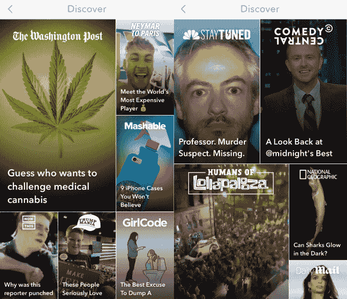

# 谷歌和脸书设想新闻报道，而不是社交报道

> 原文：<https://web.archive.org/web/https://techcrunch.com/2017/08/04/news-at-your-own-pace/>

故事告诉我们决定内容消费速度的快乐。我们以 10 秒为增量快进，当我们厌倦的时候，快速触发手指松开。这就是为什么很快，没完没了的文字段落和耗时的视频可能不是获取新闻的唯一方式。

本周，有迹象显示，脸书和谷歌都认为 Snapchat 的故事幻灯片格式可以很好地分享新闻。自 2015 年以来，Snapchat 为出版商提供了与青少年联系的 Discover 频道，但其相对较小的受众和仅移动格式限制了其吸引力和影响力。现在，新闻发行巨头们对故事的未来有着不同的梦想。

TechCrunch 首先报道说[脸书已经开始让公众人物分享故事给他们的追随者](https://web.archive.org/web/20221208010721/https://beta.techcrunch.com/2017/07/30/facebook-stories-public/)，不仅仅是朋友。虽然 Pages 还不允许制作故事，但这项功能已经允许个别记者将照片和视频串连起来，从现场或办公室制作身临其境的幻灯片。

我们还爆料说，脸书现在正在测试在桌面上观看[故事。它还在测试让你上线的](https://web.archive.org/web/20221208010721/https://beta.techcrunch.com/2017/08/03/facebook-begins-testing-stories-on-the-desktop/)[故事](https://web.archive.org/web/20221208010721/https://beta.techcrunch.com/2017/08/04/facebook-tests-going-live-from-facebook-camera-live-stories-like-instagram/)，这对于突发新闻发布者来说可能是有用的，如果他们可以访问的话。

与此同时，[华尔街日报](https://web.archive.org/web/20221208010721/https://www.wsj.com/articles/google-is-developing-technology-for-snapchat-like-media-content-1501868688?mod=e2twd)今天报道称，谷歌正准备很快推出“Stamp”，它结合了 Snapchat 的第一版 ories 格式和谷歌自己的加速版**M**mobile**P**ages。它将让新闻媒体分享出现在搜索结果中的照片、视频和文本的幻灯片，但也可以托管在出版商的网站上。

## 超越青少年的故事

脸书的更新似乎有点令人费解，考虑到批评家们已经批评脸书的故事是突兀和不必要的。脸书已经有了非常受欢迎的 Instagram Stories 和 WhatsApp Status 产品，它们都有 2.5 亿每日用户。

但是，如果你把脸书的故事看作是对 Instagram 新闻的补充，那就更有意义了。因为 Instagram 完全是关于视觉分享的，而且有长期禁止的故事之外的链接，它没有像脸书那样以其链接、趋势和即时文章成为新闻业的巨头。脸书可以向出版商开放故事，并希望他们的内容会使其故事更受欢迎，并吸引用户在那里分享他们的社交故事。

另一方面，谷歌似乎准备完全跳过过去的社交故事，专注于 Stamp。这可能是明智的，因为它在社交产品方面一直很糟糕，如失败的 Google+、Buzz 和 Wave，以及其支离破碎的消息应用程序。

[据报道，谷歌在 2016 年和今年首次公开募股前提出以 300 亿美元收购 Snapchat](https://web.archive.org/web/20221208010721/https://beta.techcrunch.com/2017/08/03/google-buy-snap/) ，商业内幕昨天报道。Axios 的 Dan Primack 和 TechCrunch 的一位内部人士也听说了谷歌对 Snap 的兴趣。然而，Snap 非常独立的首席执行官埃文·斯皮格尔没有表现出出售的兴趣，在 2013 年拒绝脸书 30 亿美元的收购要约后，Snap 的持续上升鼓舞了他。

随着谷歌在故事大战中越来越落后，Snap 也不热衷于结盟，依靠其在搜索和表面新闻方面的优势可以让它重返战斗。

如果这两个科技巨头能够推广这种新格式，他们可以吸引更多的出版商到他们的平台上，获得更多关于人们关心什么的数据，并在故事播放的任何地方提供更有利可图的视频广告。任何人都可以显示文本或主持视频。故事的技术要求可能会让出版商更加依赖硅谷进行内容分发。

如果这两个巨头鼓励更多的新闻编辑室制作新闻，Snapchat 甚至可能受益。一年前，它要求出版商建立一个 10 人的发现内容团队。如果他们有其他地方来放这些故事，那就不会显得那么疯狂了。如果 Twitter 不参与进来，它可能会被远远甩在身后。这是一个关键时刻。

## 拥有下一个新闻平台转变

脸书和谷歌都知道移动是内容消费的未来。这就是为什么他们不仅要竞争链接被发现的地方，还要竞争文章赖以生存的格式。脸书的即时文章和谷歌的 AMP 加载速度比传统的手机网页更快，所以很少有人在阅读文章和看到广告之前放弃它们。

然而，Instant Articles 和 AMP 主要是将桌面网络媒体移植到一个更时尚、更快捷的形式中。两者都不接受移动和移动时代固有的独特之处——更好的摄像头、更大的屏幕、更快的网络连接，最重要的是，更短的注意力持续时间。

如果你只是在旅途中寻找快速解决内容成瘾的方法，那么一堵文字墙并不是很吸引人。YouTube 风格的几分钟视频和电视广播新闻片段可能会令人讨厌，因为你需要声音和足够的时间来燃烧，因为价值往往被埋没在中间的某个地方。除了随意地擦拭，没有连贯的方法可以跳过视频。

故事解决了所有这些缺点。他们迫使新闻采用更加图形化的方式，文字被图像分割或覆盖，视频被尽可能简洁地剪辑。那些冗长、毫无价值的介绍被删除或压缩。字幕让无声的聆听变得更加容易。视频可以被分解成不到 15 秒的片段，一个想法一个想法，所以如果你对某些细节感到厌倦，你可以轻松地点击快进，跳到下一条相关的新闻。

此外，视觉沟通风格利用增强的摄像机、屏幕和连接向你展示新闻，而不是告诉你。唯一的问题是，今天的新闻编辑室是由作家和电视主播组成的，需要配备设计师和故事板作者来获得正确的内容。

看一个故事几乎不可能感到无聊，因为你完全控制了节奏。这对于观看你朋友的业余内容来说至关重要，他们可能会在展示有趣的东西之前自拍五张照片或一长串音乐会视频。但是，当出版商被新的分散我们时间的事物包围时，故事也可以用更华丽、无填充的风格重振新闻消费。他们只需要让我们来定节奏。