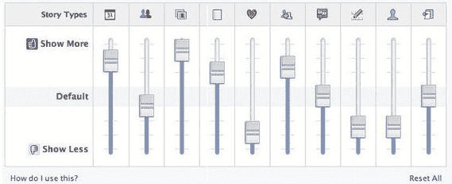

# 通过“新闻订阅设置”取消关注你最讨厌的脸书朋友和页面

> 原文：<https://web.archive.org/web/https://techcrunch.com/2014/11/07/news-feed-settings/>

面对现实吧。你接受了一些怪人和过度分享者的好友请求。幸运的是，今天脸书的[发布了一个新闻订阅设置工具](https://web.archive.org/web/20230404105147/http://newsroom.fb.com/news/2014/11/news-feed-fyi-more-ways-to-control-what-you-see-in-your-news-feed/),可以显示在你的订阅中占据最大空间的朋友和页面，并让你快速取消关注他们，而无需取消好友。还有一个新的流程，可以从你的订阅源中隐藏特定的帖子，让你告诉脸书，无论是作者，还是提到的人，页面或应用程序，你都不想看到，然后在必要时取消关注。

[脸书](https://web.archive.org/web/20230404105147/https://techcrunch.com/2014/04/03/the-filtered-feed-problem/)和[推特](https://web.archive.org/web/20230404105147/https://techcrunch.com/2013/10/05/sorry-my-feed-is-full/)都花了数年时间试图增加我们的社交图谱，提供关注谁的建议，即使这会稀释我们的订阅。然而，充满无聊或恼人帖子的订阅源是对社交网络的最大抱怨之一。最后，脸书正在与这种不相关的信息超载作斗争，即使这意味着帮助你屏蔽那些为你的喜好付费的品牌。

脸书的新闻订阅设置，大约在 2009 年

大约 5 年前，脸书有一套强大的滑块，你可以用它来调整不同类型的帖子在 feed 中的显示，比如照片、链接或关系变化。像我一样的一些铁杆用户喜欢它们，但“滑块的挑战是很难知道它们什么时候工作”,脸书新闻频道的 PM Greg Marra 告诉我。“我们不想让这种控制空间成为一件麻烦事。”他说，在复杂的强大设置和控制较少的简单设置之间取得平衡是“最难的部分”。这是脸书从对其令人困惑的隐私设置的强烈反对中学到的一件事。

因此，在滑动条和 2012 年对个人资料的控制以或多或少地查看某些人或他们的帖子类型之后，脸书决定使用一个非常简单的取消关注按钮。它可以让你和其他人保持朋友关系，而不必在你的订阅源中看到他们。你永远不知道什么时候友谊会派上用场，比如你正在旅行或找工作。切断联系对你没多大帮助。但让这些人静音对于保持新闻提要的趣味性至关重要。

在桌面主页上添加了新闻订阅设置书签，在 iOS 和 Android 应用程序设置菜单中添加了“管理新闻订阅”选项，你可以看到你可能想取消关注的最健谈的朋友、页面和群组的排名列表，以及你已经取消关注的事情的列表，以防意外或你希望它们回到订阅中。马拉告诉我，这应该会派上用场，因为他的女朋友曾经错误地不关注他。当然，格雷格。“误”。

在此之前，脸书的 Feed 设置只是显示了你未关注的人的字母列表，并不能帮助你将其他人发送到负面区域。

脸书的低效用新闻供稿设置直到今天

把人放在未关注名单中也快得多。当你在订阅源中看到一个令人讨厌的帖子时，你可以点击右上角的下拉箭头将其隐藏，这将告诉脸书在未来向你显示更少的类似帖子。但是现在你可以说是发帖的人，或者是他们发了一些你不想看到的东西。然后，如果你真的想把他们从订阅中驱逐出去，脸书会显示取消关注按钮。如果他们真的很混蛋，你可以举报他们虐待。

所以，现在是时候变得狡猾起来，剔除那些照片分享者、吹牛大王、戏剧大王和戏剧皇后以及链接分享上瘾者了。然而，可能讨厌这些新设置的一个群体是页面管理员。脸书从未像现在这样轻松地删除你多年来喜欢的品牌、乐队、名人和网站。那些留下来的可能会得到更多的参与，但是分享太多或者太自我推销的页面可能会被掩盖，从而损害他们的业务。

但是正如脸书首席执行官马克·扎克伯格昨天在他的[公开问答&中所说:](https://web.archive.org/web/20230404105147/https://techcrunch.com/2014/11/06/facebook-faq/)

> “尽管如此，这个体系中还是存在这种内在的冲突。当你阅读的时候，我们是否在努力优化新闻源，给每个人，你们所有人，最好的体验？或者，我们是在努力帮助企业接触尽可能多的人？在我们做出的每一个决定中，我们都为第一个做出优化，以便我们服务的使用脸书和阅读新闻订阅的人们能够获得最好的体验。”

脸书的设计不是为了把商业放在第一位，甚至不是为了把你所有的朋友放在第一位，这样你就可以看到他们所有的帖子。它以每个人为中心。因为如果脸书优先考虑其他事情，人们就会停止访问，没有人会关注他们的帖子。只要终端用户满意，至少有人会得到 13.5 亿人的关注。