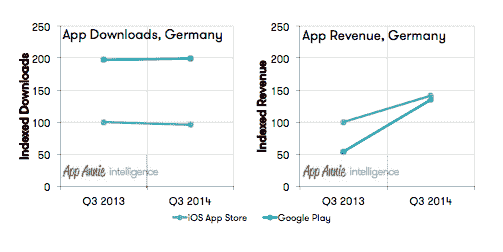
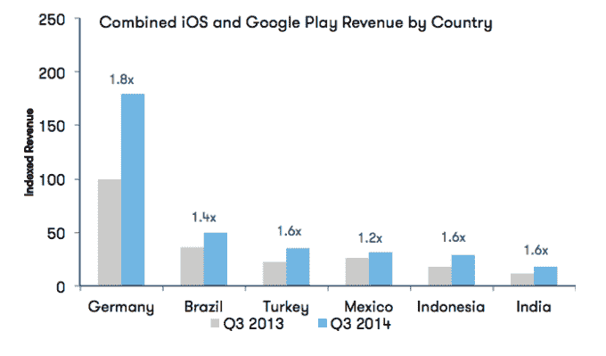

# App Annie TechCrunch 表示，巴西、印度尼西亚、墨西哥、土耳其和印度推动下一波应用增长

> 原文：<https://web.archive.org/web/https://techcrunch.com/2014/10/28/next-wave-app-growth-markets/>

# App Annie 表示，巴西、印度尼西亚、墨西哥、土耳其和印度正在推动下一波应用增长

移动应用分析公司 App Annie 和移动内容与商业协会 MEF 发布的一份新的[报告](https://web.archive.org/web/20221110160351/http://go.appannie.com/app-annie-mef-global-app-economy-q3-2014/?__hstc=45742459.aec3c54ff1f7320ec183a09d5002c52a.1414484775665.1414484775665.1414484775665.1&__hssc=45742459.1.1414484775665&__hsfp=4095068487)将巴西、印度尼西亚、墨西哥、土耳其和印度确定为应用发行商的下一个增长市场，这五个市场的应用下载率在 2013 年第三季度至 2014 年第三季度之间大幅增长。

巴西的应用程序下载量增长位居榜首，同期增长了 100%；其次是印尼，增长 70%；墨西哥和土耳其各占 60%;印度增长了 30%。虽然中国被认为是最大的增长市场，但同期中国的应用下载量仅增长了 10%。

在这些新兴市场，价格较低的 Android 设备获得了巨大的市场份额，应用程序下载率的上升推动了 Google Play 商店全球应用程序下载量的强劲增长。该报告指出，谷歌的 Play store 目前的应用下载量比苹果的 iOS 应用商店高出 60%(2013 年的报告显示，相比之下，Play 仅高出约 25%)。

报告显示，iOS 应用商店在应用收入方面继续占据主导地位，苹果应用商店的收入增长约 60%:

然而，该报告还深入研究了德国的应用收入表现，在德国，谷歌的 Play store 继续在下载量上领先，但也显示出更强劲的收入增长——在指数期结束时，几乎与 iOS 应用商店的市场收入持平。

该报告指出，这标志着一年前的“重大变化”，当时 iOS 应用商店的收入几乎是德国 Google Play 的两倍:

在所衡量的市场中，成熟市场的应用收入增长继续优于新兴市场，尽管后者的应用下载速度不断加快。

该报告发现，从 2013 年第三季度到 2014 年第三季度，在选定的市场中，德国的收入增幅最大(1.8 倍)，尽管其下载量保持稳定——该报告指出这种模式是“应用经济中更成熟市场的代表”。

因此，换句话说，在移动用户可用于付费应用的可支配收入较少的新兴市场，免费应用下载可能会推动大部分应用下载增长。

中国没有包括在这个收入图表中，因为报告指出，Google Play 在市场上不提供任何付费内容。然而，iOS 在中国的情况并非如此，该报告补充称，苹果应用商店今年在中国的收入大幅增长:

> 事实证明，中国对苹果的国际增长战略至关重要。苹果在 Q2 召开的 2014 年财报电话会议上报告称，包括零售额在内，苹果在中国的营收达到创纪录的近 100 亿美元。苹果还宣布了新 iPhone 6 和 iPhone 6 Plus 即将在中国上市。随着对 TD-LTE 和 FDD-LTE 的支持，中国的客户将能够访问中国移动、中国电信和中国联通的高速移动网络。观察新款 iPhone 在中国市场的影响将会很有趣。

该报告还指出，在跟踪期间，即时通讯应用的受欢迎程度也很高，报告指出，WhatsApp 的增长是由新兴市场的 Google Play 下载量推动的。当然，那个应用程序是在指数化期间被脸书收购的。