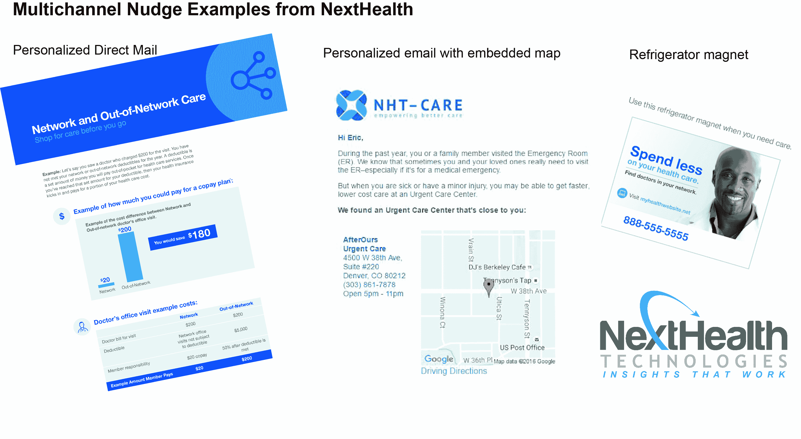

# NextHealth 从 Norwest 筹集 850 万美元以降低医疗成本 

> 原文：<https://web.archive.org/web/https://techcrunch.com/2016/08/18/nexthealth-raises-8-5m-from-norwest-to-drive-down-medical-costs/>

剩下的为数不多的普遍真理之一是医疗成本太高。保险公司在患者保护与平价医疗法案的压力下举步维艰，如果这意味着降低成本，他们愿意尝试几乎任何事情。

有了来自 [Norwest](https://web.archive.org/web/20221127015859/http://www.nvp.com/) Venture Partners 的 850 万美元的闪亮 A 轮投资， [NextHealth](https://web.archive.org/web/20221127015859/http://www.nexthealthtechnologies.com/) 将在未来几个月内做出降低美国保险公司医疗成本的确切承诺。

NextHealth 对保险公司的推销与 [OPower 对公用事业公司](https://web.archive.org/web/20221127015859/https://beta.techcrunch.com/2010/11/29/opower-series-c-50-million/)的推销非常相似。如果你能瞄准最有可能超支的客户，你就能产生效率，让整个生态系统赚钱。尽管 OPower 的崛起是由监管环境推动的，但 NextHealth 是由 ACA 的失败和保险业的固有属性支撑的。

该公司正在使用行为科学和预测分析的结合来预测特定的客户，在后 ACA 时代，只需改变一些相对简单的生活方式，就可以节省大量医疗费用。虽然未投保的美国人数量大幅下降，但新客户的涌入打破了该行业的许多传统预测模型。

Norwest Venture Partners 的普通合伙人卡斯帕·德·克勒克(Casper de Clercq)说:“保险公司对新成员的惊人损失感到非常惊讶，因为他们以前没有保险。

幸运的是，新患者的行为仍然遵循可识别的模式。例如，新英格兰医疗保健研究所的一份报告估计，美国患者每年在不必要的急诊室就诊上浪费近 380 亿美元。这些钱几乎足够给这个星球上的每个男人、女人和孩子一个墨西哥玉米煎饼碗。NextHealth 希望推动这些人养成更可持续的医疗习惯。

为了解决这个问题，NextHealth 必须将有效的目标定位与现有数据集的智能应用结合起来。该平台解析成员数据、人口统计数据、生活方式数据和地理空间数据，以挑选出具有成功干预可能性的特定个人。例如，一位年轻的母亲可能对急诊室没有什么经验。她可能听说过等待时间长，但觉得急诊室是下班后支持的唯一选择。一个温和的信息提示可以为她和她的保险公司省钱。

一旦 NextHealth 决定向前推进，就会制定针对具体病例的活动，包括电话、电子邮件、信件，甚至是冰箱磁铁，提供关于特定地点医疗保健选项的信息，如远程医疗和紧急护理诊所。为了确保干预的准确性，NextHealth 定期对对照组进行统计分析。到目前为止，25%的目标患者已经接受了这一建议，除了紧急需求外，放弃了急诊室。

NextHealth 的首席执行官埃里克·格罗斯曼(Eric Grossman)表示:“我们可以利用机器学习来了解什么有效，并轻松关闭什么无效。

常识告诉我们，索赔减少一美元意味着保险公司增加一美元的利润，但事实并非如此。保险公司被要求将收入的 85%用于索赔，并被限制在 15%以内，以支付管理费用和产生利润。然而，由于 NextHealth 被归类为运营费用，它被计入监管机构的前 85%的桶中。对于资金紧张、犹豫不决的保险公司来说，尝试这项服务是一件大事。

一旦合作开始，保险公司有两种选择。他们可以将 NextHealth 作为一项独立的服务使用，或者他们可以将对会员推广的完全访问权移交给 NextHealth。

NextHealth 目前正在与八家保险公司合作，其中一半选择给予该公司营销权，以换取以 2.5 倍的回报率返还费用的承诺。该公司在此过程中将其大约一半的费用置于风险之中，当保险公司获利时，该公司就会获利。

虽然该平台已经监控了大约 200 万名成员，但格罗斯曼仍在不断探索新的使用案例，比如有针对性的推广，以提醒人们进行癌症筛查。