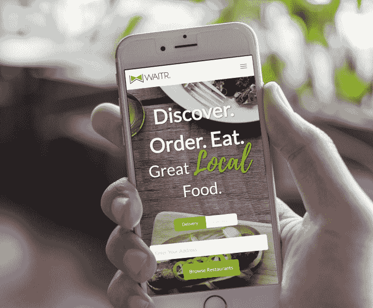

# NFL 的德鲁·布里斯支持 Waitr 让外卖在美国任何地方都变得容易

> 原文：<https://web.archive.org/web/https://techcrunch.com/2017/03/10/nfls-drew-brees-backs-waitr-to-make-takeout-easy-in-anytown-usa/>

美国有很多外卖初创公司，但很少有公司为“二线城市”和小城镇的顾客送货。从 Grubhub 这样的早期先驱到 DoorDash 这样的新服务，送餐业务往往集中在餐馆和经常点外卖的人高度集中的城市地区。

现在，新奥尔良圣徒队的四分卫、[慈善家](https://web.archive.org/web/20221209210540/http://www.drewbrees.com/)和天使投资人[德鲁·布里斯](https://web.archive.org/web/20221209210540/http://www.nfl.com/player/drewbrees/2504775/profile)正在支持一家名为 Waitr 的[初创公司，让外卖在大城市之外变得更加方便。Waitr 总部位于路易斯安那州的查尔斯湖和拉斐特，自 2014 年以来，一直在拉斐特、新奥尔良、阿拉巴马州的塔斯卡卢萨、加利福尼亚州的萨克拉门托和德克萨斯州的博蒙特等地将食物从餐厅送到顾客家中。](https://web.archive.org/web/20221209210540/https://waitrapp.com/)

Brees 已经投资创业公司大约五年了，他说:“Waitr 引起我注意的第一件事是它对我们公司之一 Walk-Ons Bistreaux 和 Bar 的影响。我们每个地方的销售额都增加了 10%或更多。随着我对这家公司的了解越来越多，我毫不怀疑它会成为送餐行业的领导者。”这位运动员兼投资者表示，与竞争对手相比，Waitr 被证明是“最快、最高效的交付系统”。

首席执行官兼创始人克里斯·莫(Chris Meaux)表示，Waitr 现在总共向四个州的 18 个城市送货，每周完成超过 50，000 份送货或外卖订单。该公司已经签署了白色桌布餐厅和大专营权一样。除了与 Brees 支持的跑龙套合作，Waitr 还与[Landry ' s Inc .](https://web.archive.org/web/20221209210540/http://www.landrysinc.com/)hospitality group[Buffalo Wild Wings](https://web.archive.org/web/20221209210540/http://www.buffalowildwings.com/?gclid=CMiJ49-0zNICFUxufgod9TQDSQ)等公司有业务往来。

*Waitr 是一款在 Grubhub 遗忘的城镇运营的送餐 app。*

Waitr 应用程序要求你选择你的城市，看看你附近的餐馆和美食列表，然后深入菜单下单。Waitr 雇佣自己的司机，这使得它有足够的人手在较小的城镇或需求高峰时履行送货订单，就像它在某些节假日和周末所做的那样。

他说，莫城为在海湾地区以及 Waitr 扩张的任何市场创造就业机会而自豪。到目前为止，该公司还一直在本地筹集资金。其最新一轮 1000 万美元的融资使 Waitr 的总资本增加到 1600 万美元。加入 Brees 的还有其他一些当地的天使投资人。

除了比竞争对手专注于不同的地理位置，Waitr 的应用程序提供了不同的用户体验。该公司派出一组摄影师到一家餐馆，并在平台上注册。他们给菜单上的所有东西拍照。“你用眼神点菜，”莫说。“我们的用户告诉我们，他们去的依据是照片，而不是描述。”

从长远来看，Waitr 也想改变在餐馆就餐的体验。“现在智能手机无处不在，人们应该能够通过移动应用程序将订单发送到厨房和他们的服务器，支付并在他们准备好的时候离开，而不是当服务员拿着记事本或支票过来时，这是有意义的，”莫解释道。

*Waitr 创始人兼首席执行官克里斯·莫。*

莫说，其他一些公司，如 [E La Carte](https://web.archive.org/web/20221209210540/http://elacarte.com/) 和 [Ziosk](https://web.archive.org/web/20221209210540/https://www.crunchbase.com/organization/ziosk#/entity) 可以通过特制的平板电脑从桌子上点菜，但 Waitr 希望避免餐厅堆满杂物和可能会出故障的硬件。

该公司将把部分资金用于地理扩张、招聘和营销。但它也将投资建设新功能，让在餐馆工作的人生活更轻松。“我们可以使用室内 GPS 和精确定位来告诉你这道菜需要放在哪里，而不是走到你的餐桌前问谁点了烤三文鱼。我们不仅可以使用人工智能为司机指引路线，还可以帮助餐馆预测他们预计会有多少人流量，以及什么菜可能卖得最好。”

根据麦肯锡 2016 年的一份报告，餐厅和快餐连锁店每年在全球范围内的销售额约为 880 亿美元，仅占餐厅食品销售额的 4%。行业研究人员预计在线食品订购将会增长，包括城市以外的地区。

Waitr 面临着来自 Groupon 旗下的 OrderUp 和其他食品配送应用的竞争，这些应用有资源扩展到大城市以外，从 T2 的 UberEATS 到 T4 的亚马逊 Prime T5。