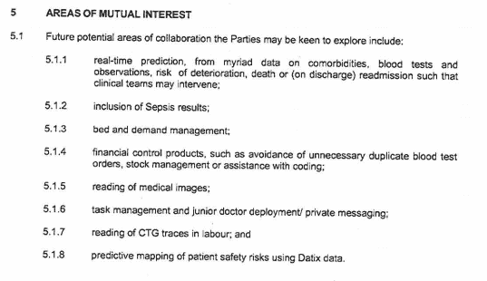

# NHS 备忘录详细介绍了 Google/DeepMind 将人工智能引入医疗保健的五年计划 

> 原文：<https://web.archive.org/web/https://techcrunch.com/2016/06/08/nhs-memo-details-googledeepminds-five-year-plan-to-bring-ai-to-healthcare/>

关于谷歌/DeepMind 将其算法手指深入医疗保健领域的雄心的广泛范围，已经出现了更多细节——包括希望在五年内将机器学习处理应用于英国国民健康保险制度的数据。

《新科学家》杂志获得了 DeepMind 和伦敦皇家自由国民健康服务信托基金(Royal Free NHS Trust)之间的一份[谅解备忘录](https://web.archive.org/web/20221208175752/https://drive.google.com/file/d/0BwQ4esYYFC04anR4VHM3aXZpMTQ/view)，该备忘录描述了两人所设想的“广泛、互利的伙伴关系，参与高水平的合作活动，并最大限度地发挥真正创新和转型项目的潜力”。

合作的预期利益包括临床结果的改善、患者安全和成本降低——后者是免费使用点的 NHS 的巨大持续压力点，因为对其服务的需求持续上升，而政府紧缩开支削减了公共部门的预算。

这份谅解备忘录列出了一长串“共同感兴趣的领域”,双方认为这些领域具有“未来潜力”,可以在备忘录设想的五年合作期内开展合作。该文件于今年 1 月 28 日签署，只有部分内容具有法律约束力。

未来合作的潜在领域包括开发医院支持系统，如床位和需求管理软件、财务控制产品以及初级医生的私人信息和任务管理。(在私人信息方面，NHS 工作人员非正式地使用 WhatsApp 等信息应用程序来快速分享信息[此前曾被认为](https://web.archive.org/web/20221208175752/http://www.independent.co.uk/life-style/health-and-families/health-news/health-apps-used-by-nhs-staff-putting-highly-sensitive-and-confidential-patient-data-at-risk-new-a6685226.html)会对患者数据保密造成风险。)

他们还表示，他们希望在实时健康预测方面进行合作——这是两人的第一项努力(一款名为 Streams 的应用程序)的重点——涉及一系列医疗保健数据，以试图确定患者病情恶化、死亡和/或再次入院的风险。

阅读医学图像，甚至在孕妇分娩时监测胎儿心跳也是其他感兴趣的领域。

以下是谅解备忘录的相关部分:

谅解备忘录首先提到了 DeepMind 构建“强大的通用学习算法”的能力。

它继续表示，DeepMind 与皇家免费 NHS 信托合作的希望之一是获得“在适当的监管和道德批准下的机器学习研究数据”。

两人表示，他们的第一个合作设计的应用程序 Streams 没有利用任何人工智能。事实上，它也不是由 DeepMind 创造的算法驱动的，而是由 NHS 编写的核心软件。

但谅解备忘录的范围表明，将机器学习应用于公共医疗数据正是雄心所在。

**针对为 Streams 应用提供个人身份数据的批评**

早在 2 月份，DeepMind 宣布它正在与皇家自由信托基金会合作——共同开发一款针对特定肾脏疾病的应用程序，名为 AKI。据说这款名为 Streams 的应用程序将提供“及时的信息，帮助护士和医生发现急性肾损伤病例”。

在那个阶段，谷歌旗下公司和皇家自由信托之间的数据共享协议的细节很少公开。但随后[曝出](https://web.archive.org/web/20221208175752/https://beta.techcrunch.com/2016/05/04/concerns-raised-over-broad-scope-of-deepmind-nhs-health-data-sharing-deal/)deep mind 被授权访问每年通过该信托的三家伦敦医院的 160 万名患者的大量医疗保健数据。

所述数据是患者可识别的(即，非匿名化、非伪匿名化)。根据协议，DeepMind 还可以访问该信托的三家医院过去五年的患者数据。

健康数据隐私组织 [MedConfidential](https://web.archive.org/web/20221208175752/https://medconfidential.org/) 等批评者质疑，为什么针对单一疾病的应用程序会共享如此多的患者身份数据。

“直接护理是病人和临床医生之间的事。医生采取措施防止他们的病人将来出现问题是直接护理。《医学机密》的萨姆·史密斯认为:“一个采取措施减少未知患者未来事件(如氟化)的组织就不是了。”。

皇家自由信托和 DeepMind 一直坚持认为，鉴于预测哪些患者有患 AKI 的风险很困难，访问如此广泛的数据对于 Streams 应用程序执行直接的患者护理功能是必要的。

他们还继续声称，该应用程序纯粹用于直接的患者护理，而不是用于研究。这是一个重要的区别，因为对患者可识别的数据进行研究可能需要他们获得额外的批准，如获得明确的患者同意或[第 251 条同意](https://web.archive.org/web/20221208175752/http://www.hra.nhs.uk/about-the-hra/our-committees/section-251/what-is-section-251/)(他们都没有获得)。

但由于他们声称这些数据没有被用于研究，他们认为这种批准是不必要的，尽管不可避免的是，数据被输入应用程序的很大一部分人永远不会直接从中受益。因此批评不断。

即使你考虑到预测 AKI 的医学不确定性——这可能意味着你需要广泛收集数据——问题仍然是为什么从未在医院进行血液测试的患者的数据被共享？这将如何帮助识别 AKI 的风险？

如果用例是用于即时和直接的患者护理，为什么每月发送一些数据？落在空档的病人会怎么样？他们是否面临“直接患者护理”效果不佳的风险？

在回应 TechCrunch 向其提出的一些关键问题时，皇家自由信托基金会再次声称该应用程序是为了直接护理患者——提供了以下声明来充实其推理:

> 我们的绝大多数住院患者都将接受血液检测，Streams 将监测每一位患者的肾功能是否有恶化的迹象，并在必要时提醒临床医生。
> 
> DeepMind 只能访问与检测 AKI 相关的数据。除了分析血液测试结果，该应用程序还允许临床医生查看可能影响治疗的诊断数据和历史趋势，从而支持有效和快速的患者护理。
> 
> 根据 HSCIC 的界面指南，必须使用患者的姓名、NHS 编号、MRN 和出生日期，以便临床医生能够明确识别患者。这将用于在医院内获得的病理结果之间进行比较。
> 
> 监测有发展为 AKI 风险的患者的 AKI 迹象，以便他们能够得到快速有效的治疗，这完全属于直接护理的定义。
> 
> 任何来我们医院的住院病人都至少有六分之一的机会发展成 AKI。为了使应用程序有效，这些数据需要存储在存储器中，以便在患者入院时进行处理。对于任何临床数据处理平台，存储数据都是很正常的，建议这些平台只保存当时正在接受治疗的患者的数据是毫无意义的。

鉴于 DeepMind 和 Royal Free 在谅解备忘录中规定的五年合作范围，谷歌旗下公司获得如此广泛的医疗保健数据似乎并不令人惊讶——因为两人预计未来将合作类似的广泛产品。

例如，如果您计划构建一个软件系统来预测三家繁忙医院的床位需求，那么访问大量住院数据(如入院、出院和转院数据、事故和急诊、病理和放射以及重症护理)显然对构建强大的算法至关重要。

这正是 DeepMind 根据与皇家自由基金会的 AKI 数据共享协议获得的数据。

然而，DeepMind 和 Royal Free 当然有必要获得谅解备忘录中设想的每个潜在用例的正确批准。

因此，除非双方之间有任何其他尚未宣布的数据共享协议，否则 DeepMind 目前可以访问的大范围个人身份医疗数据必须专门用于 Streams 应用程序。

双方的谅解备忘录还指出，将商定单独的条款来管理他们在每个项目上的合作。

“双方希望建立战略伙伴关系，探索技术和医疗保健的交叉领域，”它进一步指出，并描述了他们对“广泛合作关系的希望，目的是通过研究和相关的企业活动，推进工程、生命和医学领域的知识”。

**分享个人可识别的国民医疗保健系统患者数据**

当前处理和共享个人可识别的 NHS 患者数据的框架是在 Fiona Caldicott 于 1997 年进行的一次审查后创建的，并在 2013 年的第二次审查中进行了更新，因为人们担心患者保密性可能会因数据共享量的增加而受到破坏。

NHS 信托基金在决定分享个人可识别的患者数据(PID)时，应该考虑所谓的卡尔迪科特原则。最初有六个原则，都集中在尽量减少共享 PID 的数量，以努力减轻对患者隐私被破坏的担忧。

但第七个是在卡尔迪科特的第二份报告中增加的，该报告试图积极鼓励适当的数据共享，她描述为努力重新平衡框架与数据共享对患者的潜在好处。

最初的六项 Caldicott 原则规定:使用/传输患者识别数据应**合理**、**明确规定**和**仔细审查**，并定期审查使用是否继续；除非别无选择，否则不应使用个人身份数据**；使用**最少可能的**个人识别数据；对个人身份数据的访问应基于**严格的知情需要**；处理数据的每个人都**意识到他们对患者保密的责任**;个人身份数据的每一次使用都必须是合法的。**

第七项原则补充说:“**分享信息的义务可能与保护患者隐私的义务同样重要**”，Caldicott 写道:“卫生和社会护理专业人员应该有信心在这些原则规定的框架内分享符合其患者最佳利益的信息。他们应该得到雇主、监管机构和专业团体的政策支持。”

虽然第七项原则似乎为更广泛的数据共享协议打开了大门——如 Royal Free 和 DeepMind 之间的协议——但 Caldicott 在 2013 年 3 月对医疗数据的信息治理进行的审查确实特别指出，直接患者护理涉及特定个人的护理。

“只有与病人相关的信息才应该在专业人员之间共享，以支持他们的护理，”她写道。

而她的报告将“间接病人护理”描述为包括“有助于向全体人口或患有特定疾病的一组病人提供全面服务的活动”。

短语“一组患有特定疾病的患者”暗示了一个类似 Streams 的应用程序，该应用程序针对一种医学疾病，*可能*会基于此框架更明显地归类为“间接患者护理”。

根据卡尔迪科特的定义，健康服务管理、预防医学和医学研究都属于间接护理。

“活动的例子包括风险预测和分层、服务评估、需求评估、财务审计，”她在 2013 年的评论中补充道。

尽管 Caldicott 列举了直接与间接护理的例子，皇家自由基金会自己的 Caldicott 监护人 Killian Hynes 博士仍然声称对 Streams 应用程序构成直接患者护理感到满意，他是该基金会负责患者保密和适当数据共享的高级人员。

在提供给 TechCrunch 的一份声明中，海因斯说:

> 作为负责保护患者隐私并确保信息得到适当共享的高级信托临床医生，我广泛审查了信托和 DeepMind 之间的安排。
> 
> 我很满意 Streams 应用程序仅出于直接患者护理的目的处理患者数据，并且在安全的第三方服务器中存储加密患者数据的安排符合 Caldicott 原则和我们作为数据控制者的责任。
> 
> 这是一项开创性的工作，可以帮助我们识别和治疗我们医院中大量遭受急性肾损伤的患者。

皇家自由信托一再拒绝回答海因斯博士是否在任何患者数据被共享之前审查了与 DeepMind *的数据共享协议。*

该基金会只是表示，其数据保护官——代表基金会与 DeepMind 签署数据共享协议的人——做到了这一点。

如果信托公司自己的 Caldicott Guardian (CG)在与 DeepMind 共享数据之前没有审查如此广泛的数据共享协议，那么问题一定是为什么没有？鉴于《卡尔迪科特原则》也敦促在共享个人身份数据时对信托进行审查。

DeepMind/Royal 免费数据共享协议目前正在接受英国数据保护监管机构的调查，并根据少量公众投诉采取行动。

在本周提供给 TechCrunch 的一份声明中，ICO 证实正在继续调查这一安排。「我们正继续就此事进行调查。任何处理或使用人们敏感个人信息的组织都必须遵守《数据保护法》，“它说。

与此同时，[上个月](https://web.archive.org/web/20221208175752/https://beta.techcrunch.com/2016/05/18/uk-healthcare-products-regulator-in-talks-with-googledeepmind-over-its-streams-app/) TechCrunch 获悉，皇家免费临床医生不再使用 Streams 应用程序，该应用程序表示，到目前为止，它只进行了少量的“小用户测试”。

[上个月](https://web.archive.org/web/20221208175752/https://beta.techcrunch.com/2016/05/18/uk-healthcare-products-regulator-in-talks-with-googledeepmind-over-its-streams-app/)有消息称，英国药品和医疗保健监管机构 MHRA 已经联系了 Trust 和 DeepMind，开始讨论该应用程序是否应该注册为医疗设备。在试用 Streams 应用程序之前，MHRA 并未被告知。

还值得指出的是， [NHS 信息治理工具包](https://web.archive.org/web/20221208175752/https://www.igt.hscic.gov.uk/RequirementsList.aspx?sAssId=162418&rpprms=49979~False~8JE14~232~~False~False~False~False~False~&tk=424999242358961&lnv=3&cb=1b6158d4-69e9-43b9-94b9-0619c34495bb&sDesc=Version+13+(2015-2016))，是 DeepMind 在去年 10 月与皇家免费签署数据共享协议后完成的，是一个自我评估过程。

DeepMind 表示，它在这个 IG 工具包上获得了最高评级，NHS 为第三方组织提供了这个工具包，以根据其信息治理标准评估他们的流程。据 MedConfidential 报道，DeepMind 在 IG 工具包上的自我评分还没有经过 HSCIC 的审核。