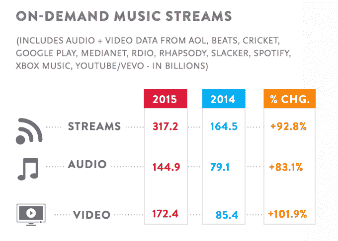
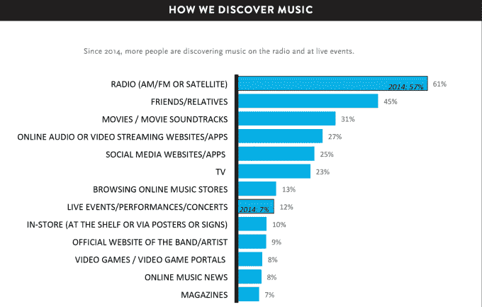
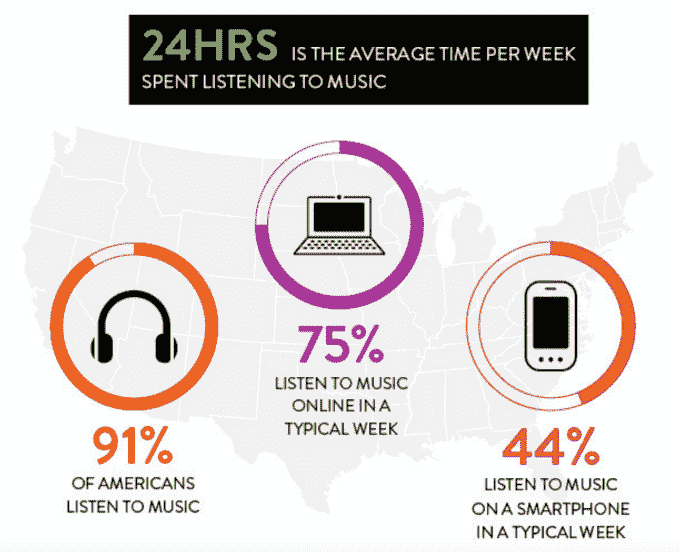
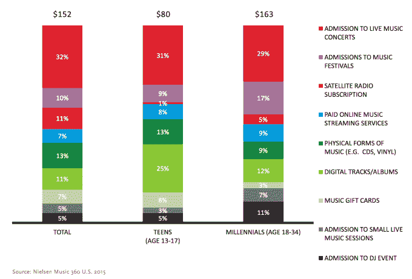
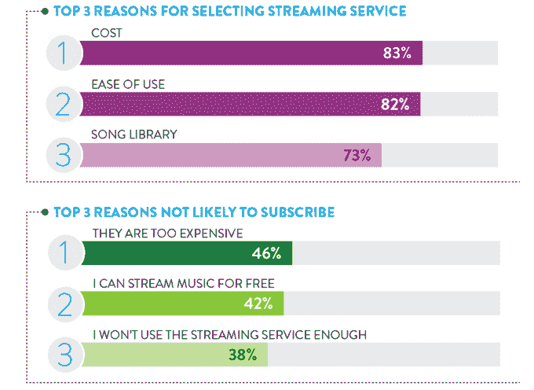
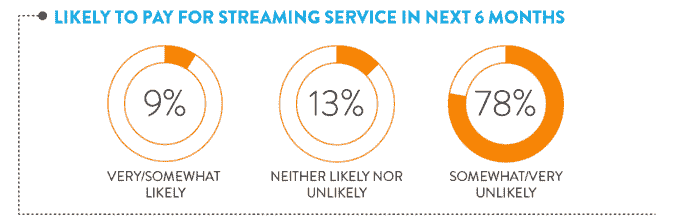

# 尼尔森:音乐流在 2015 年翻了一番，数字销售继续下降

> 原文：<https://web.archive.org/web/https://techcrunch.com/2016/01/07/nielsen-music-streams-doubled-in-2015-digital-sales-continue-to-fall/>

尼尔森的年终音乐报告 now 显示，2015 年是流媒体服务的好年景。尼尔森报告称，2015 年，点播流媒体服务增长至 3170 亿流，比 2014 年的 1645 亿首歌曲翻了一番。

同样有趣的是向流媒体的转变如何影响专辑销售。尽管 2015 年专辑销量仍下降了 6%，但这一降幅没有前一年下降 11%那么严重。

此外，黑胶唱片的销量在 2015 年有所增长。销售额增长了 30 %,几乎占实体专辑销售额的 9%。

当然，流媒体服务取代了许多传统专辑的销售，这也是整体销量持续下降的原因。

2015 年，由于流媒体的增长，数字音乐的销量也有所下降，2015 年下降了 12.5%，至 9.648 亿张，低于 2014 年的 11 亿张。

不过，数字专辑的销售并没有那么糟糕。去年，他们仅下降了 2.9%，至 1.033 亿，低于 2014 年的 1.065 亿。

好消息是“流等效”专辑增长了。根据 [Billboard](https://web.archive.org/web/20230320024110/http://www.billboard.com/articles/business/6835216/us-recording-industry-2015-streams-double-adele-dominates-nielsen-music) 的数据，2015 年流媒体歌曲的增加可以转化为 2.115 亿张流媒体等价专辑。(其方法涉及相当于一张专辑的 1，500 首歌曲流。)

这比 2014 年增加了 1.097 亿，同比增长近 93%。

值得注意的是，当尼尔森在一年中跟踪音乐流媒体时，它不只是专注于像 Spotify 这样的音频服务。相反，这家测量公司研究了各种音频和视频服务，包括 AOL、Beats(现为苹果公司所有)、Cricket、Google Play、Medianet、Rdio(现已被 Pandora 收购)、Rhapsody、Slacker、Xbox Music、YouTube 和 VEVO。

虽然总体而言，流媒体同比增长至 3172 亿流，但视频流增长更多。2015 年，音乐视频增长了 101.9%，达到 1724 亿流，而音频流增长了 83.1%，达到 1449 亿流。

然而，尽管流媒体的兴起，这些服务还没有取代广播成为人们发现新音乐的首选方式。相反，61%的人报告说他们首先从调幅、调频或卫星广播中听到歌曲；45%的人说是口碑带来了发现；31%的人在电影或音乐中听到歌曲；流媒体排名第四，27%的人说他们从流媒体网站或应用程序中了解到新歌。

除了各种流媒体指标，尼尔森的报告还从整体上审视了音乐消费。

在美国，消费者平均每周花 24 小时听音乐。在 91%听音乐的美国人中，75%的人表示每周都在网上听音乐，而 44%的人用智能手机听音乐。

与此同时，在音乐支出方面，音乐会(32%)和音乐节(10%)等现场音乐仍然占据了几乎大部分支出。卫星广播占另外 11%的支出，而付费流媒体仅占 7%，落后于实体销售(13%)和数字下载(11%)。

然而，在青少年和千禧一代(18-34 岁)中，付费流媒体的份额略高，分别为 8%和 9%。

当被问及消费者为什么选择订阅付费服务，或者选择不订阅时，成本似乎是一个很大的原因。83%的人说服务的价格是他们决定注册的首要因素，尽管易用性和歌曲库也非常重要。

当决定不订阅服务时，成本再次成为主要问题，46%的人说如果服务太贵他们不会订阅。另一个值得注意的因素是，许多消费者发现他们可以免费播放音乐，而看不到付费的好处。

这表明流媒体服务需要提供的不仅仅是点播目录。它们也应该是一个用户可以了解新音乐和艺术家的地方，就像 Spotify 通过其“发现周刊”播放列表提供的内容，以及 Apple Music 通过其“Beats 1”广播提供的内容。流媒体服务可能还需要专注于让粉丝更好地与艺术家联系，购买音乐会门票或商品，并提供在线社区或其他音乐相关内容。

似乎许多消费者仍然需要说服——78%的人表示他们不太可能在未来 6 个月内为流媒体服务付费，而只有 9%的人表示他们可能会付费。

尼尔森的报告中有很大一部分也关注了阿黛尔在 2015 年的成功。在短短六周的时间里，今年迄今为止的专辑销量超过 740 万张，阿黛尔和她的专辑《25》是今年最大的音乐故事之一。但值得注意的是，阿黛尔和泰勒·斯威夫特(Taylor Swift)等其他主要明星正在定义一个新的艺术家类别——那些大到足以避开流媒体服务的艺术家。[阿黛尔今年没有将她的专辑提供给点播流媒体服务](https://web.archive.org/web/20230320024110/https://techcrunch.com/2015/11/19/dont-do-it-adele/#.s2agxy:kucd)，包括 Spotify、Apple Music 或 Deezer。

此前，斯威夫特[在流媒体服务上拒绝了](https://web.archive.org/web/20230320024110/https://techcrunch.com/2015/06/21/free-are-never-getting-back-together/)《1989 》,直到后来在 Apple Music 上发布——但这是在她利用自己的影响力[让苹果在 Apple Music 的免费试用期](https://web.archive.org/web/20230320024110/https://techcrunch.com/2015/06/21/apple-music-free-trial/#.s2agxy:YZNa)向艺术家支付费用之后。

尼尔森的完整报告可在网上[获得](https://web.archive.org/web/20230320024110/http://www.nielsen.com/us/en/insights/reports/2016/2015-music-us-year-end-report.html)。