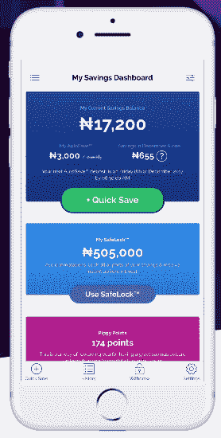
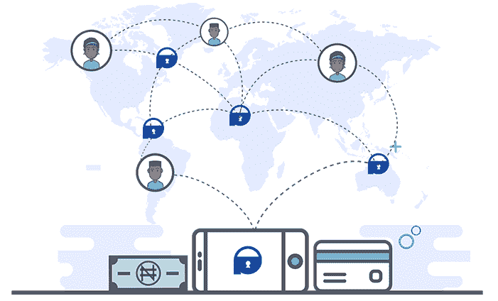

# 尼日利亚 Piggybank.ng 宣布推出集团投资产品，融资 110 万美元

> 原文：<https://web.archive.org/web/https://techcrunch.com/2018/05/31/nigerias-piggybank-ng-raises-1-1m-announces-group-investment-product/>

杰克·布莱特是一名作家、作者和顾问，关注全球商业、政治和技术。

从 2017 年到 2020 年，他是 TechCrunch 的特约作家和顾问，在那里他发表了关于非洲、流动性和政治的文章。Bright 帮助推动了对非洲的持续报道，并共同制作了非洲的第一个创业战场竞赛，以及专注于扰乱旧金山主舞台的非洲节目。

布莱特的第一本书《下一个非洲》(Macmillan 2015 年出版)预测了非洲风险投资创业的兴起。在此之前，他在 DC 的华盛顿从事国际金融工作，并担任演讲稿撰写人。Bright 继续在 TechCrunch 上偶尔发表客座文章。

More posts by this contributor

尼日利亚投资初创公司 [Piggybank.ng](https://web.archive.org/web/20230315051101/https://www.piggybank.ng/) 寻求进入非洲的非正式储蓄团体，获得了 110 万美元的种子资金，并宣布推出新产品——Smart Target，为西非常见的*esu su或 *Ajo* 团体储蓄俱乐部提供更安全、更高回报的选择。*

此次融资由 [LeadPath Nigeria](https://web.archive.org/web/20230315051101/https://www.crunchbase.com/organization/leadpath-nigeria) 承诺的 100 万美元牵头， [Village Capital](https://web.archive.org/web/20230315051101/https://vilcap.com/) 和 [Ventures Platform](https://web.archive.org/web/20230315051101/http://www.venturesplatform.com/) 各出资 5 万美元。

Piggybank.ng 成立于 2016 年，主要面向中低收入的尼日利亚人提供在线储蓄计划，每天、每周、每月或每年进行小额存款。没有前期费用。

Piggybank.ng 的 Somto Ifezue 在拉各斯与联合创始人 Odunayo Eweniyi 和 Joshua Chibueze 一起告诉 TechCrunch，根据投资的类型和期限，储户可以获得 6%至 10%的利率。

用户需要在 PiggyBank.ng 的银行合作伙伴那里拥有一个账户才能使用这些产品。这家初创公司(主要)通过投资尼日利亚政府证券(如债券和短期国库券)为小规模储户创造回报。

PiggyBank.ng 通过资产管理以及其余额在合作银行产生的浮动产生收入。

这家初创公司希望在尼日利亚年轻人和该国非正式储蓄团体中发展客户。

“我们试图服务的市场主要是千禧一代市场，尽管我们不排斥任何人，”该公司首席运营官 Eweniyi 说。该公司还希望满足尼日利亚对无障碍投资选择的需求，称他们进行的一项调查表明，这是可自由支配收入人群的首要任务。

“Piggybank 提供储蓄，但我们的愿景不仅仅是储蓄，而是成为一个整体平台——一个金融仓库——其他金融提供商可以在这里为 piggy bank 用户提供服务，”Eweniyi 说。她列举了银行、投资公司、保险和养老基金作为可能的合作伙伴。

该公司目前有 5.3 万名注册用户——其中 60%是尼日利亚千禧一代——根据一份新闻稿，自 2016 年以来，他们已经储蓄了超过 500 万美元。

PiggyBank.ng 将把 110 万美元的新种子资金用于“许可证获取和产品开发”

这家初创公司已经采取初步措施在其他非洲国家(特别是肯尼亚)推出产品，但不能提供确切的细节。

据首席运营官·埃维尼说，团体将能够通过 PiggyBank.ng 的应用程序选择储蓄选项和目标，并通过他们的个人银行账户接收自动支付的回报。

至于该公司如何向储户保证它不会成为另一个庞氏骗局，Piggybank.ng 及其主要投资者指出，这家初创公司正在尼日利亚央行申请银行牌照。该公司正在获得小额金融银行牌照，LeadPath Nigeria 创始人奥卢米德·索永博在与 TechCrunch 的电话中证实了这一点。他还指出，Piggybank 的客户余额存在注册银行，受到尼日利亚自己的 FDIC 类型的银行保险的保护。

Soyombo 将在 Piggybank.ng 的董事会中担任一个角色，他希望看到他们为个人在该平台上投入资金开辟新的选择。“代理网络业务是我们计划涉足的一个大领域。他们基本上已经变得像人类的自动提款机，”索永博说。他提到了尼日利亚数字支付公司 [Paga](https://web.archive.org/web/20230315051101/https://www.crunchbase.com/organization/paga) 和 [Safaricom 的 M-Pesa](https://web.archive.org/web/20230315051101/https://techcrunch.com/2018/04/30/safaricom-rolls-out-bonga-social-networking-platform-to-augment-m-pesa/) 的大型代理网络站，客户可以在那里用现金支付数字账户。

虽然数字支付产品已经在非洲的某些地区流行起来，但电子贸易类型的公民投资平台尚未形成任何规模。

Soyombo 认为 Piggybank.ng 还没有从固定收益投资转向股票。“也许未来股票会是一个有趣的玩法，但不是现在。人们目前正在寻找一个更无风险的地方进行电子交易，”他说。

Soyombo 认为 Piggybank.ng 有潜力成为收购目标。

“它们通常只发生在我们有两个主要参与者的市场:银行和电信公司，”他说。“银行在储蓄领域尝试新事物的速度一直很慢。Piggybank 正在进入……并满足一种特殊的需求，因此他们处于一个非常渴望获得的领域。”