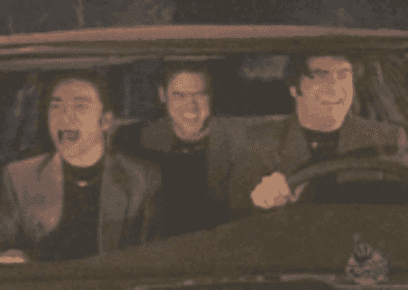

# 《洛克勒斯之夜》让你对“什么是爱”的摇头晃脑又有趣了一会儿 

> 原文：<https://web.archive.org/web/https://techcrunch.com/2014/10/01/night-at-the-roculus-makes-bobbing-your-head-to-what-is-love-funny-again-for-a-minute/>

# 《罗克吕斯之夜》让你对“什么是爱”的摇头晃脑又有趣了一分钟

90 年代可能结束了……被塞在车库里的盒子里的弹簧圈，被剃掉的碗剪，被扔掉的肮脏的大麻项链……

但是我们有虚拟现实。我们可以重建它。很明显，我们从重建罗克斯伯里之夜的汽车后座开始。

正如 *Ready 玩家一号*预测的那样，虚拟现实最受欢迎的早期用途之一是重现流行文化中的场景和环境，将它们从你*观看的东西*转化为你*体验的东西*。想逛一逛浮华、[超级粗糙版的南方公园](https://web.archive.org/web/20221206222029/https://beta.techcrunch.com/2014/07/03/south-park-now-in-virtual-reality/)？当然可以！想[逛逛宋飞的公寓](https://web.archive.org/web/20221206222029/http://jerrysplacevr.com/)？好吧！

而现在…

【YouTube https://www.youtube.com/watch?v=Sx4BGwc0LVY&w=640&h=390]

想要更多的乐趣，请访问项目网站，书中几乎所有糟糕的 90 年代网页设计陈词滥调都有客串。