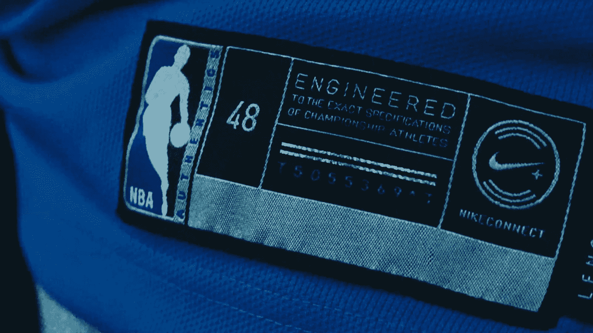
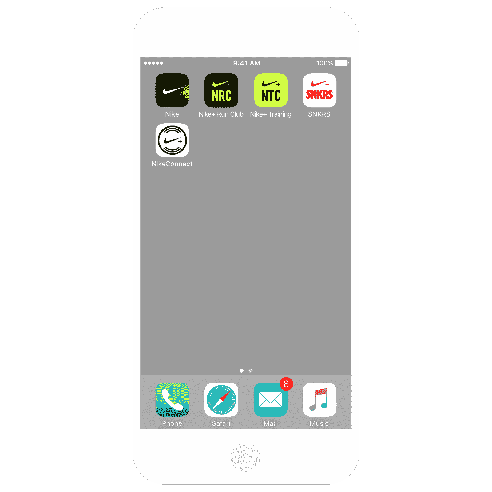
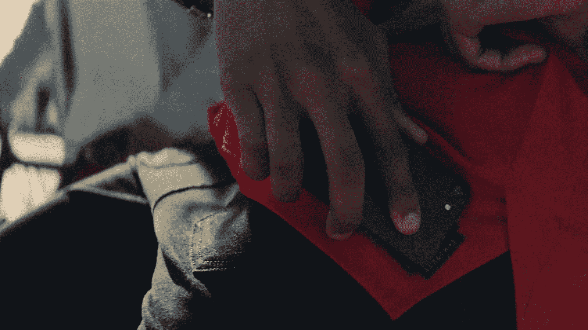
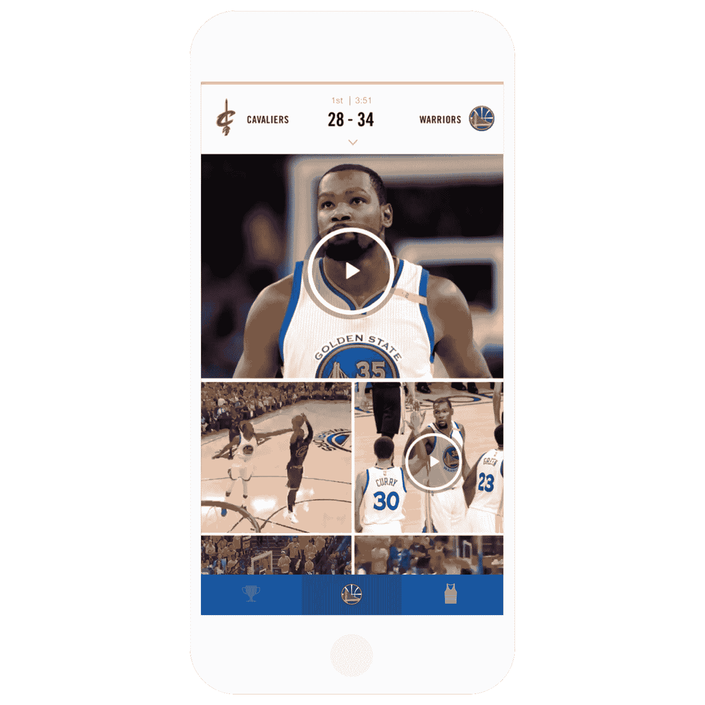
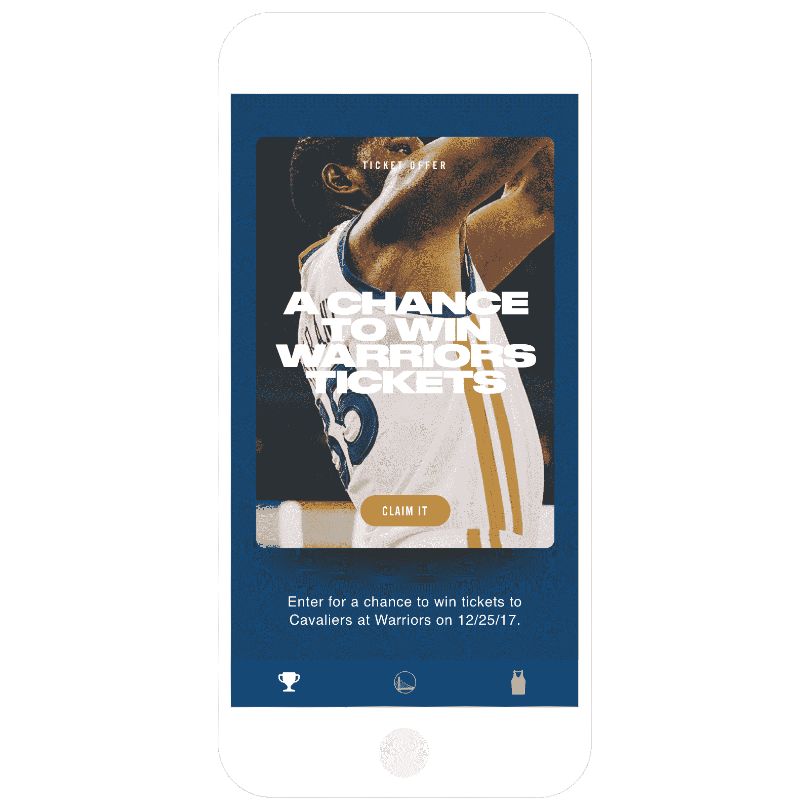

# 耐克和 NBA 推出互联球衣...它们超级酷

> 原文：<https://web.archive.org/web/https://techcrunch.com/2017/09/15/nike-and-the-nba-unveil-connected-jerseys-and-theyre-super-cool/>

https://www.youtube.com/watch?time_continue=2&v=E60ryjNqkZQ

耐克刚刚宣布了“Nike NBA 球衣与 NikeConnect”，这是一款联网球衣，允许穿着者通过手机点击球衣标签，获得他们最喜爱的球员和球队的精彩片段、比分、统计数据和独家内容。

看起来真的真的真的真的很好(不出意料)。

新款球衣将于 9 月 29 日在全国各地的商店推出，这是耐克与 NBA 合作的成果，耐克是 NBA 球衣和制服的独家供应商。

该公司承诺，通过在运动衫和耐克鞋的标签上点击 NikeConnect 标志，人们可以在指尖获得大量内容。

当然，获得所有这些东西的第一步是购买球衣，任何人都可以通过点击[耐克的 NBA 网站](https://web.archive.org/web/20230307014704/https://www.nike.com/us/en_us/c/nba)、[NBA 官方商店](https://web.archive.org/web/20230307014704/http://nbastore.com/)，或者任何耐克商店或官方球队商店来购买。NikeConnect 徽标方便地显示在标签上。

一旦设备到手，就可以获得该应用程序——该应用程序可用于具有 NFC 功能的 Android 小工具和支持 iOS11 的手机(iPhone 7 及以上)。

启动应用程序后，将智能手机轻触球衣底部的标签，瞬间改变——任何粉丝的指尖都有一个内容世界。

一旦用户使用 NikePlus 帐户完成登录，粉丝将被引导至一个页面，该页面会祝贺用户使用他们选择的球衣图像成功登录。轻按球衣即可访问独家视频，如赛前到达视频和精彩视频套餐…点击比赛日标签还可享受独家优惠。

在被引导到应用程序中的“团队”标签后，球迷们会看到一个屏幕，上面有一个赛前倒计时的状态栏，可以显示比赛中的比分或赛后的最终比分。它还包括球队下一场比赛的时间和球员统计信息。

团队反馈包括场内场外的精彩片段和恶作剧，以及可分享的图片和 GIFS。

应用程序用户还可以获得特殊优惠，如未来游戏日的“即将到来的奖励”。它们包括独家授权产品、NBA2K18 推广、比赛门票、运动员的 Spotify 播放列表等等(耐克承诺)。

而对于中国的观众来说，只需在线接入 QQ 音乐和 2K 即可。

总而言之，这是一件相当大的事情，指明了当怪物品牌同意合作时，互联体验可能会是什么样子。

整合看起来很棒，获得实际独家优惠的机会应该足够吸引人，让人们在耐克创造的平台上保持活跃。

最终，耐克似乎开辟了另一条主宰运动服装的道路。