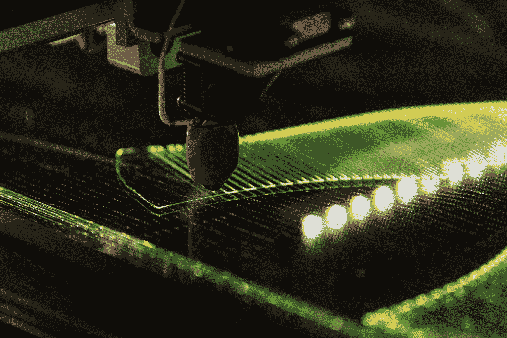

# 耐克的 Vaporfly Elite FlyPrint 大力融入计算设计

> 原文：<https://web.archive.org/web/http://techcrunch.com/2018/04/17/nikes-vaporfly-elite-flyprint-leans-hard-into-computational-design/>

计算设计是目前制造业和 3D 打印领域最热门的词汇。它正在改变人们制造各种商品的方式，耐克用它来设计和制造其新的 Vaporfly Elite FlyPrint 鞋，并于今天宣布。

这款鞋是其 Zoom Vaporfly Elite 4%的特别版，精英运动员埃鲁德·基普乔格在耐克的突破活动中使用过这款鞋，该活动创造了有史以来最快的马拉松比赛。这个版本中的特殊酱料是 FlyPrint 鞋面，它是由专门定制的 3D 打印机从专有的 Nike 聚合物中打印出来的。

我与耐克跑鞋产品线经理布雷特·霍尔茨(Brett Holts)和耐克 NXT 数字创新部门高级总监罗杰·陈(Roger Chen)讨论了这一过程和这款鞋。

这种材料以专门为特定运动员设计的图案打印出来，并附着在大肆宣传的 4%模型的 Zoom X 泡沫中底上。这一过程被耐克称为 FlyPrint，与耐克另一个著名的“飞行”过程 FlyKnit 有一些相似之处，因此得名。陈说，印刷过程很像给材料上色。

我看到的 pre-lass 鞋面看起来很像普通的蝴蝶鞋面，具有你习惯于从织物或其他聚合物鞋面材料中看到的同样的灵活性。这不是一种硬壳的 3D 打印材料，而是一种织物。鞋的几个部分仍然由 FlyKnit 制成，包括鞋舌和鞋领，这一事实加强了这一点。那些部分在化学成分上如此相似，以至于不需要用胶水把它们粘在一起。相反，FlyPrint 材料与 FlyKnit 无缝结合，形成了更坚固、更轻便的一体式设计。

消费产品中的计算机辅助设计过程有着悠久的历史——但计算设计是这一概念的演变，最近开始随着生产就绪的 3D 打印过程而获得动力，如 Carbon 的 M 系列数字光合成打印机和 [Desktop Metal 的](https://web.archive.org/web/20230314064149/https://techcrunch.com/2017/07/18/desktop-metal-gets-115-million-in-funding-to-deliver-metal-3d-printing-for-manufacturing/)生产系统。计算设计背后的指导力量是，你将参数和物理属性输入到一个模型中——基本上是限制和期望的结果——并获得对人类来说不可能或极其耗时的设计。

在新的 FlyPrint 鞋面的情况下，约束是材料的属性和基普卓格的脚施加在该材料上的力。有了这些数据，再加上聚合物的化学成分，一个计算模型就可以让耐克在一个比 FlyKnit 更精细的层面上调整支撑、弹性、加固或放松的设计。

例如，如果基普卓格觉得他需要更多的足弓区域的支撑，团队可以调整那个区域的度量，产生一个更紧凑的菱形网格。在 FlyKnit 世界(以及大多数针织跑鞋的世界)中，这是通过创建各种面板来实现的，这些面板反映了鞋的该部分的特性，并将它们粘合或缝合在一起，从而增加重量并降低强度。

现在，Nike 可以一次打印出完全定制的鞋面，将其与 FlyKnit 无缝融合，以提高舒适度。

所有这些的结果是，这款鞋非常轻。从 11 克，或者说 6%的减重开始。除此之外，基普卓格与柏林的蒸汽飞机精英们之间的一个大问题是雨中的水分滞留。鞋子一开始很轻，但水渗入了 FlyKnit，无法完全排出。FlyPrint 鞋面几乎半透明，多孔，解决了排水问题。

陈说，说他“感觉像在飞”，因为他能感觉到脚上的风。

霍尔特指出，FlyPrint 的另一个巨大优势是速度。耐克能够在短短 4 个月内设计和制造鞋子的每一个迭代，直到最终的模型。作为一个参考框架，通常需要 9 个月到一年的时间才能让一只鞋离开地面。

霍尔茨说:“我们(用 FlyKnit)永远无法做到这一点，我们在 24 小时内满足了运动员的需求。”

考虑到肯尼亚的时差，与基普卓格交换反馈并根据他的要求进行更新的这一整天的循环是通过使用 FlyPrint 流程实现的。

此外，该过程的建模组件允许 Nike 通过各种尺寸来缩放鞋子，同时保持每个部分的材料与负空间的适当比率。

耐克正在使用一种被称为固体  沉积建模的成熟 3D 打印工艺，基本上是用生产就绪的材料在表面上绘制形状，但陈说，该工艺的专有组件在于如何驱动打印机来放置 FlyPrint。两家公司都没有透露耐克使用的是什么打印机，但都提到了该公司“入侵”制造工具来完成工作的历史。作为一个行业说明，Stratasys 是这种印刷类型中比较成熟的参与者之一，拥有自己的专有工艺，称为 FDM 或熔融沉积成型。

正如我们所说，计算设计和生产就绪的 3D 打印正在改变鞋类。阿迪达斯和 Carbon 专注于中底在时尚和篮球领域，耐克正在为精英跑步者重塑鞋面。但真正的亮点可能不是速度或定制——这两个都是重要的进步。

相反，它可能是设计过程被压缩到与制造过程直接匹配的方式。这有可能改变的不仅仅是鞋类，而是每一种产品。产品设计师第一次能够直接掌控生产过程，而不是漫长而昂贵的注塑或铣削过程，通过使用强大的反馈回路实现不可能的设计和目标，该反馈回路将设计师、材料和过程包含在一个数据流中。

https://www.youtube.com/watch?v=RFW35vTTGQI

Vaporfly Elite FlyPrint 是一款专为精英跑步者设计的产品，其中少量产品将很快在伦敦的一次活动中推出，也将出现在基普卓格和其他耐克跑步者的脚上。但是，鞋子(和其他产品)的制造方式将会发生划时代的转变，这是这种转变的先兆之一。注意了。

更正:之前的版本错误地将鞋子的重量列为 12 克。它重 11 克。这个故事是用正确的信息更新的。