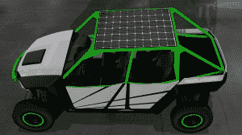

# 尼古拉汽车公司推出其电动(主要)卡车

> 原文：<https://web.archive.org/web/https://techcrunch.com/2016/05/19/nikola-motor-company-unveils-its-electric-mostly-truck/>

# 尼古拉汽车公司推出其电动(主要)卡车

对于货运创新来说，这是一个重要的月份。除了 [Otto 的](https://web.archive.org/web/20230403035443/https://techcrunch.com/2016/05/17/otto-founded-by-ex-googlers-is-bringing-self-driving-technology-to-trucks/)自动驾驶卡车公告，还有 [Nikola Motor Company 的](https://web.archive.org/web/20230403035443/https://nikolamotor.com/)电动长途钻机概念的发布。Nikola One 被称为“6×6 全轮驱动”，带有 800 伏交流电机和所有车轮的再生制动。与大多数卡车的 400-500 马力相比，它拥有巨大的 2000 马力。

它还有一个可以容纳 150 加仑压缩天然气的油箱，可以为一个为 320 千瓦时锂离子电池组充电的涡轮机提供动力。这个想法是司机不必停下来充电；CNG 加再生制动将能够驱动卡车行驶 1200 英里。这类似于[雪佛兰 Volt](https://web.archive.org/web/20230403035443/http://www.chevrolet.com/volt-electric-car.html) 的工作原理，油箱给电池充电。Volt 和 Nikola One 都是电动汽车，因为电池产生的电力驱动车轮，但电池通常由车载发电机或涡轮充电。

这不是尼古拉汽车公司与另一家公司的唯一相似之处。你可能已经注意到它使用了发明家尼古拉·特斯拉的名字；姓氏已经被使用。NMC 毫不掩饰对特斯拉汽车公司(Tesla Motors)的钦佩，但特斯拉从一辆小型跑车开始，向中型轿车发展，而 NMC 正从等式的反面——也是更大的一面——着手解决问题。它在其网站上暗示未来将有更多汽车进入其他市场，但 NMC 很可能希望在解决乘用车之前让 [Nikola One](https://web.archive.org/web/20230403035443/https://nikolamotor.com/one) 上路。

尼古拉零渲染

对于那些还没有准备好花 1500 美元预订一辆价值 35 万美元的电动牵引拖车的人，NMC 还宣布了一款沙滩车风格的 4×4 越野车，名为 [Nikola Zero](https://web.archive.org/web/20230403035443/https://nikolamotor.com/zero) 。预订价格为 750 美元(42，000 美元建议零售价)，你可以排队购买 520 马力的全电动防水驾驶。Zero plugs in 像大多数电动汽车一样为 440 伏锂离子电池充电，而不是使用 CNG 和涡轮，尽管它在车顶上有太阳能电池板为 12V 电池供电。

虽然 NMC 的网站上公布了这两款车的大量规格和数量，但它们都没有交付日期。此外，这些交通工具还不存在于现实世界中——至少不是以 NMC 可以用来拍照的形式。到目前为止，唯一的一个和零的图像是数字渲染。我们将会看到一份完整的统计列表是否足以筹集到将这些车辆从 CAD 投入现实世界所需的资金。