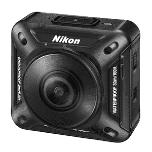
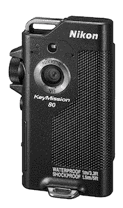
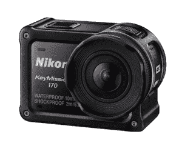

# 推出三款新相机，尼康深入研究虚拟现实和动作相机 

> 原文：<https://web.archive.org/web/https://techcrunch.com/2016/09/19/nikon-keymission/>

# 尼康推出三款新相机，深入研究虚拟现实和动作相机

通过推出其 Keymission 系列相机，尼康将战斗带到了动作相机和 VR 相机制造商的门口。这些相机包括可佩戴在胸前的摄像头、边界 GoPro 克隆体和最有趣的一项:360 度相机。

## 三个新的动作凸轮

尼康的 KeyMission 360 可能是所有相机中最有趣的一款

这是一年两次的中国摄影展的一个重要转变，反映了快速变化的摄影景观。尼康意识到它的市场正在发生变化；虽然该公司传统的面包和黄油单反相机仍然在摄影记者和铁杆摄影爱好者中销售良好，但销量已经大幅下降。问题是新妈妈和大学生，即使他们对摄影感兴趣，也不再购买高端相机。

凭借 KeyMission 360，尼康挑起了与动作相机市场和 360 度摄影市场的斗争。防水深度可达 30 米，如果从头部高度跌落，它还能防震，并有尼康认证印章作为后盾，它可能会有适当的机会。该相机在 4K 拍摄 360°视频，这也开始使虚拟现实使用的镜头变得有趣。

KeyMission 80 看起来像是从 20 世纪 90 年代中期的奥林巴斯录音机上抄袭来的。

KeyMission 80 是一款设计奇特的胸部安装相机，配有磁性底座，可在瞬间快速访问和拍摄。它有一个前置镜头和一个后置镜头，可以进行即时自拍。当然，它是防水防震的，针对的是那些不愿意用智能手机拍照的户外型用户……所以说实话，我基本上看不到有人买。

KeyMission 170 是另一个好奇的野兽，可能是 GoPro 系列最直接的竞争对手。防水深度可达 10 米，它可以拍摄时间流逝、4K 视频和所有其他你期望从动作相机中得到的东西。基本上，它是一个令人打哈欠的套件(想想带有尼康标签的 GoPro)，但它首先是有趣的。相机制造商最终承认这个市场值得投资，这很有意思。尼康在动作相机领域的飞跃可能会被证明为时过晚，力不从心，无法在动作摄影的道路上取得有意义的进展。

尼康全新的 KeyMission 170 与 GoPro 最为相似。

所有相机都包含尼康的 SnapBridge 技术，可以轻松地将镜头复制到智能手机上进行编辑和共享。

“虚拟现实的创新步伐正在挑战摄影行业。尼康影像业务部门的市场部负责人 Hiroyuki Ikegami 说:“我们必须拓展共享的质量和速度。“要做到这一点，一台摄像机是不够的。迄今为止，动作相机一直针对极限运动，但我们相信这些产品不仅对寻求刺激的人来说很棒，对其他用户来说也很棒。”