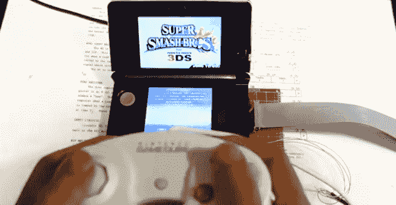

# 任天堂 3DS 侵入 Gamecube 控制器，使 Smash Bros 不那么容易起泡 

> 原文：<https://web.archive.org/web/https://techcrunch.com/2014/10/06/nintendo-3ds-hacked-to-work-with-a-gamecube-controller-to-make-smash-bros-less-blister-inducing/>

# 任天堂 3DS 侵入了 Gamecube 控制器，使 Smash Bros 不那么容易起泡

任天堂 3DS 的新超级粉碎兄弟相当出色——但对于任何在全尺寸控制器上玩这个系列长大的人来说，3DS 的控制布局并不完全是…最佳的。除了水泡和难以触及的肩膀触发器，一些玩家已经设法在游戏试玩版发布的几周内就把他们的 3DSes 穿到了 T2。

不要害怕！有人已经想出了如何让一个合适的 GameCube 控制器与 3DS 一起工作。你所需要的只是一只稳定的手，一些该死的焊接技巧，一个 Arduino 和对保修的完全漠视。

【YouTube https://www.youtube.com/watch?v=seAI9W9SYjo？feature = player _ embedded & w = 640 & h = 360]

好消息是什么？mod 相当便宜。假设你已经有了 GameCube 控制器，你应该能以不到 15 美元的价格把剩下的部分组装起来。坏消息呢？这里正在进行大量紧张的修补工作。如果你没有至少几十个小时的焊接工作台和一个或三个控制台模块，你可能不想接近这个。只要知道在某个地方，*有人*正在一个合适的控制器上玩 *Smash Bros. DS* 就开心了。

如果我们的警告还没有吓到你，你可以在这里找到完整的教程。

[Via [Kotaku](https://web.archive.org/web/20221006181904/http://kotaku.com/how-to-mod-your-3ds-to-play-smash-bros-with-a-gamecube-1643073790)