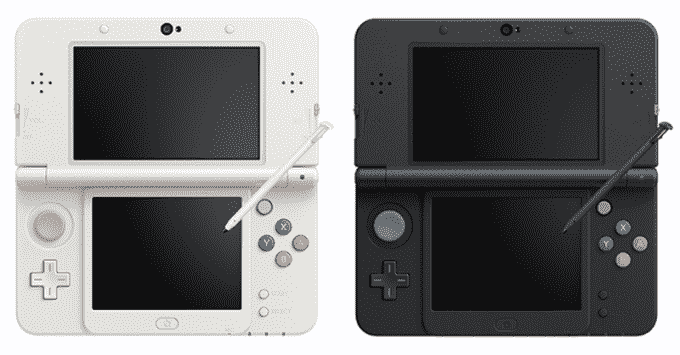

# 任天堂宣布“新任天堂 3DS”

> 原文：<https://web.archive.org/web/https://techcrunch.com/2014/08/29/nintendo-announces-the-new-nintendo-3ds/>

任天堂 3DS 于 2011 年首次发布，现已重新发布，既有更大的 3DS XL，也有更便宜、适合儿童的 2DS。在今天的“任天堂 Direct”视频更新中，任天堂宣布了“新的任天堂 3DS”，这是一个介于小更新和全面更新之间的平台更新。

最明显的变化在设备外部立即可见。面部按钮 A、B、X 和 Y 的颜色与经典 SNES 控制台上的颜色相似。该设备的每个肩部不是一个按钮，而是两个。如果你看一下面部按钮上方，现在有第二个模拟小块。

更深入地看，任天堂说游戏机将有更快的处理器和更多的内存。这意味着该设备可以提供比以前更好的视觉效果，让开发人员带来更接近他们在任天堂 Wii U 上提供的体验(事实上，它现在提供了几乎完全相同的控制方案也有所帮助)。不幸的是，这也意味着专门为新的任天堂 3DS 开发的游戏(比如即将推出的风靡一时的 RPG [Xenoblade Chronicles](https://web.archive.org/web/20230406070658/http://xenobladechronicles.nintendo.com/) )不会向后兼容旧机型。

任天堂还将 NFC 打包到设备中，以便它可以与任天堂的 [Skylander](https://web.archive.org/web/20230406070658/http://www.skylanders.com/trapteam) 一起使用，就像 Amiibo 小雕像一样。《超级粉碎兄弟》(Super Smash Bros .，[)是任天堂展示的首批内置 Amiibo 支持](https://web.archive.org/web/20230406070658/https://techcrunch.com/2014/06/10/nintendo-reveals-amiibo-skylanders-style-nfc-figurines-that-evovle-as-you-play/)的游戏之一，将于 10 月份上市，因此新款任天堂 3DS 将于 10 月 11 日在日本上市可能并非巧合。不幸的是，任天堂没有透露在北美或欧洲的发售日期。

新的任天堂 3DS 将有两种尺寸，一种与最初的 3DS 尺寸大致相同，另一种与 3DS XL 尺寸大致相同(尽管这两种型号的屏幕都比之前的型号大)。说到屏幕，任天堂声称它终于解决了其 3D 实现的最大问题之一:如果你不正面看它，它是一个模糊的混乱。现在，该设备使用前置摄像头和陀螺仪将 3D 效果“瞄准”你的眼睛，就像廉价版的[亚马逊 Fire 手机的动态透视功能。](https://web.archive.org/web/20230406070658/https://techcrunch.com/2014/06/18/amazons-fire-phone-uses-depth-and-3d-effects-to-stand-out/)

虽然很高兴看到任天堂发布了一款速度更快、控制更好的受欢迎的游戏机，但我不禁对任天堂选择如何宣布这一消息感到困惑。新的任天堂 3DS 向后兼容旧的 3DS 游戏，但它也将有自己的专属游戏。它应该是自己的新设备吗？如果是的话，我担心任天堂没有推出一个更大的爆炸和一个新名字，这是在搬起石头砸自己的脚。与从 Wii 到 Wii U 相比，这款新设备的增量更小，有趣的是，过去几年我问过的大多数人都没有意识到这是两个不同的系统。