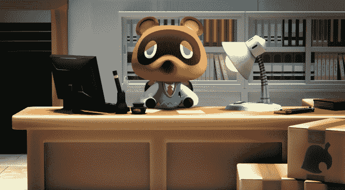

# 任天堂终于宣布了一些新游戏

> 原文：<https://web.archive.org/web/https://techcrunch.com/2018/09/13/nintendo-finally-announces-some-more-new-games-for-the-switch/>

# 任天堂终于宣布了一些新游戏

任天堂终于(终于！)给 Switch 带来了一些新的内容！是啊！

在任天堂的指导下，该公司发布了一些游戏和一些原创游戏。我们瞥见的最大的任天堂制作的游戏是为 Switch 和 Luigi 的大厦 3 开发的一个新的动物穿越。

我们对新的动物穿越几乎一无所知，只知道它将在 2019 年到来，但我们确实看到了 Luigi 在任天堂世界唯一的名义冒险的最新章节的一些游戏性。路易吉的《豪宅 3》似乎跟随了其前作的幽灵吸尘的脚步，采用了怪异的拍摄角度和所有的一切。它也将在 2019 年进入切换阶段，为我们建立几个任天堂游戏，让我们期待明年，可能与 Metroid Prime 4(？).

Switch 的其他熟悉的新增内容包括 Wii U 游戏新超级马里奥兄弟 U Deluxe 将于 1 月推出的端口，以及 Yoshi 将于 2019 年春季推出的精心制作的世界。

除了任天堂制作的游戏，粉丝们还收到了一个大惊喜，宣布一些最近和老派的最终幻想游戏即将切换。最终幻想 VII，IX，X，X-2 HD Remaster 和 XII 都将在 2019 年到来。

大约有十几个其他即将推出的游戏(其中几个是重制游戏)，包括 EA SPORTS FIFA 19，Starlink:Atlas 之战，Diablo III:永恒的收藏，Mega Man 11，Katamari Damacy REROLL 和许多其他你可以在下面直接跳过的游戏。

任天堂 Switch 是一个神奇的系统，虽然它有很多优点，但我几乎没有任何游戏可以玩了。对于任天堂来说，推迟满足客户的即时需求并不太反常，但自推出以来，Switch 的内容展示一直特别断断续续。希望随着更多第三方工作室的加入，该公司能够加快步伐。