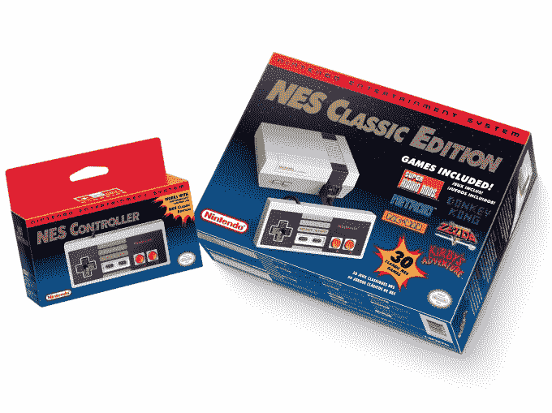

# 任天堂发布了一款迷你版的 NES 游戏机，内含 30 款经典游戏

> 原文：<https://web.archive.org/web/https://techcrunch.com/2016/07/14/nintendo-is-launching-a-mini-version-of-its-iconic-nes-console-with-30-classic-games/>

# 任天堂推出了其标志性的 NES 游戏机的迷你版，内含 30 款经典游戏

当你走运的时候，为什么不做出取悦大众的决定。由于《口袋妖怪 Go》现象，任天堂的市值[飙升](https://web.archive.org/web/20230225043408/https://techcrunch.com/2016/07/11/pokemon-go-adds-9b-to-nintendos-value-global-rollout-continues-this-week/)，而[刚刚宣布](https://web.archive.org/web/20230225043408/http://www.businesswire.com/news/home/20160714005388/en/Relive-Glories-Nintendo%E2%80%99s-Ultimate-Retro-Gaming-Experience)将重新推出其标志性的 NES 游戏机。

NES 经典版将于 11 月 11 日开始发售，售价为 59.99 美元。然而，有一个值得注意的变化，NES 将预装 30 款游戏，包括经典的超级马里奥兄弟 1，2 和 3，塞尔达传说，出拳，最终幻想，大金刚，泡泡等等。它也将比原始型号小一点——任天堂将其描述为“迷你复制品”——并将有一条 HDMI 电缆以跟上时代。

一个重要的警告:这看起来像是在美国推出的，但我们还没有确认。

如果你是一个老派的任天堂粉丝(像我一样！)，或者知道一个，那么这可能就是完美的圣诞礼物…当然假设你能忍受等六个星期才能得到它。任天堂表示，对于第一次玩任天堂的粉丝或后来的成熟玩家来说，这里也可能有吸引力——特别是因为你可以花 9.99 美元购买第二个控制面板，供两个玩家使用。那款 NES 经典 pad 也可以搭配 Wii U 和 Wii 使用。

我们从任天堂梳理出的一些其他细节:游戏选择旨在在流行游戏和可能被遗漏的游戏之间取得平衡——“星战被低估了，”任天堂的一位代表说——但它们是你所能得到的全部。没有外部存储或在线功能，所以你可以得到仿生突击队或原来的魂斗罗。除此之外，事实上它只是 HDMI-out，该公司没有讨论技术规格——我们将不得不等待不可避免的拆除。

“我们想给所有年龄段的粉丝一个机会，让他们重温任天堂最初的系统，重新发现他们当初为什么会爱上任天堂，”任天堂美国总裁兼首席运营官·雷吉·菲尔斯-艾梅在一份声明中说。

“任天堂娱乐系统:NES 经典版是任何记得玩 NES 的人的理想选择，或者是想把那些怀旧的记忆传递给下一代游戏玩家的人，”他补充道。

是的，的确如此。

在多年固步自封之后，今年对于任天堂来说无疑是一个积极变化的时期。该公司终于发布了第一款手机游戏 ( [还有更多](https://web.archive.org/web/20230225043408/https://techcrunch.com/2016/04/27/nintendo-unveils-its-next-smartphone-games-to-follow-app-store-hit-miitomo/))，[口袋妖怪 Go 大受欢迎](https://web.archive.org/web/20230225043408/https://techcrunch.com/2016/07/11/the-brilliant-mechanics-of-pokemon-go/)，[其下一代 NX 即将推出](https://web.archive.org/web/20230225043408/https://techcrunch.com/2016/04/27/the-nintendo-nx-will-be-available-in-march-2017/)，现在 NES 正在卷土重来。