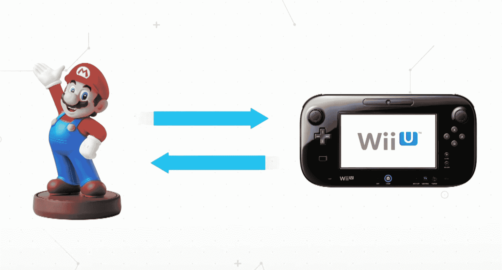
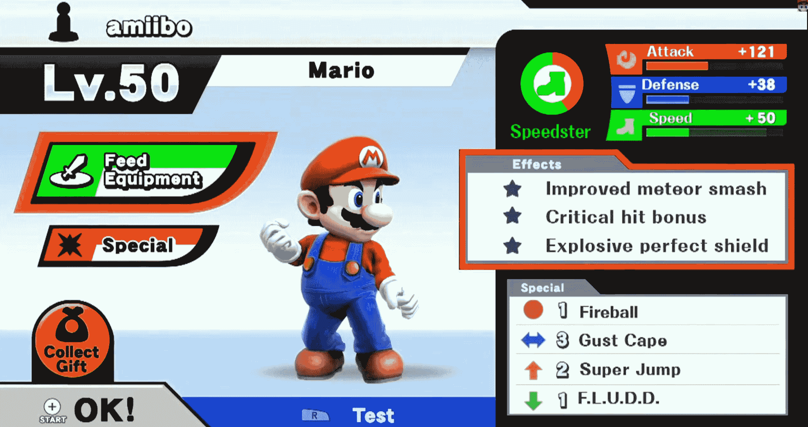
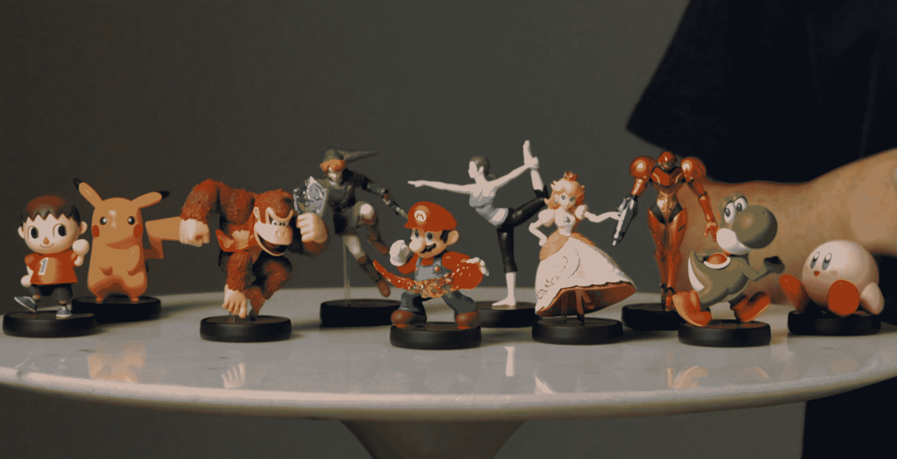

# 任天堂展示了一个 Amiibo，Skylanders 风格的 NFC 小雕像，它会随着你的游戏而进化

> 原文：<https://web.archive.org/web/https://techcrunch.com/2014/06/10/nintendo-reveals-amiibo-skylanders-style-nfc-figurines-that-evovle-as-you-play/>

# 任天堂展示了一个 Amiibo，Skylanders 风格的 NFC 小雕像，它会随着你的游戏而进化

今天在其数字活动中，任天堂展示了 Amiibo，其新产品类别 Skylander 和迪士尼无限风格的收藏品雕像。其中包括一个 NFC 芯片，当与 Wii U 控制器一起使用时，它们可以出现在兼容的游戏中，并被用作玩家角色。

Amiibo 标志着任天堂进入了“生活玩具类别”，正如任天堂美国总裁 Reggie Fils-Aime 在演示中所说。除了 Amiibo，Disney Infinity 和 Skylanders Trap Team 已经为 Wii U gamepad 提供了特殊的 NFC 功能，使他们能够以新的方式在兼容的游戏中“焕发生机”。您正在使用的人物的角色数据被下载到您正在玩的游戏中，但这是一条双向道路，因此数据实际上也会返回到人物，并且它们会随着您的游戏而变化和发展。

例如，你的玩家在 Wii U 的《超级粉碎兄弟》中进化为一名战士，这款游戏将于今年假期上市。据任天堂称,《超级粉碎兄弟》是第一款支持 Amiibo 的游戏，因此可收集的数字也将在 2014 年假期到来。

每一个角色都有自己独特的能力和技能，并与许多游戏一起工作。Super Smash Bros .的集成只是一个开始——amii bo play 也正在为许多其他游戏做准备，包括一些已经发布的游戏，如《马里奥赛车 8》。任天堂表示，更新的更多细节和其他具有 Amiibo 功能的游戏“即将推出”。