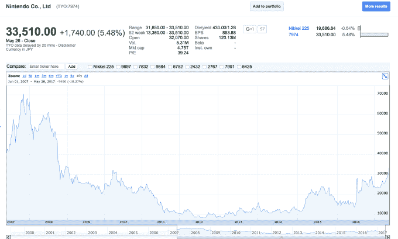

# 任天堂股价创下 8 年新高，因 Switch TechCrunch 宣布推出《怪物猎人》

> 原文：<https://web.archive.org/web/https://techcrunch.com/2017/05/26/nintendo-shares-hit-8-year-high-as-cult-title-monster-hunter-is-announced-for-switch/>

# 任天堂股价创下 8 年新高，邪教标题怪物猎人宣布切换

在 [Capcom 透露](https://web.archive.org/web/20221209125156/http://www.capcom.co.jp/monsterhunter/XX-Switch/)计划将其怪物猎人特许经营权与即将到来的怪物猎人 XX 游戏一起带到游戏机上之后，任天堂在 Switch 上发布了一个怪物游戏——不夸张地说。(顺便说一下，那是“双十字”而不是“XX”。)

虽然它在西方可能不是主流，但《怪物猎人》在日本是一个巨大的特许经营。

我们从哪里开始？该系列过去的游戏帮助[索尼卖出了数百万台 PSP](https://web.archive.org/web/20221209125156/https://beta.techcrunch.com/2008/08/27/ten-million-psps-sold-in-japan-monster-hunter-rocks/)，[任天堂卖出了数百万台 3d 游戏机](https://web.archive.org/web/20221209125156/https://beta.techcrunch.com/2011/12/14/nintendos-3ds-japan/)和[得到了评论家们的最高评价](https://web.archive.org/web/20221209125156/https://beta.techcrunch.com/2011/12/14/nintendos-3ds-japan/)。最初的游戏在 2004 年为 PlayStation 2 增光添彩，更新的游戏已经登陆 PS3、PS Vita、Wii、Wii U、Xbox 360，更不用说 Windows 和 iOS 了。XX 实际上是在 3 月份首次为 3DS 发布的，人们对 Switch 版本有很多期待。

今天的披露对游戏玩家来说是一件大事，但对任天堂这个企业来说也是如此。消息传出后，该公司的股价跃升了百分之五以上。仅今天一天，任天堂的市值就增加了 22 亿美元，股价达到了 2008 年 10 月以来的最高水平。

怪物猎人 XX 什么时候登陆 Switch 现在还没有消息。更多的信息将在周六发布——这也是今年怪物猎人锦标赛的日期——所以死忠们不用等太久了。