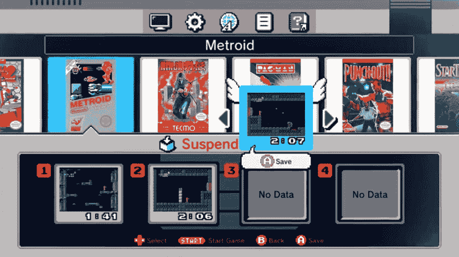
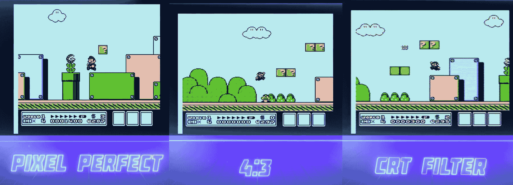

# 任天堂展示了 NES 迷你 TechCrunch 的一些非常令人讨厌的功能

> 原文：<https://web.archive.org/web/https://techcrunch.com/2016/09/30/nintendo-shows-off-some-highly-nerdy-features-of-the-nes-mini/>

[https://web.archive.org/web/20221206181135if_/https://www.youtube.com/embed/-SYfdwtv3eI?feature=oembed](https://web.archive.org/web/20221206181135if_/https://www.youtube.com/embed/-SYfdwtv3eI?feature=oembed)

视频

任天堂进一步揭开了[假日必备游戏小工具](https://web.archive.org/web/20221206181135/https://beta.techcrunch.com/2016/07/14/nintendo-is-launching-a-mini-version-of-its-iconic-nes-console-with-30-classic-games/)的神秘面纱——也就是说，一上市我们都在给自己买。今天发布的一个极具复古主题的视频直观地展示了 NES Mini 的三个特点。做好准备，这里会变得很无聊。

与普通玩家最相关的是保存状态选项——任天堂称之为暂停点。你们中使用过模拟器或虚拟控制台的人对此会很熟悉，但老派玩家会感到惊讶，甚至可能会感到不快。基本上，你可以在任何时候保存游戏——跳跃中，在一个 boss 之前，在打开随机箱子之前，等等。然后如果你死了，得到一个坏的物品，或者只是想再玩一遍某个部分，你可以重新装弹。

新的视频显示，每个游戏将获得四个暂停点插槽，你可以通过拖放一个可爱的翅膀截图到它们上面来写入。这是对 VC 系统的一个很大的改进，尽管某些模拟器已经实现类似的东西很多年了。

我确信这对很多人都有帮助，但是另外两个特性只适合像我这样的纯粹主义者和书呆子。首先，可以选择在 50Hz 和 60Hz 内部刷新率之间切换；在 PAL 上运行的游戏比在 NTSC 上运行的稍慢，欧洲玩家可能会发现在 60Hz 模式下控制的感觉是关闭的。这是一个深思熟虑的包容。

接下来是显示模式，这是真正令人讨厌的地方。几乎可以肯定的是，NES 是在 4:3 的 CRT 电视上通过类似 RF 适配器或 RCA 的东西播放的。然而，NES 的输出不完全是 4:3 (~256x240px)，所以像素会被拉伸——也就是说，不完全是方形的，就像你在屏幕上看到的那样。这一点，再加上当时电缆传输的视频信号很差，以及阴极射线管荧光粉的自然模拟外观，给了 NES 游戏一个非常独特和易于识别的外观。

【T2

NES 迷你将有三种显示模式(点击上面的大图):

*   **像素完美**，以方形像素显示图形，与 NES 输出的完全一样。在某些方面，这是理想的格式，但在其他方面对许多玩家来说完全陌生。因为它更窄，距离会显得更短，移动更慢——相信我，人们会注意到这些事情。
*   **4:3** ，将图像拉伸到你熟悉的老式电视的比例。这本身会使图像有些模糊，值得注意。
*   **CRT 过滤器**，它添加了一个覆盖层，模拟你在 CRT 电视上通过模拟连接看到的视觉伪像。

你用哪种真的是一个品味问题。发送像素完美的信号并在电视上拉伸可能比在盒子里看起来更好。

至于 CRT 滤波器，我知道这听起来如何，但我见过更好的。实际上，有一个相当重要的群体在设计这些东西，使它们更加精确，增加轻微的失真来模拟旧镜头的玻璃，移动失真，可调整的色差，所有这些东西。人们愿意[花大价钱](https://web.archive.org/web/20221206181135/http://retrorgb.com/upscalers.html)——我们这里说的是几百美元——购买一种本质上给干净的数字视频信号添加结构化噪声的设备。

这听起来很疯狂，但这就是一些人对重新获得第一次坐在客厅玩《最终幻想》或《银河战士》的感觉有多认真。我保证他们中的一些人在任天堂工作，并坚持在 NES Mini 的显示选项中增加这种级别的控制——不，我想他们甚至想要更精细的控制。

昨天的另一条新闻是:日本将获得自己版本的游戏机，但它看起来像该国最初的 Famicom，配有硬连线控制器和略有不同的游戏选择。

[https://web.archive.org/web/20221206181135if_/https://www.youtube.com/embed/3GQ02nXQQiM?feature=oembed](https://web.archive.org/web/20221206181135if_/https://www.youtube.com/embed/3GQ02nXQQiM?feature=oembed)

视频

多有趣啊。

两款手机都将很快上市:NES Mini 将于 11 月 11 日上市，售价 60 美元，而 Famicom Mini 将同时上市，售价相当，但显然是用日元。