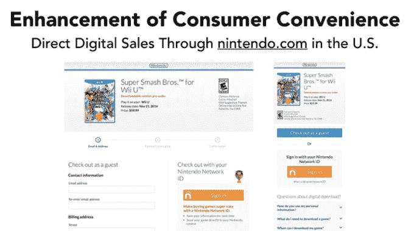

# 任天堂缓慢更新其在线战略 

> 原文：<https://web.archive.org/web/https://techcrunch.com/2014/11/02/nintendo-slowly-modernizes-its-online-strategy/>

# 任天堂慢慢地使它的在线战略现代化

在上周发布的[“半年财务结果简报”](https://web.archive.org/web/20230129073009/http://www.nintendo.co.jp/ir/en/library/events/141030/04.html)中，任天堂公开讨论了其不断发展的数字战略。这家日本视频游戏硬件和软件开发商多年来一直在追赶竞争对手微软(Microsoft)和索尼(Sony)，很高兴看到该公司承认自己的一些缺点，并表明它正在寻求改善。

在简报的一个部分，任天堂展示了它最终实现了玩家多年来的许多要求。通过为 Wii U 提供 Super Smash Bros .服务，该公司让消费者能够在游戏正式发布前预购和下载游戏，这样在发布当天，你就不必等待 8gb 通过电缆或 DSL 连接到达。该公司还推出了一个系统，可以自动将通过美国任天堂网站购买的游戏下载到游戏玩家的游戏机上，只要他们能记住自己的任天堂 ID 和密码。该公司还表示，这一功能将很快进入 Amazon.com。

任天堂的数字销售策略中仍然存在一些粗糙的补丁，使消费者的体验更差。虽然新的在线购买系统与你的任天堂账户绑定，但那些在游戏机上遇到重大硬件问题的人不能简单地更换它，并在新的游戏机上重新下载他们的游戏。任天堂 eShop 上游戏的权利是附在特定的游戏机上的，要转移这些权利，你必须打电话给任天堂支持部门。这既适用于毁了她的 2d 的孩子，也适用于最终从 Wii 升级到新的 Super Smash Bros 的 Wii U 的大学生游戏玩家。

任天堂也没有很好地宣传其最近的改进。虽然该公司在给投资者的简报中吹嘘其为客户提供的便利，但其最近的 Wii U 独家 Bayonetta 2 网站有一个立即购买按钮，提供了这一选项:

“如何购买和下载”按钮将你带到[一个视频](https://web.archive.org/web/20230129073009/http://bayonetta2.nintendo.com/media/trailers/#eshop)解释说，你可以在游戏机上的 Wii U 的 eShop 上一起获得魔兵惊天录 1 和 2，而不是任天堂网站上的实际数字商店。谢了？

随着越来越多的游戏玩家转向以数字方式购买游戏，游戏机上的存储也将出现短缺。即使你只在 Wii U 上购买任天堂的产品，你必须为每个游戏下载的 4-8gb 很快就会填满今天出售的 Wii U 内置的 32g 存储空间。任天堂发布 Wii U 的更新将这个数字提升到至少 64 GBs，这真是太好了——经过多年的失望，我知道不要指望 Xbox One 内置 500 GB 的硬盘。但是，直到任天堂用 Wii Ui 或 2DU 或 LUX 或他们为其 spec bump 版本想出的任何可怕的名字给我们带来惊喜，客户(理解为:想玩马里奥游戏的孩子的父母)才不得不为 Wii U 购买和管理外部存储或继续使用可能被划伤、破裂、丢失或被盗的光盘。