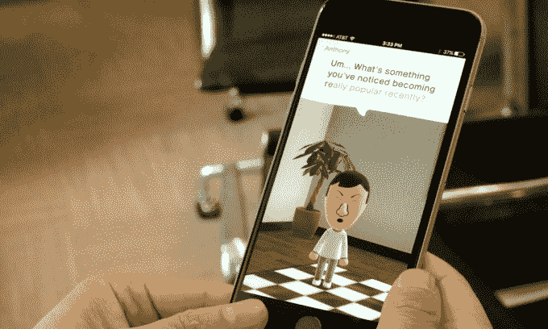

# 继 App Store 热门游戏 Miitomo TechCrunch 之后，任天堂发布了下一款智能手机游戏

> 原文：<https://web.archive.org/web/https://techcrunch.com/2016/04/27/nintendo-unveils-its-next-smartphone-games-to-follow-app-store-hit-miitomo/>

任天堂将继其成功的应用商店 Miitomo 之后，于今年秋天发布两款新游戏，该公司今天早上宣布。细节与其他公司新闻一起公布，包括[新游戏机任天堂 NX](https://web.archive.org/web/20221005190101/https://beta.techcrunch.com/2016/04/27/the-nintendo-nx-will-be-available-in-march-2017/) 的发布日期和塞尔达延迟的细节，等等。不，如果你想知道的话，新的智能手机游戏仍然不会有马里奥。相反，这两个应用程序将基于现有的专营权，“火徽”和“动物穿越”，该公司说。

前者是一款角色扮演策略游戏，涉及一小群士兵，任天堂表示，与为任天堂游戏机设计的同类游戏相比，这款游戏对用户来说“更容易理解”。换句话说，虽然之前版本的“火焰徽章”是针对更严肃的游戏玩家的，但这是一次将这一点转化为智能手机环境的尝试。

与此同时，《动物穿越》将与任天堂游戏系统的《动物穿越》世界相连。关于这意味着什么的细节仍然很少，但任天堂暗示，通过跨平台玩游戏，它将在某种程度上提供更好的体验。

正如玩家所知，“动物穿越”是一系列游戏。目前还不清楚新的应用程序是否会成为该系列的一个新标题，或者它是否会以某种方式与现有的游戏配合使用。

同样值得指出的是，任天堂的新游戏不仅是彼此不同类型的手机游戏——一个是战术、角色扮演游戏，另一个更休闲——它们也不同于任天堂的第一个应用商店发布的 iPhone 应用 Miitomo。

该应用程序更像是一个社交网络，而不是一个游戏，用户可以设计名为 Miis 的个性化化身——类似于 Wii 推出的那些——然后在虚拟环境中与其他化身互动。您可以通过选择服装和配饰、面部特征、发型等来自定义角色的外观和感觉。然后你回答几个“了解你”的问题。当你在 Miitomo 的世界中与他人互动时，那些答案会与和你一起玩游戏的其他人分享。

该应用程序还有其他元素，包括拍摄 Mii 照片的能力和一个可以赢得奖品的迷你游戏，如独特的配件。店内商店将允许你为你的角色购买更多的配件和服装。

任天堂尚未表示将如何为新游戏创收，不过应用内购买似乎也有可能。

虽然任天堂在推出新的应用商店版本时会关注其后备目录是有道理的，但它仍然坐在超级马里奥专营权上。也许这是一个聪明的策略——毕竟，任天堂粉丝今天对它的游戏有如此多被压抑的需求，以至于他们吃掉了任天堂为移动设备发布的任何产品——甚至是奇怪的 Miitomo。

虽然听起来像是一个儿童社交网络，但任天堂表示，Miitomo 现在已经在全球范围内发展到超过 1000 万独立用户。

这在短时间内是一个相当大的增长。这款游戏于 2016 年 3 月 17 日在日本试玩，随后[于 3 月 31 日登陆美国和其他国家，包括部分欧洲市场。](https://web.archive.org/web/20221005190101/https://beta.techcrunch.com/2016/03/29/nintendos-first-smartphone-app-miitomo-arrives-in-the-u-s-and-other-markets-this-thursday/)

任天堂指出，在美国，这款应用首次亮相后不久就登上了 iTunes 应用商店的榜首。此外，迄今为止，在 Miitomo 上已经进行了超过 3 亿次对话，用户已经创建了超过 2000 万张照片。

这些数字表明，它的早期采用者不只是好奇地下载游戏，而是实际上在玩它。不过，这种情况会持续多久是另一个问题。该应用在美国应用商店的整体排名已经下降到第 580 位，在社交网络中排名第 42 位。

任天堂的新游戏将于今年秋天上市，2017 年还会推出几款。公司[此前曾表示](https://web.archive.org/web/20221005190101/https://www.nintendo.co.jp/ir/en/library/events/150508/03.html)将在 2017 年 3 月之前推出大约 5 款新的智能手机游戏，因此任天堂更具标志性的角色仍有希望在未来最终首次亮相 iPhone。