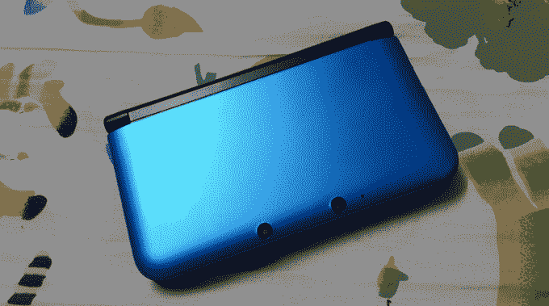

# 任天堂将付给你高达 20，000 美元来黑掉 3DS 

> 原文：<https://web.archive.org/web/https://techcrunch.com/2016/12/08/nintendo-will-pay-you-up-to-20000-to-hack-the-3ds/>

# 任天堂将付给你高达 20，000 美元来黑掉 3DS

所以你买了一台任天堂 3DS 来玩口袋妖怪孙……但是现在你的 Pokedex 已经完成了，你已经探索了阿罗拉的每一寸土地。现在怎么办？

如果你有技术背景，你可以考虑一下 3DS 本身。可能会有一大笔钱给你。

任天堂刚刚通过黑客龙推出了一个 [bug 奖励计划。找到一个可以让 3DS 做某些它不应该做的事情的错误，任天堂会支付 100 美元到 20，000 美元不等。](https://web.archive.org/web/20230209002813/https://hackerone.com/nintendo)

任天堂对他们希望在这里消除的东西相当开放。直接引用他们的话:

> 以下是任天堂重点防范的活动类型的示例:
> 
> **盗版，包括:**
> –游戏应用转储
> –复制游戏应用执行
> 
> **作弊，包括:**
> –游戏应用修改
> –保存数据修改
> 
> **向儿童传播不当内容**

正如大多数 bug 赏金计划一样，有一些条件:奖金取决于任天堂，你必须是第一个告诉他们这个 bug 的人(公开或私下)*和*你必须同意永远不告诉其他任何人这个 bug。

特别是最后一个可能会让一些人犯错——一旦一家公司有机会修复它，许多研究人员都喜欢向公众详细介绍他们寻找漏洞的过程。唉，由于任天堂不一定能修补所有游戏机上存在的所有漏洞(其中许多从未连接到互联网)，他们试图保持严密的控制。

我有一种感觉，这是任天堂的一次演习——一次实验，看看这样的东西如何在任天堂 Switch 上工作。举个例子:防止 3DS 上的盗版被列为主要目标之一，但那艘船早就起航了。他们可能会通过这个程序发现一些他们以前没有见过的新漏洞，但这并不能帮助所有自 2011 年 3DS 开始发货以来出现的漏洞。