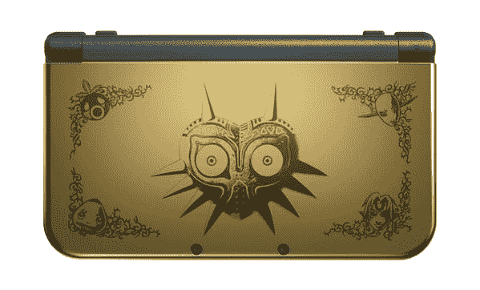

# 任天堂新 3DS XL 将于 2 月 13 日在美国上市，售价 200 美元 

> 原文：<https://web.archive.org/web/https://techcrunch.com/2015/01/14/nintendos-new-3ds-xl-is-heading-to-the-u-s-february-13-for-200/>

# 任天堂的新 3DS XL 将于 2 月 13 日在美国上市，售价 200 美元

任天堂透露，继去年在日本推出重新设计的硬件后，它将于 2 月 13 日在美国推出新版本的 3DS XL。新版本具有第二个模拟杆，以及两个新的肩部触发器，microSD 和 NFC 支持。它还对 3D 观看系统进行了改进，可以从一系列角度进行更好的观看，这意味着在上部屏幕上观看无眼镜 3D 效果的所谓“最佳位置”比以前大得多。

[tweet https://Twitter . com/Nintendo America/status/555371684472320000 align = ' center ']

任天堂 3DS XL 的新版本得到了许多能够接触到日本原版的人的积极评价，但迄今为止，支持新按钮的游戏有限。任天堂今天还宣布，新 3DS XL 型号的系统更新将激活 Amiibo 支持，这意味着你可以在系统中使用任天堂的新人物形象和游戏互动功能，从 3DS 的 Smash Bros .开始，很快就会在 2 月 13 日与新系统一起推出新的 Ace 战斗游戏。

任天堂特别没有提到关于新 3DS 在北美发布的任何事情，新 3DS 提供了相同的 C-stick 模拟控制器、肩部按钮和其他功能，但外形尺寸与原始 3DS 的比例相同(比 XL 小)。3DS XL 显然也不会在包装盒中附带交流适配器，因为假设许多人在以前的系统购买中已经有了这种配件。3DS XL 也将于 2 月 13 日与怪物猎人 4 旗舰版捆绑销售，这是一款很好地利用了新硬件控制的游戏。

3DS XL 的特别 Majora 面具版也将于 2 月 13 日推出，延续了任天堂的长期趋势，即让人们非理性地想要比他们可能需要的更多的系统。