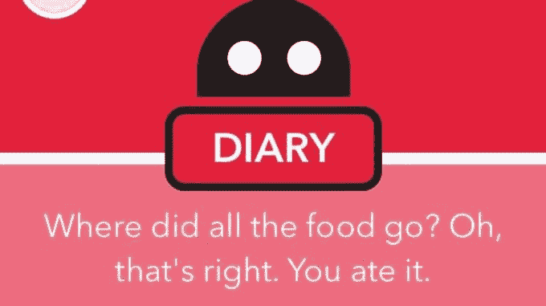
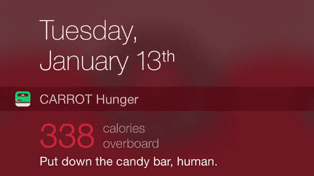

# 胡萝卜饥饿是一个让你羞于吃得更健康的应用程序技术危机

> 原文：<https://web.archive.org/web/https://techcrunch.com/2015/01/13/no-more-doughnuts-fatty/>

# 胡萝卜饥饿是一个让你羞于吃得更健康的应用程序

布莱恩·米勒(Brian Mueller)的[胡萝卜应用套件](https://web.archive.org/web/20221005093631/http://www.meetcarrot.com/)通过虐待狂式地推动用户做出更好的行为而变得流行起来。最新的是[胡萝卜饥饿](https://web.archive.org/web/20221005093631/https://itunes.apple.com/app/id912570794)，一个人工智能的卡路里计数器，它会因为你的饮食习惯而羞辱或奖励你。

该应用程序允许您扫描食品条形码并记录您一天吃的东西，以准确记录您脸上塞满了什么。它会警告你，如果你即将超过你的卡路里与一个几乎[达莱克一样的感觉](https://web.archive.org/web/20221005093631/http://en.wikipedia.org/wiki/Dalek)。

她(我问，是的，胡萝卜饥饿背后的人工智能被认为是一位女士)知道你什么时候打开冰箱，如果你已经吃得太多了，她会对你大喊大叫。如果你忽视她，她也会变得刻薄。

但你可以贿赂她收取一定的费用。这就是免费增值应用赚钱的方式。您购买应用程序是为了让您的看护人保持安静，或者面对一大堆广告的愤怒。

有时这些广告是假的。有一个问你要不要薯条。如果你点击它，它会因为你虚弱而羞辱你。应用程序植入这些只是为了嘲笑你。

创作者 Brian Mueller 说，他喜欢拿出有时很残酷的对话。作为一名前荧屏作家，他通过在线教程自学如何设计和编码，他相信幽默对人们有用。“这不仅仅是另一个生产力应用程序。它是以一种有趣的方式完成的，而不仅仅是卑鄙的，”他告诉我。

出于隐私原因，穆勒回避收集人们的具体信息。然而，该应用程序确实想知道你的某些事情，例如你有多高，你是雄性、雌性还是松鼠(它会问)，以确定你每天的卡路里。

在我看来，减肥的热量限制似乎有点苛刻。我应该每天摄入大约 1800 卡路里来保持体重，但是如果我计划一周减掉 2 磅的话，应该摄入 800 卡路里左右。不过，我不是人工智能减肥经理。

穆勒不确定这款应用与其他产品相比效果如何，但他听说过一些通过这种方法减肥 5-100 磅的人。

穆勒也是用于 iOS 的[胡萝卜做](https://web.archive.org/web/20221005093631/http://www.meetcarrot.com/)、[胡萝卜报警](https://web.archive.org/web/20221005093631/http://www.meetcarrot.com/)和[胡萝卜适应](https://web.archive.org/web/20221005093631/http://www.meetcarrot.com/)生产力和健康应用的幕后主脑。

[https://web.archive.org/web/20221005093631if_/https://www.youtube.com/embed/Nmx4gL7fv74?feature=oembed](https://web.archive.org/web/20221005093631if_/https://www.youtube.com/embed/Nmx4gL7fv74?feature=oembed)

视频