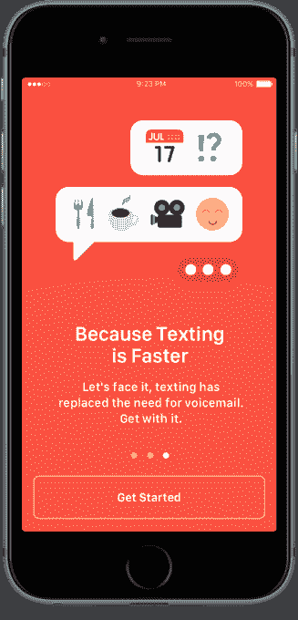

# 不再有语音邮件是一个杀死语音邮件的应用程序，所以来电者不得不给你发短信

> 原文：<https://web.archive.org/web/https://techcrunch.com/2016/03/02/no-more-voicemail-is-an-app-that-kills-voicemail-so-callers-have-to-text-you-instead/>

语音邮件是上个世纪的事了。给某人打电话，然后在他们不接电话的时候留一条漫无边际的信息的想法[在即时连接的时代，朋友、家人、同事和其他人可以很容易地通过短信联系到，这种想法显然是过时的](https://web.archive.org/web/20230313195359/http://www.nytimes.com/2014/06/15/fashion/millennials-shy-away-from-voice-mail.html?_r=1)。事实上，语音邮件已经过时了，像 [JP 摩根](https://web.archive.org/web/20230313195359/http://blogs.wsj.com/moneybeat/2015/06/02/in-bid-to-cut-costs-j-p-morgan-hangs-up-on-voicemail/)和[可口可乐](https://web.archive.org/web/20230313195359/http://www.wsj.com/articles/at-coke-newest-flavor-is-austerity-1419352337)这样的大公司已经完全放弃了这项服务。要是消费者也有同样的选择就好了。

嗯，多亏了一款名为[不再有语音邮件的新应用，现在有了。](https://web.archive.org/web/20230313195359/http://www.nomorevoicemail.co/)[不再有语音邮件](https://web.archive.org/web/20230313195359/http://www.nomorevoicemail.co/)适用于 iOS 和 Android 设备，是语音邮件问题的一个巧妙解决方案。

今天，如果你真的想关闭语音邮件，你必须联系你的运营商，并解释你不想要这项服务。这本身就是一个麻烦。如果你因为任何原因想要重新打开语音邮件，你必须再次打电话给运营商重新启用它。

不再有语音邮件提供了不同的解决方案。该应用程序实际上并没有禁用每个运营商的语音邮件，只是看起来像是这样。取而代之的是，不再有语音邮件使用手机上的条件呼叫转移功能将未接来电发送到一个只会响个不停的虚拟号码。

这是今天在其他合法的第三方语音邮件应用程序中使用的相同概念，如 YouMail 或 Google Voice，希望它放弃提供托管语音邮件系统的想法。

除非你拒绝或忽略来电，否则来电不会被转移到语音邮件的第三方系统。这意味着当您有时间通话时，您可以正常接听电话。

但该公司声称，如果你选择不接电话，打电话的人只会听到电话铃声没完没了。

最终，打电话的人会厌倦等待语音信箱接听，然后挂断电话。(然后希望改为给你发短信！)

不再设置语音邮件的过程很简单。您将获得一个激活码，可以复制并粘贴到您的电话拨号器中，然后您可以拨打该号码进行必要的更改。

[gallery ids="1285666，1285667，1285668，1285669，1285670，1285671"]

在实践中，我发现这个过程在第一次尝试时失败了，然后在第二次尝试时成功了。当进一步测试时，我拒绝了一个来电，但发现电话没有像承诺的那样无限期地响，而是响了一会儿，然后自动断开了呼叫。

遗憾的是，这远非完美。但是，即使有一点小问题，它也确实*阻止了我的语音邮件以我的名义接听电话。我希望随着时间的推移，这些问题会得到解决。*

(我用的是 iPhone 6s，在 T-Mobile 上运行 iOS 的测试版，所以我应该指出，我可能不是最好的测试对象。您的里程可能会有所不同！)

不再禁用语音邮件使用与激活服务类似的过程。这与测试中宣传的一样有效。

这款应用是 TelTech Systems 的最新产品，该公司多年来已经发布了许多电信应用。它最出名的可能是 TrapCall，[2009 年发布的一项服务，可以在被阻止的来电上显示来电显示](https://web.archive.org/web/20230313195359/http://www.wired.com/2009/02/trapcall/)，或者是它早期的 SpoofCard 来电显示欺骗服务。

“我们认为语音邮件已经成为过去，它让生活变得更加轻松，再也不用担心检查和回复语音邮件，”TelTech 特殊项目合伙人 Nate Kapitanski 解释道。“如果事情很重要，人们会给你发短信，或者在各种信息应用上给你发信息，”他说。

包括美国电话电报公司、威瑞森、T-Mobile、Sprint 和 US Cellular 在内的所有主要运营商在发布时都不再支持语音邮件。这款应用可以在 iTunes 应用商店和 T2 的 Google Play 上免费下载。