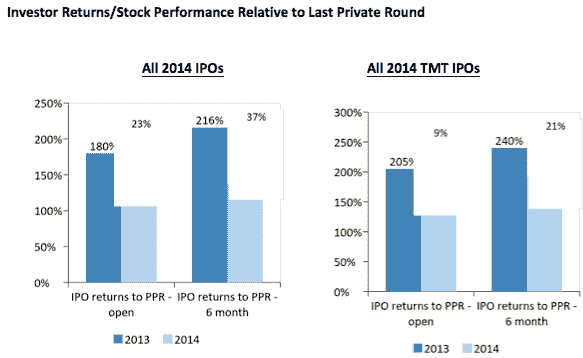

# 不必为私人公司的估值担忧

> 原文：<https://web.archive.org/web/https://techcrunch.com/2015/03/21/no-need-for-alarm-over-private-company-valuations/>

3.投资者回报:

与 2013 年的 216%相比，2014 年投资者回报率(从上一轮私募融资到 IPO 后 6 个月的股价)下降了 37%。

数据显示，是的，通胀趋势是真实的，后期投资的回报正在减少，但揭发者忽略了一些事实……最值得注意的是，这些投资仍然利润丰厚。

2013 年至 2014 年间，从最近一轮私募到禁售期满退出，投资者的回报确实下降了 37%，但他们仍然实现了 137%的回报。在“技术、媒体和电信”板块(TMT)中，结果甚至更大，同期回报率为 **191%** 。所有这些都发生在数据集中的公司在上一轮私募融资后平均 20 个月上市的时候。

不仅不会出现泡沫破裂，而且我们在一段时间内不会看到这种趋势的逆转。

**这一趋势存在的原因:硅谷 Vs 纽约，**

硅谷认为，共同基金和对冲基金(也叫纽约基金，也叫“傻钱”)付钱购买“上市前”公司，这是在夸大估值，超出逻辑。《华尔街日报》将 Tiger Global 和 T.Rowe price 列为十亿美元创业俱乐部的五大投资者之一，排在 Andreesen Horowitz 之前。

要理解这种“逻辑”上的差异，你必须理解回报预期。根据晨星公司的数据，共同基金投资者的年化回报率为 5-12%，而风险投资者的年化回报率为 3-10 倍(300%-1000%)。这两者之间存在相当大的差距。由于在大约两年的时间里获得了 137%的回报，共同基金继续向强劲的 IPO 候选公司投入大笔资金是合乎逻辑的，因此大大抬高了估值。面对这种侵蚀性的竞争，风投发出警告就不足为奇了。

**为什么会继续？**

显然，这些后期投资的回报比广泛的共同基金表现好几倍，也比在同一家公司通过公开市场首次公开募股后投资该公司好得多。

这些大型“东海岸基金”正转向私募基金，它们的资本传统上被分配给了公共股票投资组合。这些基金有兴趣成为长期股东……在 IPO 或禁售期满后很久。机构公众投资者无法通过 IPO 获得足够大的股票配置，尤其是在最令人兴奋的科技公司，也是这种交叉的动机。

> 由于在大约两年的时间里获得了 137%的回报，共同基金继续向强劲的 IPO 候选公司投入大笔资金是合乎逻辑的，因此大大抬高了估值。

他们的新策略已经变成，首先从私募轮持有股票，然后参与 IPO，最后在公开市场填补所需头寸的余额。

尽管与 2013 年相比，这些回报正在减少，IPO 下跌轮数正在以有意义的速度增加，但这些交易仍具有高度的逻辑性，并将继续下去，直到回报耗尽。

**让我们讨论一下风险**

 *New Relic、HortonWorks 和 Box 是最近几轮 IPO 的典型代表。在彭博的一篇文章中，Serena Saitto 和 Leslie Picker 声称，这些公司代表了后期投资的“高风险结果”和“[私人]公司和上市公司估值之间的脱节”

对于所谓的失败者来说，后期阶段甚至不一定会在这些投资上赔钱。这些股票的交易价格都远高于其私人估值的高点，现在也不远了。如果你在最近三轮私募中持有相同的头寸，你就下跌了约 5%……对于 2014 年的大标题输家来说，这是 5%。

你可以以 1500 万美元的价格甩卖 Fab.Com T4 的 T3。对这家曾经价值 10 亿美元的公司来说，这并不是一个好的回报。这个基本上 0%的回报率与这个话题无关，因为在私人公司投资中总会有零。不管你是在 1B 的 7.5 亿美元还是 6，000 万美元买的股票，你都是零。一家公司走向零并不是泡沫或通胀的征兆——不管有没有泡沫，投资者都需要对一家企业的长期可持续性做出判断。在这种情况下(当然是事后看来),在任何级别投资都是错误的，但这总是私人投资游戏的一部分。

**2000 年对 2014 年——泡沫**

将 2000 年和 2015 年进行比较是没有意义的——如今，投资者根据收入、未来收益，或者(在少数情况下)只需轻触货币化开关的能力(即 Instagram、Snapchat 等)来对公司进行估值。然而，在 2000 年，投资者是根据用户和页面浏览量来评估公司价值的。我们认为这是一个根本性的区别。

 *现在的公开估值也更加合理:在美国消费者新闻与商业频道，阿曼达·德鲁里(Amanda Drury)表示，2000 年，科技公司 IPO 的平均收入是 32 倍，而 2014 年是 6 倍。2002 年，纳斯达克的市盈率是 120 倍，如今是 26 倍。

虽然我们应该继续关注这些趋势，但与 2000 年实际泡沫的比较需要搁置。**