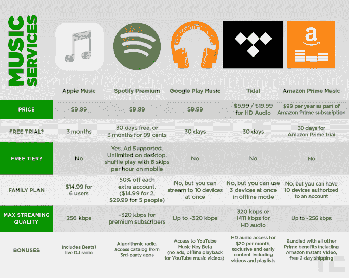
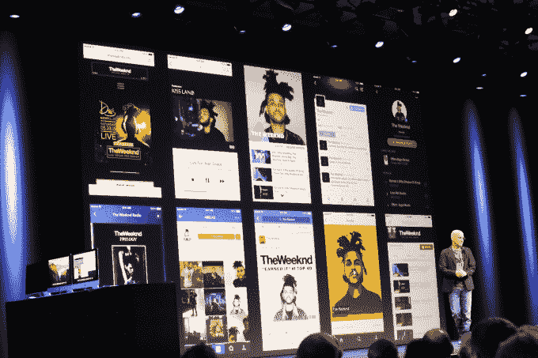
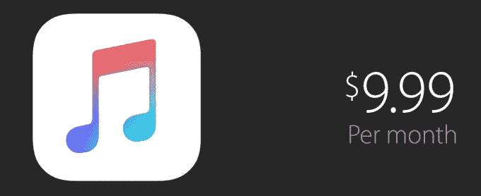

# Apple Music 的优势和劣势 

> 原文：<https://web.archive.org/web/https://techcrunch.com/2015/06/08/no-sound-investment/>

Spotify 杀手？还是 Ping 2.0？苹果今天终于宣布进军点播音乐流媒体，推出了苹果音乐。现在的问题是 Apple Music 是否会受到公众的欢迎，带来大量新用户，并从竞争对手那里窃取资源。或者它会不会是另一个被我们塞在文件夹里然后忘记的苹果应用。

以下是 Apple Music 与其竞争对手之间的比较，以及对发布会的积极和消极方面的深入了解:

**优势:点播流媒体**–音乐下载[销量迅速下滑](https://web.archive.org/web/20221007034045/https://beta.techcrunch.com/2014/07/03/streaming-is-killing-downloads/)流媒体业务迅速崛起。苹果迫切需要从 iTunes 销售模式转向订阅流媒体，否则将面临使用量和收入下降的风险。

**缺点:发布日期**——全世界都在看着，苹果本可以告诉我们去下载它的新音乐应用程序，现在就开始听。相反，我们必须等到 6 月 30 日才能发布，到那时许多人可能已经忘记了。当你谈论销售一款新设备时，发布后的这种延迟是可以接受的。每个人都在谈论花费数百美元，炫耀他们闪亮的新玩意。软件藏在手机里，没有人骄傲地宣称他们开始了免费试用。

**优势:可用性**——苹果很聪明地让苹果音乐可以在安卓手机和 Windows PCs 上使用，但它要到“秋天”才会在那里推出。在那之前只有 iOS、Mac 和 Apple Watch。同样，如果苹果希望其流媒体应用成为一种全球现象，那么今天统一的跨平台发布会更强大。至少它可以在 100 个国家使用，而 Spotify 只有 58 个国家，而且你可以将歌曲同步到离线模式。由于它内置于 iOS 设备上的股票音乐应用程序和 MAC 电脑上的 iTunes 中，它将享有一个完全庞大的预安装基础。

优势:免费试用——至少每个人都有三个月的时间来尝试苹果音乐。对许多人来说，这可能是他们第一次接触搜索框，它会播放几乎所有的歌曲。从第一天开始就让人们付费可能会让苹果音乐胎死腹中。

**缺点:没有免费/广告支持层**——免费试用的问题在于，它阻碍了人们通过创建播放列表和教授他们喜欢的服务来投资个性化他们的收听体验。Spotify 利用其有限的免费广告支持层，将临时听众转化为付费用户，取得了巨大成功。Spotify 告诉我，其 80%的付费用户都是从免费层开始的。

尽管其 iAd 并不出色，但苹果并不是一家真正的广告公司，因此缺乏广告支持层在某种程度上是可以预见的。但它仍然可以提供比 Beats1 电台、iTunes 电台和 Apple Music Connect 更多的服务来吸引那些不愿付费的人。苹果本可以做一些有创意的事情，比如提供有限的免费访问，比如每月歌曲/小时数上限，或者只访问手机上的一些功能。相反，三个月后，你要么付钱，要么被解雇。这可能会阻止不太可能付费的年轻用户，但可能会提供重要的网络效应和病毒式传播。

**缺点:价格**——Apple Music 每月 10 美元，与 Spotify 等独立竞争对手相同。苹果无法说服唱片公司降低收费，但它真正的失败可能是拒绝补贴订阅费。说到底，苹果不会一次赚几块钱。它的设备销售额高达数十亿美元。拥有最受欢迎的点播流媒体服务可以帮助它卖出更多的 iPhones，而更低的价格或免费等级会让这变得更有可能。如果苹果公司聪明起来，它将通过赠送购买 iPhone/iPad/MacBook/Mac 的 6 个月或 12 个月订阅来刺激设备销售。音乐不会消失，从其 1980 亿美元的现金储备中拿出来赢得这场战争可能是一项明智的投资。

**优势:家庭计划**——苹果公司正在大力讨好父母，推出 14.99 美元的家庭计划，允许最多六个账户。这使得父母可以把苹果音乐给他们所有的孩子，并以合理的价格为自己购买，或者终止另一个音乐服务订阅，比如一个 Spotify 帐户 10 美元(两个帐户 15 美元，五个帐户 30 美元)，并连接整个家庭。[更新:Spotify 已经在一些市场测试类似的家庭计划费率，很可能很快就会缩小自己与 Apple Music 之间的价格差距，从而消除这一优势。]

缺点:缺乏独家报道(T1)——苹果还可以用另一种方式来砸钱，那就是[为苹果音乐锁定一些必须的独家内容(T3)。如果它获得了披头士或泰勒·斯威夫特的目录，人们就会有一个令人信服的理由去注册或转换。但是苹果没有提到任何这样的独家。
](https://web.archive.org/web/20221007034045/https://beta.techcrunch.com/2015/02/08/exclusive-streaming/)

**强项:beats 1 Radio**–点播流媒体最大的问题是，大多数人不知道该搜索什么，听什么。创建一个旗舰的、24/7 的、由人运营的 Beats1 电台可以帮助临时听众发现艺术家，然后他们可以在闲暇时播放。iTunes 收音机并没有死。它只是埋藏在节拍 1 中。任何人，包括非付费用户，都可以使用苹果个性化的潘多拉风格的 iTunes Radio，它可以为那些不想做 DJ 的人保持果酱流动。

**待定:Connect**——苹果[将 Ping 重新命名为 Connect](https://web.archive.org/web/20221007034045/https://beta.techcrunch.com/2015/06/08/apple-revives-ping-as-connect-letting-artists-share-a-feed-of-music-videos-and-social-media/) ，这是苹果音乐中的一个标签，用户可以在这里看到音乐、照片、视频和文章。它旨在让苹果拥有音乐家和粉丝之间的关系，但这种联系在 Twitter 和脸书等服务上已经很强了。

不过，很难说 Connect 会成功还是失败，因为这完全取决于艺术家是否真的花时间在那里创建定制内容和回应粉丝，或者他们是否会在那里整合他们的其他社交帖子或完全忘记它。苹果有可能通过在流媒体发现标签中悬挂促销广告来吸引艺术家们加入进来。但是，如果没有根深蒂固的行为或朋友的内容来吸引人们到“连接”标签，以及用户必须手动关注艺术家而不是自动订阅他们所听的人的事实，艺术家可能会发现很少有人关心另一个订阅源。

**判词:** **没事。** Apple Music 是一项合适的流媒体服务。这种产品并不比它的竞争对手好多少或差多少。决定其命运的是苹果如何营销它。

如果苹果在 iTunes 中提供大量交叉推广，在 iOS 上预装，购买设备时免费订阅，并为高调的独家服务付费，它可能会超越资源较少的 Spotify 和似乎没有优先考虑音乐的谷歌。

但如果没有免费的用户层、较低的单个账户价格或出色的产品创新，Apple Music 就缺乏一个令人信服的理由来解释为什么坚持流媒体播放的用户应该为其付费，或者为什么其竞争对手的用户应该转向流媒体播放。一旦我们在月底听到苹果音乐，我们会知道更多。

