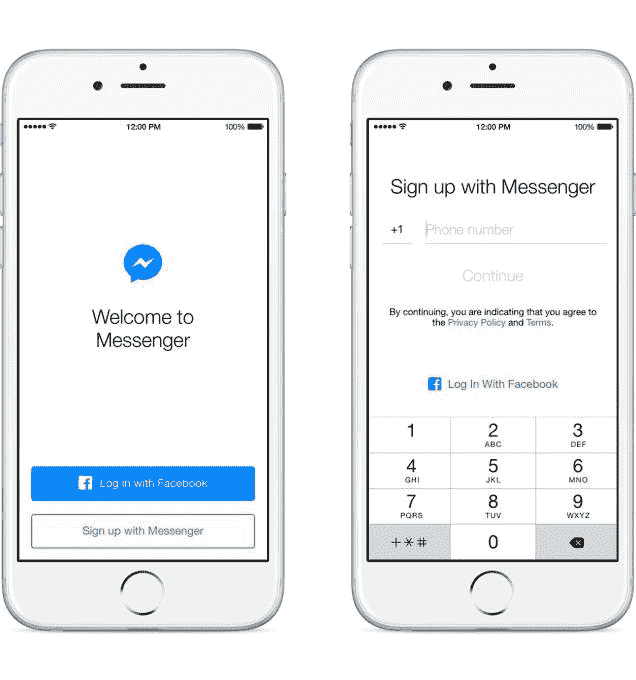

# Messenger 不再需要脸书帐户

> 原文：<https://web.archive.org/web/https://techcrunch.com/2015/06/24/nobook-messenger/>

脸书甚至希望那些讨厌脸书的人也能使用 Messenger，所以它在社交网络上开放了[注册聊天应用而不用账号](https://web.archive.org/web/20230224013949/http://newsroom.fb.com/news/2015/06/sign-up-for-messenger-without-a-facebook-account/)的选项。从今天开始，美国、加拿大、秘鲁和委内瑞拉的用户只需填写名字、姓氏和电话号码就可以注册，之后该功能将在其他地方推出。

[2012 年，脸书在印度和其他三个国家测试了安卓系统的 Messenger 无账户注册，但几个月后停止了测试。但是信使报的负责人大卫·马库斯告诉我“两年前的那个时候，我们在路中间。现在，这是一种到达最后一英里和最后几个想使用 Messenger 的人的方式，这些人可能不想使用脸书或不能使用脸书。”](https://web.archive.org/web/20230224013949/https://techcrunch.com/2012/12/04/messenger-no-facebook-account/)

一个新的“不在脸书？”Messenger 注册流程中的按钮将允许人们上传他们的电话联系人。然后，脸书会将它们与用这些电话号码注册的 Messenger 用户进行匹配，以建立一个无账户用户的社交图谱。人们还可以使用脸书搜索功能找到他们想聊天但没有给脸书号码的人。

“这就像是一个扩充的通讯录，”马库斯告诉我。“您拥有所有的地址簿，然后可以在 Messenger 上搜索所有人。”

Marcus 坚持认为，这不是一种让他的公司进入中国或其他脸书被封锁的国家的战略。由于脸书所有的 IP 地址通常都会被屏蔽，Messenger 也将受到审查。

## Messenger 的下一步是什么？

脸书最近一直在为 Messenger 开发一系列新功能。它增加了[好友间支付](https://web.archive.org/web/20230224013949/https://techcrunch.com/2015/03/17/facebook-pay/#.c09dfs:84lo)、新的[位置共享](https://web.archive.org/web/20230224013949/https://techcrunch.com/2015/06/04/foursquessenger/#.c09dfs:74vd)选项、[专用网络接口](https://web.archive.org/web/20230224013949/https://techcrunch.com/2015/04/08/facebook-messenger-desktop/#.c09dfs:f1xS)、 [VOIP 视频呼叫](https://web.archive.org/web/20230224013949/https://techcrunch.com/2015/04/27/facebook-messenger-video-chat/#.c09dfs:8OF8)，以及[应用平台](https://web.archive.org/web/20230224013949/https://techcrunch.com/2015/03/25/facebook-launches-messenger-platform-with-content-tools-and-chat-with-businesses/#.c09dfs:YRev)，用于向好友发送图像和声音片段或[玩游戏](https://web.archive.org/web/20230224013949/https://techcrunch.com/2015/06/09/facebook-messenger-game/#.c09dfs:I59p)。

马库斯告诉我，Messenger 的下一个大项目是在更多垂直市场推出 Messenger For Business 系统，这样在线商家就可以通过 Messenger 为客户提供支持，而不是打缓慢的电话或发送令人讨厌的电子邮件。他还表示，Messenger 在解释其强大功能并提醒人们何时使用这些功能方面可以做得更好。

这包括让第三方开发者在 Messenger 平台上构建的实用程序更容易访问。目前，他们隐藏在“”菜单中，以独立应用的形式生活在 Messenger 之外。Discovery 是隐藏的，它的使用需要大量的应用切换。我怀疑马库斯是在暗示脸书可能会直接在 Messenger 中构建第三方体验，只要它不牺牲速度，而速度对于实时聊天应用来说至关重要。

## 长大成熟而不再

但所有这些努力的基础都是增长。

Messenger 的月活跃用户已达 7 亿，规模已经非常庞大。但要打败短信，它需要无处不在。这样，您就可以依靠所有在上面的朋友，这样就不必离开 Messenger 去联系他们。在脸书的早期市场，如美国和英国，新功能将主要帮助信使招募的人谁离开脸书或从未想过加入。

与此同时，在新兴市场，脸书本身尚未覆盖全部人口，但其免费的短信替代品正在流行，Messenger 可能是人们的第一个脸书。“我们在这些市场发展的唯一途径是让不在脸书的人也能加入进来，”Marcus 解释道。“我们不想停下来，直到每个人都在平台上，因为当你知道你可以找到每个人时，这会带来更好的体验。”

信使号的负责人大卫·马库斯在脸书 F8 会议的舞台上

马库斯并不羞于承认有些人就是不想要脸书。他告诉我，“有些人有一些反对社交网络的意识形态信仰”。这不是他的错。他从未在那里工作过。去年，马库斯被聘为贝宝总裁，并带领 Messenger 的用户数量从 2 亿增加到 7 亿，并推出了一系列产品。

只要脸书能够迈出第一步，它就有可能说服用户注册其全部服务。人们的 Messenger 个人资料中的链接指向他们的脸书照片，并会吸引注册。这对脸书的底线很重要，因为它现在只在新闻提要上显示广告，并没有直接将 Messenger 货币化。

本质上，脸书意识到，不是每个人都想要一个社交网络或新闻源，但每个人都聊天。