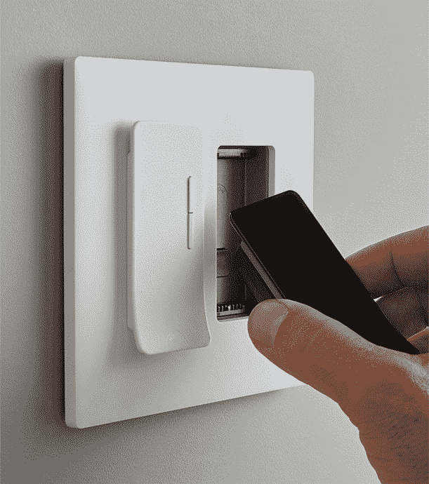
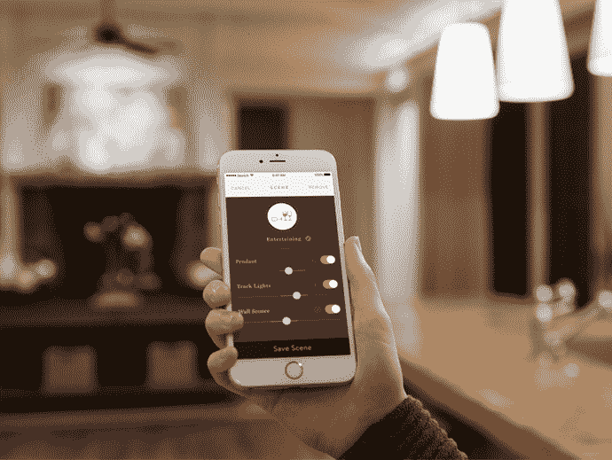

# Noon Home 为电灯开关带来互联家庭智能技术 

> 原文：<https://web.archive.org/web/https://techcrunch.com/2017/10/26/noon-home-brings-connected-home-smarts-to-light-switches/>

# Noon Home 为电灯开关带来互联家庭智能

智能灯泡从一开始就是互联家居空间的基石之一。飞利浦凭借其 Hue 系列牢牢控制着市场，但从 116 年历史的坚定的 Sylvania 到 LIFX 这样的初创公司，每个人都在参与变色连接灯泡的行动。

总部位于旧金山湾区的一家新的家庭自动化创业公司 Noon Home 正在寻找电灯开关。该公司包括来自 Nest 和 August Home 等公司的前高管，一直以一个明显不太容易发音的代号 Locoroll 秘密运营。它已经获得了像 Shasta Ventures、Lux Capital 和 Sway Ventures 这样的投资者的支持。该公司的第一个产品是直接命名为 Noon 的智能照明系统。

该系统售价 400 美元，并不便宜，尽管它旨在取代昂贵得多的定制安装。主控制面板是一个小型触摸屏显示器，直接插入墙上的电源，滑动即可打开电灯开关。一旦启动并运行，它就可以与现有的灯一起工作，为特定的空间提供定制的分层照明。

该系统使用板载传感器尽最大努力猜测房间的照明需求，但其余的定制则取决于用户。像许多其他智能家居产品一样，它也可以用于开发不同场景的定制场景。它为您提供了三种开箱即用的产品:*日常、明亮*和*放松、*可以通过开关或使用公司的应用程序远程控制。

很自然地，该产品将推出 Alexa 功能——这并不奇怪，因为亚马逊一直看好[最近拥抱每一个联网的家庭小工具](https://web.archive.org/web/20221025222700/https://beta.techcrunch.com/2017/10/24/amazon-echo-plus-review-youll-probably-want-the-standard-echo-instead/)。这些系统从今天开始可以通过[公司的网站](https://web.archive.org/web/20221025222700/https://noonhome.com/)获得。额外的分机开关 100 美元一个，该公司提供 50 美元的专业安装服务。